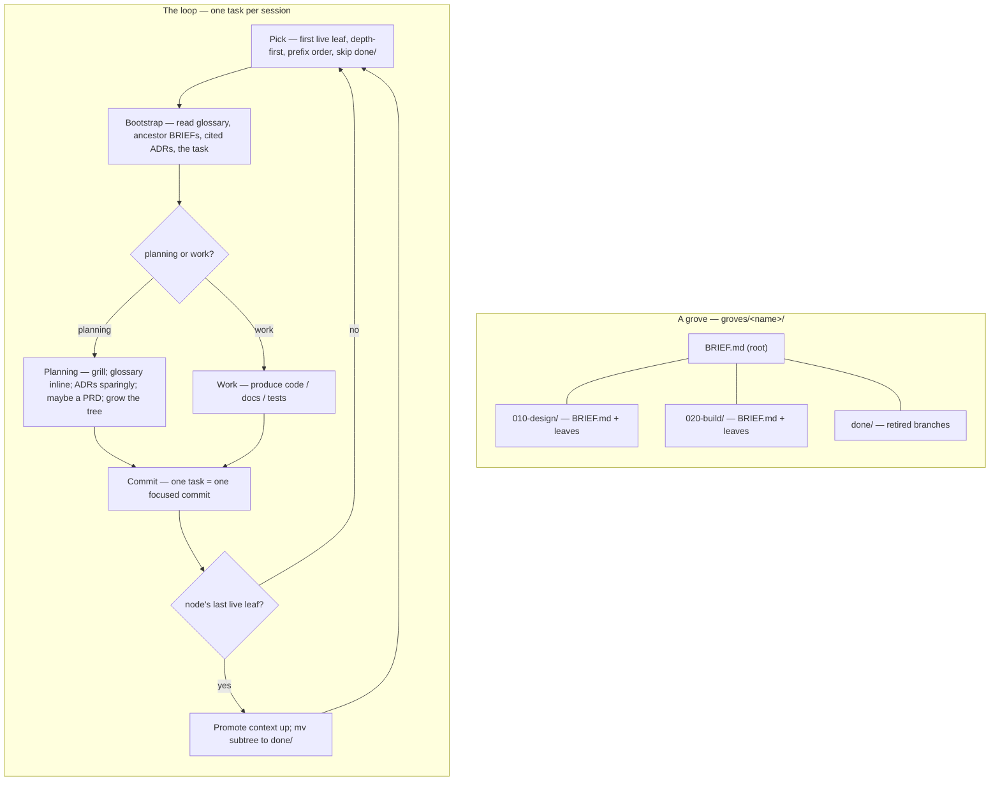

# grove — hierarchical, self-extending workstreams

A **grove** is one workstream driven as a git-tracked **tree of task files**,
one task per session. Planning tasks grow the tree as understanding deepens;
completed branches retire to an archive. The tree's shape — what `ls` shows —
is the only state; git is the history.

## The spine — seven constraints

grove drives long work *without* becoming brittle, constraining machinery.
These seven rules are non-negotiable; everything below is subordinate to them.

1. **Artifacts, not state.** No phase file, no session log, no status file.
   What `ls` shows is the only state; git is the history.
2. **Read, don't run.** A session bootstraps by *reading markdown* — no script
   must succeed before work begins. (Materialising or updating grove itself is
   a separate maintenance action and may use a script — see `VERSION.md`.)
3. **Suggested shape, not enforced schema.** Task files and briefs are freeform
   markdown. The format files are guides; nothing validates them.
4. **Lazy and optional.** Every artifact — brief, ADR, PRD, glossary entry — is
   created only when it earns its place, never because a step demands it.
5. **grove guides, it does not gate.** grove never refuses to proceed. A task
   may be done by hand, reordered, or skipped.
6. **Walk-away-able.** Delete this skill and `groves/` is still a legible
   folder of notes; every durable output is standard, team-readable markdown.
7. **One page of rules.** If the loop below does not fit on a page, it is too
   complex — cut until it does.

## The loop

One task is one session.

**Pick.** From the grove root, depth-first in numeric-prefix order, skipping
`done/`: descend into directories; the first `.md` leaf reached is the next
task.

**Bootstrap.** Read, in order: the glossary (`CONTEXT.md`, or the relevant
bounded context via `CONTEXT-MAP.md`); the ADRs cited by the briefs; the
`BRIEF.md` chain root→leaf; the task file. That assembled context is the
session's entire mandate — read nothing else by reflex.

**Execute.** The task file states its kind (`TASK-FORMAT.md`):
- A **work task** produces code, docs, or tests.
- A **planning task** grills (`grilling.md`), updates `CONTEXT.md` *inline* as
  terms resolve, raises ADRs *sparingly* (`ADR-FORMAT.md`), MAY write a PRD at a
  genuine agreement point, and **grows the tree**.

**Decompose.** When a leaf is too big for one focused session, a planning task
replaces the leaf `NNN-x.md` with a node `NNN-x/` holding a `BRIEF.md`
(`BRIEF-FORMAT.md`) and ordered child leaves — lazily, only when needed.

**Commit.** One task = one focused commit.

**Retire.** When a node's last live leaf completes, promote anything still
relevant from its `BRIEF.md` upward — to the parent brief, an ADR, or the
glossary — then `mv` the node into `groves/<name>/done/`, preserving its
relative path. Archived, never deleted.

## Artifacts

Only the task tree is grove-specific and ephemeral. Everything else is a
standard artifact that outlives grove (constraint 6).

| Artifact | Path | Role |
|---|---|---|
| Glossary | `CONTEXT.md` (+ `CONTEXT-MAP.md`) | the Ubiquitous Language — read every session, appended inline |
| ADRs | `docs/adr/NNNN-*.md` | atomic decisions: hard to reverse, surprising, or a real trade-off |
| PRDs | `docs/prd/` | human-facing agreement checkpoints; committed, never retired |
| Design specs | `docs/specs/*-design.md` | workstream-level technical design |
| Task tree | `groves/<name>/` | the process: the self-extending decomposition of work |

**The glossary is load-bearing.** The acute failure mode of multi-session work
is terminology drift: a later session, with no memory of an earlier one,
reinvents its term under a new name or reuses the words with a shifted meaning.
`CONTEXT.md`, read every session and appended *inline* whenever a term is
resolved, is the forcing function against that. Keep it a glossary and nothing
else — terse definitions, aliases-to-avoid, no implementation detail
(`CONTEXT-FORMAT.md`).

**Briefs vs. the glossary.** A bounded context is a *domain* partition; a
task-tree node is a *process* partition. They are orthogonal axes. The glossary
is per-bounded-context; a node carries a `BRIEF.md`, not a glossary.

## PRDs

A **PRD** is the human-facing, team-shareable face of a planning increment,
produced lazily by a planning task *when the increment is a genuine agreement
point*. The flow there: grill → PRD (review & agree) → decompose → execute.
PRDs live in `docs/prd/`, are committed, and are never retired.

## Reference files

- `BRIEF-FORMAT.md` — the `BRIEF.md` shape.
- `TASK-FORMAT.md` — the task-file shape and the two task kinds.
- `CONTEXT-FORMAT.md` — the glossary format (bundled from `mattpocock/skills`).
- `ADR-FORMAT.md` — the ADR format (bundled from `mattpocock/skills`).
- `grilling.md` — the grilling procedure for planning tasks (bundled).
- `VERSION.md` — which grove version this is and how to update it (present only
  in a materialised copy; written by the materialise script).
