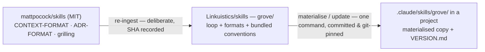
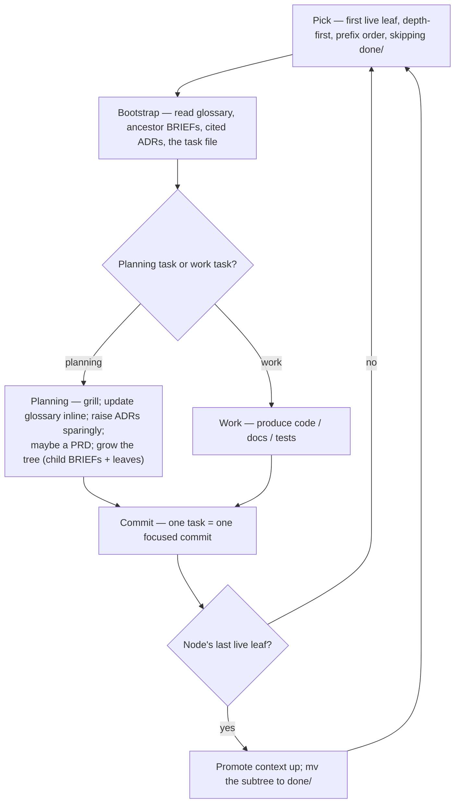

# grove — A Skill for Hierarchical, Self-Extending Workstreams

`grove` is a Claude Code skill that drives a long, multi-session project as a
**git-tracked tree of task files** — one task per session, where planning tasks
grow the tree as understanding deepens, and completed branches are retired to an
archive. It is "Linear, but ordered and committed with the code," anchored on a
Domain-Driven Ubiquitous Language, and deliberately *not* a return to
Ravel-style machinery.

`grove` is authored in the **`Linkuistics/skills`** repository (namespace
`linkuistics:`) and consumed by **materialising** it into each project that uses
it — see *Consuming and versioning grove*.

## Context

The project's pipeline work was historically driven by the **Ravel-Lite**
work→reflect→triage phase cycle, with per-workstream state under
`LLM_STATE/<name>/`. That machinery was fully retired on 2026-05-22 and
`LLM_STATE/` deleted; workstreams are now tracked by `docs/specs/*-design.md`
plus `docs/superpowers/plans/*`. The racket-oo completion design explicitly left
one decision open: *"choosing the replacement new-target methodology is a
separate decision."* **This spec is that decision.**

A monolithic implementation plan suits work whose shape is known upfront. It
does not suit a project that spans many sessions and many months, where some
steps are *themselves* design or planning steps whose output is *more steps*.
`grove` is the process for that kind of work: a task tree decomposed
dynamically, built up as it is walked, executed one fresh session at a time.

## Goal

A skill that encapsulates a hierarchical, self-extending, git-tracked task-tree
workflow, such that:

- Each unit of work is a self-contained task file, executed in a fresh session.
- Planning tasks decompose work into subtrees on demand — the tree is grown
  lazily, never specified exhaustively upfront.
- A Domain-Driven **Ubiquitous Language** is maintained as a first-class,
  living asset, read at the start of every session.
- Human-facing **PRDs** are produced at agreement points and archived with
  project history.
- It is **easy to consume, version, update, and reason about**, and the
  mechanisms stay **open and walk-away-able** — the explicit anti-goal is
  recreating the Ravel trap.

## Governing constraints — the spine

These seven rules are non-negotiable. Every later section is subordinate to
them. They exist because Ravel-Lite became brittle and constraining — a form of
lock-in — and `grove` must not repeat that.

1. **Artifacts, not state.** No `phase.md`, no session log, no status files.
   The tree's shape — what `ls` shows — is the *only* state. Git is the history.
2. **Read, don't run.** A *session* bootstraps by *reading markdown*. There is
   no `pre-work.sh`, no script that must succeed before work begins.
   (Consuming or updating `grove` itself is a separate, occasional maintenance
   action — see *Consuming and versioning grove* — and may use a script.)
3. **Suggested shape, not enforced schema.** Task files and briefs are freeform
   markdown. Templates are guides; nothing validates them; nothing breaks if one
   is "wrong."
4. **Lazy and optional.** Every artifact — brief, ADR, PRD, glossary entry — is
   created *only when it earns its place*, never *because a step demands it*.
5. **The skill guides, it does not gate.** `grove` never refuses to proceed. A
   task may be done by hand, reordered, or skipped; the skill describes a way of
   working, it does not enforce one.
6. **Walk-away-able.** Delete the `grove` skill and `groves/` is still a legible
   folder of notes; every durable output (glossary, ADRs, PRDs, specs, code) is
   standard, team-readable, tool-agnostic markdown.
7. **One page of rules.** If `grove`'s core loop does not fit on a page, it is
   too complex — cut until it does.

Note on constraint 6: it governs whether the *artifacts* survive the *skill's*
removal — and they do, unconditionally. Ravel's fragility was *endogenous* — a
state machine that could corrupt its own state and block work. `grove` has no
such machinery.

## Where grove lives, and what it builds on

`grove` is authored in **`Linkuistics/skills`** — a Claude Code marketplace repo
holding one plugin, `linkuistics`, giving every Linkuistics skill the namespace
`linkuistics:` (as `superpowers:` does for its skills). This repo is the
generalisation of the existing `Linkuistics/coding-standards` repo (see *Scope*).

`grove` **builds on the `mattpocock/skills` ecosystem** (`grill-with-docs`,
`grill-me`), which already proves out the grilling-and-documentation half of
this design. Specifically, `grove` adopts three conventions from it:

| Convention | Source file | Used for |
|---|---|---|
| `CONTEXT.md` glossary + `CONTEXT-MAP.md` | `grill-with-docs/CONTEXT-FORMAT.md` | the Ubiquitous Language |
| ADRs in `docs/adr/` | `grill-with-docs/ADR-FORMAT.md` | atomic decisions |
| the grilling procedure | `grill-with-docs`, `grill-me` | planning-task interrogation |

`grove` **bundles** these three convention files as its own reference files,
rather than depending on `mattpocock/skills` being installed. The reason is
reproducibility (see the next section): a `grove` materialised into a project
must be fully self-contained and git-pinned — it cannot reach out to a live,
separately-versioned plugin. `mattpocock/skills` is therefore a recorded
*source* for those files, not a runtime dependency. The `Linkuistics/skills`
repo records the exact `mattpocock/skills` commit the bundled files came from;
refreshing them is a deliberate re-ingest performed when cutting a new `grove`
version. (`mattpocock/skills` may *also* be installed globally for ad-hoc use of
its skills as tools — that is independent of `grove`.)

## Consuming and versioning grove

The driving requirement: a project with **many concurrent, long-lived
workstreams** needs each to be reproducible across its many sessions, and
different projects need to pin different `grove` versions independently. A
globally-installed plugin is *one version per machine* — it cannot satisfy that.
So `grove` is consumed by **materialisation**.



**Two consumption paths.**

- *Casual / exploratory* — install the `linkuistics` plugin and use
  `linkuistics:grove`. Latest, global, unpinned. Fine for a one-off workstream.
- *Materialised (the path for serious work)* — copy `grove` into the project's
  `.claude/skills/grove/` and commit it. Project-local skills are
  auto-discovered and outrank plugin skills, so a materialised `grove` simply
  works as a project skill — pinned by the project's own git, isolated per
  repo. APIAnyware-MacOS uses this path.

**The materialised footprint** is a handful of small markdown files:
`SKILL.md`, `BRIEF-FORMAT.md`, `TASK-FORMAT.md`, the bundled `CONTEXT-FORMAT.md`
/ `ADR-FORMAT.md` / `grilling.md`, a `LICENSES/` directory, and `VERSION.md`.

**`VERSION.md`** is the legibility key — one human-readable stamp that answers
every versioning question at a glance: which `grove` version this is
(`grove vX` / `Linkuistics/skills@<sha>`), which `mattpocock/skills@<sha>` it
bundles, when it was materialised into this repo, and the one command to update
it. `cat .claude/skills/grove/VERSION.md` tells the whole story.

**Consume / update** is a single command shipped in `Linkuistics/skills`: it
git-fetches `Linkuistics/skills` at a chosen ref, copies `grove/` into the
target repo's `.claude/skills/grove/`, and writes `VERSION.md`. Updating is the
same command again; the diff is plain files; the project commits it and (by
discipline) records the bump in an ADR.

**Plain copy, not submodules.** Materialisation deliberately avoids git
submodules/subtrees — they are a recurring source of confusion and worktree
friction. A materialised `grove` is *just files in the repo*: the pin is the
project's own git history, `VERSION.md` documents the upstream correspondence,
`git log .claude/skills/grove/` is the update history, and if the command ever
breaks you can materialise by hand (copy a folder, write one file). That is
constraint 6 honoured.

In one breath: *`grove` is a folder committed in my repo; `VERSION.md` says
which upstream version it is and how to update it; updating is one command plus
one commit.*

## Licensing and attribution

`grove` redistributes work from `mattpocock/skills` (by bundling — D2), so
licensing is a first-class concern, not an afterthought.

- **Upstream — `mattpocock/skills` is MIT.** MIT permits copying, modification,
  and redistribution under any terms, with one obligation: the MIT copyright
  notice and licence text must travel with the copies. Bundling the three
  convention files into `grove` is therefore fully permitted.
- **Attribution travels with the files.** Each bundled file
  (`CONTEXT-FORMAT.md`, `ADR-FORMAT.md`, `grilling.md`) carries a one-line origin
  header (`adapted from mattpocock/skills@<sha>, MIT`), and `grove` ships a
  `LICENSES/` directory holding the verbatim upstream MIT licence. The
  materialise command copies `LICENSES/` along with everything else, so a
  consuming repo automatically satisfies the attribution obligation — provenance
  (`VERSION.md`) and licensing (`LICENSES/`) are self-documenting and travel
  together.
- **`grove`'s own parts** — the loop, the `BRIEF.md` / `TASK-FORMAT`
  conventions — are original work, licensed under whatever licence
  `Linkuistics/skills` adopts (below).
- **`Linkuistics/skills` is licensed Apache-2.0.** The current `Linkuistics/`
  `coding-standards` repo has no licence — "all rights reserved" by default,
  which blocks others from using the skills; the restructured repo adds
  Apache-2.0, matching all Linkuistics open-source projects (and
  APIAnyware-MacOS). Apache-2.0 is permissive and composes cleanly with the
  bundled MIT files — see D9.
- **Compatibility downstream.** MIT (the bundled files) and a permissive
  `Linkuistics/skills` licence are both compatible with materialisation into an
  Apache-2.0 project such as APIAnyware-MacOS, or any other — permissive
  licences compose, and no copyleft obligations are introduced.

## Isolation — the project repo is the boundary

Claude Code resolves project-local skills (`.claude/skills/`) by directory:
discovered from the cwd up to the repo root, higher precedence than plugins.
There is **no per-session skill isolation within a repo** — and `grove` does not
need any. The isolation boundary is the **project repo**, which is exactly the
right granularity: one project = one pinned methodology version; two workstreams
in the same repo share it; two different repos are fully independent.

- A **workstream is driven by a top-level `claude` session** in its project repo
  (or a git worktree of it) — not by an Agent-tool subagent of a coordinator.
  A top-level session gets well-defined cwd-based skill resolution; subagent
  skill resolution is under-specified. A "multi-project coordinator" is a thin
  launcher (a script, or a person) that starts one top-level session per
  project. A grove session may *internally* spawn subagents for sub-work; the
  loop itself stays top-level.
- **Git worktrees** of one repo all share that repo's committed
  `.claude/skills/grove/` — correct: a worktree is the same project, the same
  methodology version. Worktrees give parallel isolation *within* a project
  without methodology divergence.

## Artifact taxonomy

Five artifact types. Only one — the task tree — is `grove`-specific and
ephemeral. Everything else is a standard artifact that outlives the process.

| Artifact | Path | Role | Lifecycle |
|---|---|---|---|
| **Glossary** | `CONTEXT.md` (+ `CONTEXT-MAP.md`) | The Ubiquitous Language — domain vocabulary | Living — never retired |
| **ADRs** | `docs/adr/NNNN-*.md` | Atomic decisions; hard-to-reverse, surprising, real trade-off | Living — never retired |
| **PRDs** | `docs/prd/` | Incremental, human-facing, team-shareable agreement checkpoints | Living (archival) |
| **Design specs** | `docs/specs/*-design.md` | Workstream-level technical design (existing project convention) | Living |
| **Task tree** | `groves/<name>/` | The *process*: hierarchical, self-extending decomposition of work | Retired branch-by-branch to `done/` |

### The Ubiquitous Language

`CONTEXT.md` is the project glossary in the sense Matt's `CONTEXT-FORMAT.md`
defines: opinionated, terse, one-or-two-sentence definitions, aliases-to-avoid,
**totally devoid of implementation details**. It exists because the acute
failure mode of multi-session LLM work is **terminology drift**: session 1 coins
a term; session 7, with no memory of session 1, reinvents it under a different
name, or reuses the words with a subtly shifted meaning. The glossary, read at
the start of *every* session and appended to *inline* whenever a term is
resolved, is the forcing function against that. It is load-bearing.

### Bounded contexts vs. task-tree nodes — orthogonal

A DDD **bounded context** is a *domain* partition with its own ubiquitous
language. A **task-tree node** is a *process* partition — a group of work. They
are independent axes and must not be conflated: the glossary is organised by
bounded context (one `CONTEXT.md`, or several linked by `CONTEXT-MAP.md`); the
task tree is organised by decomposition of work. A task-tree node therefore does
**not** carry a glossary — it carries a `BRIEF.md` (process scaffolding). This
is the distinction that keeps `CONTEXT.md` a glossary "and nothing else."

## The task tree

A **grove** is one task tree, for one workstream, living at `groves/<name>/`.
A **node** is a directory; a **leaf** is a `.md` task file. Numeric prefixes in
tens (`010-`, `020-`, …) order siblings and leave gaps for insertion.

```
CONTEXT.md                          project glossary (repo root)
docs/adr/0001-*.md …                decisions
docs/prd/0001-*.md …                agreement checkpoints
docs/specs/*-design.md              workstream technical designs
.claude/skills/grove/               the materialised grove skill (+ VERSION.md)
groves/
  chez-functional/
    BRIEF.md                        root brief for this grove
    010-design/
      BRIEF.md                      brief for the design branch
      010-seed-glossary.md          leaf task
      020-write-design-spec.md      leaf task (planning)
    020-build-emitter/
      BRIEF.md
      010-ffi-type-mapper.md
      020-emit-class/               a leaf a planning task decomposed
        BRIEF.md
        010-…md
    done/                           retired branches, structure preserved
```

### `BRIEF.md` — the node briefing

Every node carries a `BRIEF.md`: neither glossary nor decision log. It records,
for its subtree, the goal and done-criteria rollup, the decomposition rationale
and child ordering, and **pointers** to the ADRs and glossary terms a session
needs — so a session reads three ADRs, not fifty. A `BRIEF.md` is written by the
planning task that creates its node. Briefs inherit root→leaf and retire *with*
their subtree.

## The loop

This is `grove` itself, and it fits on a page.



**Pick.** Depth-first, prefix-order traversal from the grove root, skipping
`done/`: walk children in numeric order, descend into directories; the first
`.md` leaf reached is the next task.

**Bootstrap.** To execute leaf `groves/W/010-a/020-b/030-task.md`, read, in
order: the glossary (`CONTEXT.md`, or the relevant bounded context via
`CONTEXT-MAP.md`); the ADRs cited by the briefs; the `BRIEF.md` chain root→leaf;
the task file. That assembled context is the session's entire mandate.

**Execute.** One task = one session. A **planning task** grills (using the
bundled grilling procedure), updates the glossary *inline*, raises ADRs
*sparingly*, MAY produce a PRD at a genuine agreement point, and **grows the
tree** — writes child `BRIEF.md`s and leaves. A **work task** produces code,
docs, or tests. Both kinds are leaf `.md` files; a task file states its kind.

**Decompose.** A planning task replaces an oversized leaf `NNN-x.md` with a node
`NNN-x/` containing a `BRIEF.md` and ordered child tasks — **lazily**, only when
a task is too big for one focused session.

**Retire.** When a node's last live leaf completes, the session promotes
anything still relevant from the node's `BRIEF.md` upward (to the parent brief,
an ADR, or the glossary), then `mv`s the node into `groves/<name>/done/`,
preserving its relative path. Archived, never `rm`-ed.

## PRDs

A **PRD** is the human-facing, team-shareable, archival face of a planning
increment, produced **lazily** by a planning task *when the increment is a
genuine agreement point*. The flow at such a point is: grill → **PRD** (review &
agree) → decompose into the task subtree → execute. PRDs live in `docs/prd/`,
are committed, and are **never retired**. `grove` diverges from Matt's `to-prd`
here: `to-prd` posts a PRD as a GitHub issue; `grove` writes it as an in-repo
file so it versions with the code.

## The grove skill's own files

```
grove/
  SKILL.md            the loop + the seven constraints; opens with a mermaid diagram
  BRIEF-FORMAT.md     the BRIEF.md shape (a guide, not a schema)
  TASK-FORMAT.md      the task-file shape; the two task kinds
  CONTEXT-FORMAT.md   bundled from mattpocock/skills (the glossary format)
  ADR-FORMAT.md       bundled from mattpocock/skills (the ADR format)
  grilling.md         bundled from mattpocock/skills (the grilling procedure)
  LICENSES/           upstream licence text (mattpocock/skills MIT)
  VERSION.md          provenance stamp, written at materialisation time
```

`SKILL.md` **opens with a simple visual description** — a mermaid diagram of the
tree and the loop — as the entry point, prose second. All diagrams in `grove`
and in this spec are mermaid (or another diagram generator); ASCII art is not
used. The skill stays thin: the loop and its conventions, nothing more.

## Decisions

Decisions reached during this design. D1–D3 meet Matt's three ADR criteria and
become the first ADRs (`docs/adr/0001`…) once `docs/adr/` is established.

- **D1 — `grove` is consumed by materialisation into each project repo**
  (`.claude/skills/grove/`, git-pinned), not as a shared global plugin.
  Trade-off: a per-repo copy to maintain vs. a single global install. Chosen
  because a global plugin is one version per machine and cannot give many
  concurrent, long-lived workstreams independent, reproducible pins.
- **D2 — `grove` bundles the `mattpocock/skills` convention files it uses;**
  `mattpocock/skills` is a recorded *source*, not a runtime dependency. A direct
  consequence of D1 — a materialised, git-pinned `grove` must be self-contained.
  `mattpocock/skills` is MIT-licensed, so bundling is permitted with attribution
  preserved (see *Licensing and attribution*).
- **D3 — `grove`'s home is the `Linkuistics/skills` repo;** the marketplace and
  plugin are named `linkuistics`, giving the `linkuistics:` namespace.
  `coding-style` and the other current Linkuistics skills move under it.
- **D4 — The glossary is `CONTEXT.md`** (Matt's convention), repo-root, with
  `CONTEXT-MAP.md` if multiple bounded contexts emerge.
- **D5 — Task trees live in `groves/<name>/`;** nodes carry `BRIEF.md`; numeric
  prefixes in tens order siblings; completed branches retire to `done/`.
- **D6 — PRDs are in-repo** at `docs/prd/`, committed and never retired.
- **D7 — One task per session.** Predictability over throughput.
- **D8 — Bounded contexts (domain) and task-tree nodes (process) are
  orthogonal.** The glossary is per-bounded-context; `BRIEF.md` is per-node.
- **D9 — `Linkuistics/skills` is licensed Apache-2.0**, matching all Linkuistics
  open-source projects. The current `coding-standards` repo has no licence; the
  restructured repo adds one. Apache-2.0 is permissive and composes cleanly with
  the bundled MIT files and with materialisation into any project.

## First customer: the `chez-functional` target

Building `grove` is done conventionally — this spec → an implementation plan →
execution, performed in the `Linkuistics/skills` repo. `grove`'s **first use**
is the Chez Scheme target, a genuinely many-session effort and the reason this
process is needed (Part 2 of the originating task). Chez is delivered *through*
`grove`, as `groves/chez-functional/` in the APIAnyware-MacOS repo.

Its first planning task will (a) seed `CONTEXT.md` by harvesting the dense
latent vocabulary already in `knowledge/` — especially
`knowledge/targets/racket-oo.md` — and (b) expand the Chez design seed below
into `docs/specs/2026-05-22-chez-functional-design.md`.

**Chez design seed** — the technical thinking already established, preserved as
input so it is not lost:

- **Paradigm: Functional** (per the README) → target slug `chez-functional`,
  emitter crate `emit-chez` (already a commented-in workspace member).
- **Implementation:** Chez Scheme 10.4.1 — installed via Homebrew as `chez` /
  `petite`, arm64-native, threaded, with a full FFI.
- **FFI:** Chez's native FFI — `load-shared-object`, `foreign-procedure`,
  `foreign-callable`, `ftype`. No `tell`-macro equivalent: every method call is a
  typed `foreign-procedure` over `objc_msgSend`. This collapses racket-oo's
  Tell-vs-TypedMsgSend dispatch duality to a single mechanism.
- **Module system:** R6RS `library` forms, one per generated class/protocol file.
- **Memory model:** wrap ObjC pointers in records; use a Chez **`guardian`** for
  release-on-finalization; **`lock-object`** every `foreign-callable` code object
  so the compacting GC cannot move a pointer handed to C.
- **Dispatch & naming:** receiver-first flat free functions; kebab-case
  identifiers; `make-<class>`, `<class>-<method>`, `<class>?` predicates, `!`
  setters — structurally like racket-oo's generated code.
- **Blocks / delegates / subclassing:** via libobjc plus an `APIAnywareChez`
  Swift dylib (a stub exists at `swift/Sources/APIAnywareChez/`).
- **Error handling:** match racket-oo — emit `NSError**` methods normally with
  an enrichment comment; no automatic result-or-error wrapper.
- **Scope — Milestone 1 (confirmed with the user):** the first grove covers the
  `emit-chez` crate, the Chez runtime library, the `APIAnywareChez` dylib, CLI
  registration, snapshot + runtime-load harnesses, and non-GUI smoke tests — a
  working, test-verified target with **no sample apps**. Sample apps, bundling,
  and TestAnyware validation are a later grove.
- **Reuse:** the shared `emit` crate wholesale; a new `ChezFfiTypeMapper`
  implementing `FfiTypeMapper`; Chez emit modules mirroring `emit-racket-oo`.

## Scope

**In scope (this spec):** the design of the `grove` skill.

**Out of scope, but prerequisite work (sequenced by the implementation plan):**

- Restructuring `Linkuistics/coding-standards` → `Linkuistics/skills`: rename the
  repo, rename the plugin `coding-standards` → `linkuistics` (→ the `linkuistics:`
  namespace), keeping `coding-style` and the other current skills.
- Adopting an explicit licence for `Linkuistics/skills` (D9).
- *Building* `grove` itself, in `Linkuistics/skills`.
- Materialising `grove` into the APIAnyware-MacOS repo (`.claude/skills/grove/`).

**Out of scope entirely:**

- The `chez-functional` target's implementation — run through `grove` once it
  exists.
- Migrating the existing `racket-oo` workstream onto `grove` — a separate,
  optional decision.

## Success criteria

`grove` is done when:

- `grove/SKILL.md` plus its reference files exist, the core loop fits on one
  page (constraint 7), and `SKILL.md` opens with a mermaid visual description.
- All seven governing constraints are demonstrably met.
- `grove` bundles its `mattpocock/skills` conventions and records their source
  commit; it has no runtime dependency on an external plugin.
- Attribution is preserved: each bundled file headers its `mattpocock/skills`
  origin, `LICENSES/` holds the upstream MIT text, and materialisation copies
  them so a consuming repo satisfies the obligation automatically.
- Materialisation works: one command copies `grove` into a target repo's
  `.claude/skills/grove/` and writes a `VERSION.md` that legibly answers *which
  version, what it bundles, when materialised, how to update*.
- `Linkuistics/skills` exists with the `linkuistics` plugin and namespace, the
  Apache-2.0 licence (D9), and `coding-style` et al. resolving as `linkuistics:*`.
- A dry run holds: a fresh `groves/<name>/` with a root `BRIEF.md` and one leaf
  task can be picked, bootstrapped, and executed *by reading alone*.
- Full validation follows from `grove`'s first real use — the `chez-functional`
  grove.

## Open questions

Deferred to the build or the first grilling task; none blocks the plan:

- PRD identifier scheme — sequential `NNNN-` vs. dated.
- `grove` version identifiers — git SHAs only, or human-friendly tags
  (`grove vX`) in `Linkuistics/skills` plus the SHA.
- Whether APIAnyware-MacOS warrants multiple bounded contexts (Collection /
  Analysis / Generation are candidates) and therefore a `CONTEXT-MAP.md`.
