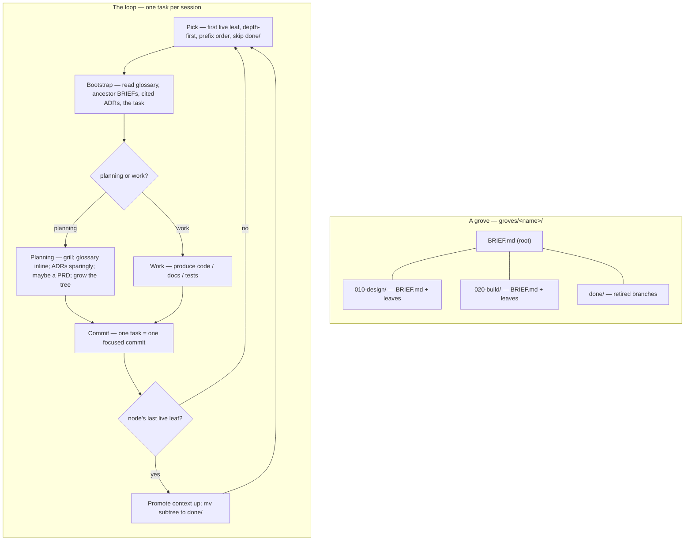

# grove Skill Implementation Plan

> **For agentic workers:** REQUIRED SUB-SKILL: Use superpowers:subagent-driven-development (recommended) or superpowers:executing-plans to implement this plan task-by-task. Steps use checkbox (`- [ ]`) syntax for tracking. Tasks 5–11 additionally require superpowers:writing-skills.

**Goal:** Build `grove` — a Claude Code skill that drives long, multi-session workstreams as a git-tracked, self-extending task tree — authored in `Linkuistics/skills` and materialised into `APIAnyware-MacOS`.

**Architecture:** Three sequential parts in two repos. **Part 1** restructures the existing `Linkuistics/coding-standards` marketplace into `Linkuistics/skills` (rename repo, rename plugin → `linkuistics`, add Apache-2.0). **Part 2** builds the `grove` skill inside that repo: it bundles three convention files from `mattpocock/skills` (MIT), adds grove's own `SKILL.md` + format files, and ships a one-command materialise script. **Part 3** runs that script to materialise grove into `APIAnyware-MacOS` at `.claude/skills/grove/` and records the founding decisions as ADRs.

**Tech Stack:** Markdown (the skill, formats, bundled conventions, ADRs), JSON (Claude Code plugin/marketplace manifests), Bash (the materialise script + its test), `gh` CLI (GitHub repo rename), `git`.

---

## Execution context

**Authoritative spec:** `docs/specs/2026-05-22-grove-skill-design.md` in `APIAnyware-MacOS`. Read it before starting. This plan implements it; on any conflict the spec wins. Decisions D1–D9 in the spec are settled — do not re-litigate them.

**Two repos, two working copies:**

| Part | Repo | Local clone | Branch |
|---|---|---|---|
| 1 + 2 | `Linkuistics/skills` (currently `Linkuistics/coding-standards`) | `/Users/antony/Development/coding-standards` | `grove` |
| 3 | `APIAnyware-MacOS` | `/Users/antony/Development/APIAnyware-MacOS` | `grove-materialise` |

All paths in Parts 1–2 are relative to `/Users/antony/Development/coding-standards`. All paths in Part 3 are relative to `/Users/antony/Development/APIAnyware-MacOS`. Each task names its repo explicitly.

**The local clone keeps its directory name** (`coding-standards`) even after the GitHub repo is renamed — renaming the local directory is cosmetic and optional. Only the `git remote` URL changes (Task 4).

**Skill-authoring discipline.** Tasks 5–11 build the `grove` skill. They follow superpowers:writing-skills: Task 6 is the RED baseline (observe an agent *without* grove), Tasks 7–9 are GREEN (write the skill), Tasks 10–11 are the GREEN test and REFACTOR. Do not write `SKILL.md` before completing Task 6.

**Pinned upstream versions** (verified 2026-05-23):
- `mattpocock/skills` HEAD: `b8be62ffacb0118fa3eaa29a0923c87c8c11985c` (MIT, default branch `main`).
- The three bundled files: `skills/engineering/grill-with-docs/{SKILL.md,CONTEXT-FORMAT.md,ADR-FORMAT.md}` and `skills/productivity/grill-me/SKILL.md`.

---

## File structure

### `Linkuistics/skills` repo — after Parts 1–2

```
.claude-plugin/marketplace.json        modified: marketplace + plugin renamed to linkuistics
LICENSE                                created: Apache-2.0
README.md                              modified: new name, grove row
CHANGELOG.md                           modified: rename + grove entries
install.sh                             modified: new plugin name + path
scripts/
  materialise-grove.sh                 created: the one-command materialise/update tool
  materialise-grove.test.sh            created: bash test for the script
plugins/linkuistics/                   renamed from plugins/coding-standards/
  .claude-plugin/plugin.json           modified: name → linkuistics
  skills/
    coding-style/ … cli-tool-design/   unchanged (8 existing skills)
    grove/                             created — the new skill:
      SKILL.md                         the loop + seven constraints; opens with a mermaid diagram
      BRIEF-FORMAT.md                  the BRIEF.md shape (a guide, not a schema)
      TASK-FORMAT.md                   the task-file shape; the two task kinds
      CONTEXT-FORMAT.md                bundled from mattpocock/skills (glossary format)
      ADR-FORMAT.md                    bundled from mattpocock/skills (ADR format)
      grilling.md                      bundled from mattpocock/skills (grilling procedure)
      LICENSES/
        mattpocock-skills.LICENSE      verbatim upstream MIT licence text
```

`grove/` deliberately contains **no `VERSION.md`** — that file describes a *materialisation event* and is written by the materialise script into the *consuming* repo. The materialise script lives in `scripts/`, **not** inside `grove/`, so it is not part of the materialised footprint.

### `APIAnyware-MacOS` repo — after Part 3

```
.claude/skills/grove/                  created by the materialise script:
  SKILL.md, BRIEF-FORMAT.md, TASK-FORMAT.md,
  CONTEXT-FORMAT.md, ADR-FORMAT.md, grilling.md,
  LICENSES/mattpocock-skills.LICENSE
  VERSION.md                           written fresh by the script — provenance stamp
docs/adr/                              created:
  0001-grove-consumed-by-materialisation.md      D1
  0002-grove-bundles-its-convention-files.md     D2
  0003-grove-authored-in-linkuistics-skills.md   D3
docs/superpowers/plans/2026-05-23-grove-skill.md  this plan
```

Part 3 does **not** create `groves/`, `CONTEXT.md`, or `docs/prd/` — those are produced by grove's *first customer*, the `chez-functional` grove, which is out of scope (spec § "First customer").

---

# Part 1 — Restructure `Linkuistics/coding-standards` → `Linkuistics/skills`

All tasks in this part run in `/Users/antony/Development/coding-standards` on branch `grove`.

## Task 1: Branch the repo and add the Apache-2.0 LICENSE

**Files:**
- Create: `/Users/antony/Development/coding-standards/LICENSE`

- [ ] **Step 1: Confirm the starting state**

Run:
```bash
cd /Users/antony/Development/coding-standards && git status --porcelain && git branch --show-current
```
Expected: no output from `git status` (clean tree); current branch `main`.

- [ ] **Step 2: Create the work branch**

Run:
```bash
cd /Users/antony/Development/coding-standards && git checkout -b grove
```
Expected: `Switched to a new branch 'grove'`.

- [ ] **Step 3: Add the Apache-2.0 LICENSE**

Copy the verbatim Apache-2.0 text from the APIAnyware-MacOS repo (already Apache-2.0 — guarantees an identical, offline-available copy):
```bash
cp /Users/antony/Development/APIAnyware-MacOS/LICENSE /Users/antony/Development/coding-standards/LICENSE
```

- [ ] **Step 4: Verify the LICENSE is the Apache-2.0 text**

Run:
```bash
head -2 /Users/antony/Development/coding-standards/LICENSE
```
Expected: a line containing `Apache License` followed by `Version 2.0, January 2004`.

- [ ] **Step 5: Commit**

```bash
cd /Users/antony/Development/coding-standards
git add LICENSE
git commit -m "chore: add Apache-2.0 licence (grove spec D9)"
```

## Task 2: Rename the plugin `coding-standards` → `linkuistics`

The plugin's name is what gives skills their namespace prefix. Renaming the plugin to `linkuistics` makes every skill resolve as `linkuistics:<skill>`.

**Files:**
- Rename: `plugins/coding-standards/` → `plugins/linkuistics/`
- Modify: `plugins/linkuistics/.claude-plugin/plugin.json`
- Modify: `.claude-plugin/marketplace.json`

- [ ] **Step 1: Rename the plugin directory**

Run:
```bash
cd /Users/antony/Development/coding-standards && git mv plugins/coding-standards plugins/linkuistics
```

- [ ] **Step 2: Rewrite `plugins/linkuistics/.claude-plugin/plugin.json`**

Replace the entire file with:
```json
{
  "$schema": "https://json.schemastore.org/claude-code-plugin-manifest.json",
  "name": "linkuistics",
  "description": "Linkuistics skills — coding standards (universal principles, per-language style guides, CLI design) and grove, a methodology for hierarchical, self-extending workstreams.",
  "author": {
    "name": "Antony Blakey",
    "email": "antony.blakey@gmail.com"
  },
  "repository": "https://github.com/Linkuistics/skills",
  "keywords": [
    "coding-standards",
    "style-guide",
    "rust",
    "python",
    "elixir",
    "typescript",
    "swift",
    "bash",
    "cli-design",
    "grove",
    "workstream",
    "methodology"
  ]
}
```

- [ ] **Step 3: Rewrite `.claude-plugin/marketplace.json`**

Replace the entire file with:
```json
{
  "name": "linkuistics",
  "owner": {
    "name": "Antony Blakey",
    "email": "antony.blakey@gmail.com"
  },
  "plugins": [
    {
      "name": "linkuistics",
      "source": "./plugins/linkuistics",
      "description": "Linkuistics skills: coding standards (universal principles, per-language style guides, CLI design) and grove, a methodology for hierarchical, self-extending workstreams."
    }
  ]
}
```

- [ ] **Step 4: Verify both manifests are valid JSON and the source path resolves**

Run:
```bash
cd /Users/antony/Development/coding-standards
python3 -m json.tool .claude-plugin/marketplace.json >/dev/null && echo "marketplace.json OK"
python3 -m json.tool plugins/linkuistics/.claude-plugin/plugin.json >/dev/null && echo "plugin.json OK"
test -d plugins/linkuistics/skills && echo "source path OK"
```
Expected: three `OK` lines.

- [ ] **Step 5: Commit**

```bash
cd /Users/antony/Development/coding-standards
git add -A
git commit -m "refactor: rename plugin coding-standards -> linkuistics (grove spec D3)"
```

## Task 3: Update `install.sh`, `README.md`, and `CHANGELOG.md`

**Files:**
- Modify: `install.sh`
- Modify: `README.md`
- Modify: `CHANGELOG.md`

- [ ] **Step 1: Update `install.sh`**

Make exactly these three replacements.

Replace the comment line:
```
# Install the coding-standards skills into non-Claude-Code agent harnesses by
```
with:
```
# Install the linkuistics skills into non-Claude-Code agent harnesses by
```

Replace:
```
#   /plugin marketplace add Linkuistics/coding-standards
#   /plugin install coding-standards@linkuistics-standards
```
with:
```
#   /plugin marketplace add Linkuistics/skills
#   /plugin install linkuistics@linkuistics
```

Replace:
```
skills_dir="${repo_root}/plugins/coding-standards/skills"
```
with:
```
skills_dir="${repo_root}/plugins/linkuistics/skills"
```

- [ ] **Step 2: Update `README.md`**

Replace the title line `# coding-standards` with `# skills`.

Replace the body reference `plugins/coding-standards/skills/` (in the "canonical source" sentence) with `plugins/linkuistics/skills/`.

Replace the install block:
```
/plugin marketplace add Linkuistics/coding-standards
/plugin install coding-standards@linkuistics-standards
```
with:
```
/plugin marketplace add Linkuistics/skills
/plugin install linkuistics@linkuistics
```

Replace the clone block:
```
git clone https://github.com/Linkuistics/coding-standards.git
cd coding-standards
```
with:
```
git clone https://github.com/Linkuistics/skills.git
cd skills
```

Replace the editing-instructions reference `plugins/coding-standards/skills/<name>/` with `plugins/linkuistics/skills/<name>/`.

- [ ] **Step 3: Add a CHANGELOG entry**

Under the `## Unreleased` heading in `CHANGELOG.md`, add as the first bullet:
```
- Renamed the repo to `Linkuistics/skills` and the plugin to `linkuistics`
  (namespace `linkuistics:`); added an Apache-2.0 licence.
```

- [ ] **Step 4: Verify no stale plugin-name references remain**

Run:
```bash
cd /Users/antony/Development/coding-standards
grep -rn 'coding-standards' install.sh README.md plugins/ .claude-plugin/ || echo "CLEAN"
```
Expected: `CLEAN`. (The `CHANGELOG.md` entry intentionally still names the old repo as historical context — it is excluded from this grep.)

- [ ] **Step 5: Commit**

```bash
cd /Users/antony/Development/coding-standards
git add install.sh README.md CHANGELOG.md
git commit -m "docs: update install.sh, README, CHANGELOG for the linkuistics rename"
```

## Task 4: Rename the GitHub repo to `Linkuistics/skills`

`gh repo rename` run inside the clone renames the GitHub repo **and** updates the local `origin` remote. GitHub keeps a redirect from the old URL, so this is low-risk and reversible.

**Files:** none (GitHub-side + local remote config).

- [ ] **Step 1: Confirm the target name is free**

Run:
```bash
gh repo view Linkuistics/skills >/dev/null 2>&1 && echo "TAKEN — STOP" || echo "free"
```
Expected: `free`. (Verified free on 2026-05-23. `mattpocock/skills` is a different owner — no conflict.)

- [ ] **Step 2: Rename the repo**

Run:
```bash
cd /Users/antony/Development/coding-standards && gh repo rename skills --yes
```
Expected: confirmation that `Linkuistics/coding-standards` is now `Linkuistics/skills`.

- [ ] **Step 3: Verify the local remote was updated**

Run:
```bash
cd /Users/antony/Development/coding-standards && git remote get-url origin
```
Expected: `https://github.com/Linkuistics/skills.git`. If it still shows `coding-standards`, fix it:
```bash
git remote set-url origin https://github.com/Linkuistics/skills.git
```

- [ ] **Step 4: Push the branch**

```bash
cd /Users/antony/Development/coding-standards && git push -u origin grove
```
Expected: branch `grove` pushed to `Linkuistics/skills`.

---

# Part 2 — Build the `grove` skill

All tasks in this part run in `/Users/antony/Development/coding-standards` on branch `grove`. **REQUIRED SUB-SKILL:** Use superpowers:writing-skills throughout this part.

## Task 5: Bundle the `mattpocock/skills` convention files and `LICENSES/`

grove bundles three convention files so a materialised grove is fully self-contained (spec D2). Each bundled file carries a one-line origin header naming the exact upstream commit; `LICENSES/` holds the verbatim upstream MIT text.

**Files:**
- Create: `plugins/linkuistics/skills/grove/CONTEXT-FORMAT.md`
- Create: `plugins/linkuistics/skills/grove/ADR-FORMAT.md`
- Create: `plugins/linkuistics/skills/grove/grilling.md`
- Create: `plugins/linkuistics/skills/grove/LICENSES/mattpocock-skills.LICENSE`

- [ ] **Step 1: Create the grove directory**

Run:
```bash
cd /Users/antony/Development/coding-standards
mkdir -p plugins/linkuistics/skills/grove/LICENSES
```

- [ ] **Step 2: Fetch the three convention files at the pinned commit**

Run (writes the raw upstream content into the grove directory):
```bash
cd /Users/antony/Development/coding-standards/plugins/linkuistics/skills/grove
SHA=b8be62ffacb0118fa3eaa29a0923c87c8c11985c
gh api "repos/mattpocock/skills/contents/skills/engineering/grill-with-docs/CONTEXT-FORMAT.md?ref=$SHA" --jq '.content' | base64 -d > CONTEXT-FORMAT.md
gh api "repos/mattpocock/skills/contents/skills/engineering/grill-with-docs/ADR-FORMAT.md?ref=$SHA"      --jq '.content' | base64 -d > ADR-FORMAT.md
gh api "repos/mattpocock/skills/contents/skills/engineering/grill-with-docs/SKILL.md?ref=$SHA"           --jq '.content' | base64 -d > grilling.md
gh api "repos/mattpocock/skills/contents/LICENSE?ref=$SHA"                                               --jq '.content' | base64 -d > LICENSES/mattpocock-skills.LICENSE
```

- [ ] **Step 3: Prepend the origin header to `CONTEXT-FORMAT.md`**

Insert this as the new first line of `plugins/linkuistics/skills/grove/CONTEXT-FORMAT.md`:
```
<!-- bundled in grove from mattpocock/skills@b8be62ffacb0118fa3eaa29a0923c87c8c11985c — MIT licensed; see LICENSES/mattpocock-skills.LICENSE -->
```

- [ ] **Step 4: Prepend the origin header to `ADR-FORMAT.md`**

Insert this as the new first line of `plugins/linkuistics/skills/grove/ADR-FORMAT.md`:
```
<!-- bundled in grove from mattpocock/skills@b8be62ffacb0118fa3eaa29a0923c87c8c11985c — MIT licensed; see LICENSES/mattpocock-skills.LICENSE -->
```

- [ ] **Step 5: Adapt `grilling.md`**

`grilling.md` is sourced from `grill-with-docs/SKILL.md`. It is a *reference file* inside grove, not a standalone skill, so strip its YAML frontmatter (the `---` … `---` block at the top) and give it a title. The procedure is the same one grove's planning tasks use; `mattpocock/skills`' `grill-me` skill is the terser sibling of the same procedure and is cited as a secondary source.

Replace the YAML frontmatter block at the top of `plugins/linkuistics/skills/grove/grilling.md` (everything from the opening `---` through the closing `---`, inclusive) with:
```
<!-- bundled in grove from mattpocock/skills@b8be62ffacb0118fa3eaa29a0923c87c8c11985c (skills/engineering/grill-with-docs/SKILL.md, with skills/productivity/grill-me/SKILL.md as the terser variant) — MIT licensed; see LICENSES/mattpocock-skills.LICENSE -->

# Grilling — the planning-task interrogation procedure
```

Leave the rest of the file unchanged. Its internal links `[CONTEXT-FORMAT.md](./CONTEXT-FORMAT.md)` and `[ADR-FORMAT.md](./ADR-FORMAT.md)` stay valid — grove bundles both as siblings.

- [ ] **Step 6: Verify the bundle**

Run:
```bash
cd /Users/antony/Development/coding-standards/plugins/linkuistics/skills/grove
for f in CONTEXT-FORMAT.md ADR-FORMAT.md grilling.md; do
  head -1 "$f" | grep -q 'mattpocock/skills@b8be62' && echo "$f header OK" || echo "$f HEADER MISSING"
done
head -1 LICENSES/mattpocock-skills.LICENSE | grep -q 'MIT License' && echo "LICENSE OK" || echo "LICENSE MISSING"
grep -q '^# Grilling' grilling.md && echo "grilling.md title OK" || echo "grilling.md TITLE MISSING"
```
Expected: five `OK` lines, no `MISSING`.

- [ ] **Step 7: Commit**

```bash
cd /Users/antony/Development/coding-standards
git add plugins/linkuistics/skills/grove/
git commit -m "feat(grove): bundle mattpocock/skills conventions + upstream MIT licence"
```

## Task 6: RED — baseline a fresh agent *without* the grove skill

writing-skills' Iron Law: observe the failure before writing the skill. Build a tiny fixture grove, hand it to a subagent with no methodology, and document exactly how it flails. This is a *technique-skill application test* (per writing-skills): the failure mode is "no consistent loop," not a discipline violation.

**Files:**
- Create (throwaway, not committed): `/tmp/grove-dryrun/repo/` — a fixture repo reused by Task 10.
- Create (notes, not committed): `/tmp/grove-dryrun/baseline-notes.md`

- [ ] **Step 1: Build the fixture grove**

Run:
```bash
rm -rf /tmp/grove-dryrun && mkdir -p /tmp/grove-dryrun/repo/groves/demo
cd /tmp/grove-dryrun/repo && git init -q && git config user.email t@t && git config user.name t
```

Create `/tmp/grove-dryrun/repo/CONTEXT.md`:
```markdown
# CONTEXT — glossary

- **grove** — one workstream, driven as a tree of task files under `groves/<name>/`.
- **leaf** — a single `.md` task file; one leaf is one session.
```

Create `/tmp/grove-dryrun/repo/groves/demo/BRIEF.md`:
```markdown
# demo — brief

## Goal
A throwaway grove to exercise the loop end to end.

## Done when
Both child leaves are complete and retired to `done/`.

## Decomposition
- `010-seed-glossary` (planning) seeds vocabulary before any work begins.
- `020-write-hello` (work) produces the deliverable.
```

Create `/tmp/grove-dryrun/repo/groves/demo/010-seed-glossary.md`:
```markdown
# 010-seed-glossary

**Kind:** planning

## Goal
Add one glossary term, `salutation`, to `CONTEXT.md`.

## Done when
`CONTEXT.md` defines `salutation` in one terse sentence.
```

Create `/tmp/grove-dryrun/repo/groves/demo/020-write-hello.md`:
```markdown
# 020-write-hello

**Kind:** work

## Goal
Create `hello.txt` containing one salutation line.

## Done when
`hello.txt` exists with a single line of greeting text.
```

Then commit the fixture so Task 10 can reset to it:
```bash
cd /tmp/grove-dryrun/repo && git add -A && git commit -q -m "fixture: demo grove"
```

- [ ] **Step 2: Dispatch a baseline subagent (no grove skill)**

Dispatch a `general-purpose` subagent with exactly this prompt — and **nothing about grove, the loop, or the format files**:

> The repo at `/tmp/grove-dryrun/repo` has a `groves/demo/` folder of markdown files. Continue this workstream — do the next piece of work. Report what you picked, why, what you read first, what you produced, and whether you changed the folder's structure afterward.

- [ ] **Step 3: Record the baseline behaviour verbatim**

Write the subagent's report into `/tmp/grove-dryrun/baseline-notes.md`. Capture specifically: Did it pick `010-` before `020-`, or guess? Did it read `BRIEF.md` and `CONTEXT.md` first, or dive straight in? Did it commit one focused commit? Did it do anything to retire the finished leaf? Did it reuse the glossary term or coin a new one?

Expected RED outcome: no consistent pick order, no brief-chain bootstrap, no retire step, no one-task-one-commit discipline. These gaps are what `SKILL.md` (Task 9) must close. **Do not commit anything in `/tmp/grove-dryrun`.**

## Task 7: Write `BRIEF-FORMAT.md`

**Files:**
- Create: `plugins/linkuistics/skills/grove/BRIEF-FORMAT.md`

- [ ] **Step 1: Write the file**

Create `plugins/linkuistics/skills/grove/BRIEF-FORMAT.md` with exactly:
````markdown
<!-- grove reference file — the BRIEF.md shape -->

# BRIEF-FORMAT — the node briefing

Every node directory in a grove carries a `BRIEF.md`. It is **process
scaffolding** — neither the glossary (`CONTEXT.md`) nor a decision log
(`docs/adr/`). It exists so that a session executing a leaf can read *three*
ADRs, not fifty: the brief chain, root→leaf, is the curated path into the
project's documented decisions.

A `BRIEF.md` is written by the planning task that creates its node, and is
retired (moved into `done/`) together with its subtree.

## Suggested shape

A guide, not a schema (constraint 3). Nothing validates a brief; nothing breaks
if a section is missing, reordered, or renamed. Include a section only when it
earns its place (constraint 4).

```markdown
# <node name> — brief

## Goal
One or two sentences: what this subtree delivers, and why.

## Done when
The done-criteria rollup for the subtree — the conditions under which every
child is complete and the node retires.

## Decomposition
Why this node is split the way it is, and what the numeric child ordering
encodes (dependencies, natural sequence). One line per child is enough.

## Pointers
- ADRs a session here must read: docs/adr/NNNN-*.md, …
- Glossary terms in play: <term>, <term> (see CONTEXT.md)
- Design specs: docs/specs/*-design.md

## Notes
Anything a session needs that is not yet an ADR or a glossary entry. On
retirement, anything still live here is promoted upward (see SKILL.md, "Retire").
```

## Briefs inherit

A session reads the **whole brief chain**, root→leaf. A child brief states only
what is *new* at its level — it does not repeat the parent. Pointers accumulate
down the chain.
````

- [ ] **Step 2: Verify**

Run:
```bash
cd /Users/antony/Development/coding-standards
grep -q '^# BRIEF-FORMAT' plugins/linkuistics/skills/grove/BRIEF-FORMAT.md && echo OK
```
Expected: `OK`.

- [ ] **Step 3: Commit**

```bash
cd /Users/antony/Development/coding-standards
git add plugins/linkuistics/skills/grove/BRIEF-FORMAT.md
git commit -m "feat(grove): add BRIEF-FORMAT.md"
```

## Task 8: Write `TASK-FORMAT.md`

**Files:**
- Create: `plugins/linkuistics/skills/grove/TASK-FORMAT.md`

- [ ] **Step 1: Write the file**

Create `plugins/linkuistics/skills/grove/TASK-FORMAT.md` with exactly:
````markdown
<!-- grove reference file — the task-file shape -->

# TASK-FORMAT — the leaf task file

A **leaf** in a grove is a single `.md` task file, named with a numeric prefix
in tens (`010-`, `020-`, …). One task is one session (constraint: one task per
session). The file is freeform markdown — a guide follows, not a schema.

## The two kinds

Every task file states its **kind**. There are two:

- **work** — produces code, docs, or tests. The deliverable is an artifact.
- **planning** — grills, sharpens the glossary, may raise an ADR or a PRD, and
  **grows the tree**: replaces an oversized leaf with a node directory of child
  briefs and ordered leaves. The deliverable is *more tree*.

A task too big for one focused session *is* a planning task — its job is to
decompose, not to do.

## Suggested shape

```markdown
# <NNN-task-name>

**Kind:** work          (or: planning)

## Goal
What this one session must deliver.

## Context
Pointers *beyond* the brief chain — specific files, prior leaves, ADRs — that
this task in particular needs. The brief chain and glossary are read anyway;
list only the extras.

## Done when
Concrete, checkable completion conditions for this task.

## Notes
Anything else the executing session should know.
```

## Planning tasks — extra guidance

A planning task additionally:

- runs the grilling procedure (`grilling.md`) to interrogate the design;
- updates `CONTEXT.md` **inline** as terms are resolved — never batched;
- raises ADRs **sparingly** — only decisions hard to reverse, surprising, or a
  real trade-off (`ADR-FORMAT.md`);
- MAY write a PRD (`docs/prd/`) when the increment is a genuine agreement point;
- writes the child `BRIEF.md`(s) and ordered leaf files for any node it grows
  (`BRIEF-FORMAT.md`).
````

- [ ] **Step 2: Verify**

Run:
```bash
cd /Users/antony/Development/coding-standards
grep -q '^# TASK-FORMAT' plugins/linkuistics/skills/grove/TASK-FORMAT.md && echo OK
```
Expected: `OK`.

- [ ] **Step 3: Commit**

```bash
cd /Users/antony/Development/coding-standards
git add plugins/linkuistics/skills/grove/TASK-FORMAT.md
git commit -m "feat(grove): add TASK-FORMAT.md"
```

## Task 9: Write `SKILL.md` — the loop and the seven constraints

This is grove itself. `SKILL.md` opens with a mermaid diagram (spec § "The grove skill's own files"); the core loop fits on a page (constraint 7); the `description` frontmatter gives *triggering conditions only*, no workflow summary (writing-skills CSO rule).

**Files:**
- Create: `plugins/linkuistics/skills/grove/SKILL.md`

- [ ] **Step 1: Write the file**

Create `plugins/linkuistics/skills/grove/SKILL.md` with exactly:
````markdown
---
name: grove
description: Use when driving a long, multi-session workstream that cannot be planned exhaustively upfront — work spanning many sessions and months where some steps are themselves planning steps — or when picking up or continuing a task tree under groves/.
---

# grove — hierarchical, self-extending workstreams

A **grove** is one workstream driven as a git-tracked **tree of task files**,
one task per session. Planning tasks grow the tree as understanding deepens;
completed branches retire to an archive. The tree's shape — what `ls` shows —
is the only state; git is the history.



## The spine — seven constraints

grove drives long work *without* becoming brittle, constraining machinery.
These seven rules are non-negotiable; everything below is subordinate to them.

1. **Artifacts, not state.** No phase file, no session log, no status file.
   What `ls` shows is the only state; git is the history.
2. **Read, don't run.** A session bootstraps by *reading markdown* — no script
   must succeed before work begins. (Materialising or updating grove itself is
   a separate maintenance action and may use a script — see `VERSION.md`.)
3. **Suggested shape, not enforced schema.** Task files and briefs are freeform
   markdown. The format files are guides; nothing validates them.
4. **Lazy and optional.** Every artifact — brief, ADR, PRD, glossary entry — is
   created only when it earns its place, never because a step demands it.
5. **grove guides, it does not gate.** grove never refuses to proceed. A task
   may be done by hand, reordered, or skipped.
6. **Walk-away-able.** Delete this skill and `groves/` is still a legible
   folder of notes; every durable output is standard, team-readable markdown.
7. **One page of rules.** If the loop below does not fit on a page, it is too
   complex — cut until it does.

## The loop

One task is one session.

**Pick.** From the grove root, depth-first in numeric-prefix order, skipping
`done/`: descend into directories; the first `.md` leaf reached is the next
task.

**Bootstrap.** Read, in order: the glossary (`CONTEXT.md`, or the relevant
bounded context via `CONTEXT-MAP.md`); the ADRs cited by the briefs; the
`BRIEF.md` chain root→leaf; the task file. That assembled context is the
session's entire mandate — read nothing else by reflex.

**Execute.** The task file states its kind (`TASK-FORMAT.md`):
- A **work task** produces code, docs, or tests.
- A **planning task** grills (`grilling.md`), updates `CONTEXT.md` *inline* as
  terms resolve, raises ADRs *sparingly* (`ADR-FORMAT.md`), MAY write a PRD at a
  genuine agreement point, and **grows the tree**.

**Decompose.** When a leaf is too big for one focused session, a planning task
replaces the leaf `NNN-x.md` with a node `NNN-x/` holding a `BRIEF.md`
(`BRIEF-FORMAT.md`) and ordered child leaves — lazily, only when needed.

**Commit.** One task = one focused commit.

**Retire.** When a node's last live leaf completes, promote anything still
relevant from its `BRIEF.md` upward — to the parent brief, an ADR, or the
glossary — then `mv` the node into `groves/<name>/done/`, preserving its
relative path. Archived, never deleted.

## Artifacts

Only the task tree is grove-specific and ephemeral. Everything else is a
standard artifact that outlives grove (constraint 6).

| Artifact | Path | Role |
|---|---|---|
| Glossary | `CONTEXT.md` (+ `CONTEXT-MAP.md`) | the Ubiquitous Language — read every session, appended inline |
| ADRs | `docs/adr/NNNN-*.md` | atomic decisions: hard to reverse, surprising, or a real trade-off |
| PRDs | `docs/prd/` | human-facing agreement checkpoints; committed, never retired |
| Design specs | `docs/specs/*-design.md` | workstream-level technical design |
| Task tree | `groves/<name>/` | the process: the self-extending decomposition of work |

**The glossary is load-bearing.** The acute failure mode of multi-session work
is terminology drift: a later session, with no memory of an earlier one,
reinvents its term under a new name or reuses the words with a shifted meaning.
`CONTEXT.md`, read every session and appended *inline* whenever a term is
resolved, is the forcing function against that. Keep it a glossary and nothing
else — terse definitions, aliases-to-avoid, no implementation detail
(`CONTEXT-FORMAT.md`).

**Briefs vs. the glossary.** A bounded context is a *domain* partition; a
task-tree node is a *process* partition. They are orthogonal axes. The glossary
is per-bounded-context; a node carries a `BRIEF.md`, not a glossary.

## PRDs

A **PRD** is the human-facing, team-shareable face of a planning increment,
produced lazily by a planning task *when the increment is a genuine agreement
point*. The flow there: grill → PRD (review & agree) → decompose → execute.
PRDs live in `docs/prd/`, are committed, and are never retired.

## Reference files

- `BRIEF-FORMAT.md` — the `BRIEF.md` shape.
- `TASK-FORMAT.md` — the task-file shape and the two task kinds.
- `CONTEXT-FORMAT.md` — the glossary format (bundled from `mattpocock/skills`).
- `ADR-FORMAT.md` — the ADR format (bundled from `mattpocock/skills`).
- `grilling.md` — the grilling procedure for planning tasks (bundled).
- `VERSION.md` — which grove version this is and how to update it (present only
  in a materialised copy; written by the materialise script).
````

- [ ] **Step 2: Verify structure and the one-page constraint**

Run:
```bash
cd /Users/antony/Development/coding-standards/plugins/linkuistics/skills/grove
grep -q '^name: grove$' SKILL.md && echo "frontmatter name OK"
grep -q '```mermaid' SKILL.md && echo "mermaid diagram OK"
awk '/^## The loop$/{f=1} f{n++} /^## Artifacts$/{print "loop section lines: " n; exit}' SKILL.md
```
Expected: `frontmatter name OK`, `mermaid diagram OK`, and a loop-section line count under ~55 (a page). If the loop section is longer, cut until it fits (constraint 7).

- [ ] **Step 3: Verify the `description` carries no workflow summary**

Read the `description:` line. Confirm it states *only* triggering conditions ("Use when…") and does **not** summarise the loop's steps (pick/bootstrap/execute). A description that summarises the workflow causes agents to follow the description instead of reading the skill (writing-skills CSO). Fix if needed.

- [ ] **Step 4: Commit**

```bash
cd /Users/antony/Development/coding-standards
git add plugins/linkuistics/skills/grove/SKILL.md
git commit -m "feat(grove): add SKILL.md — the loop and the seven constraints"
```

## Task 10: GREEN — dry-run a fresh agent *with* the grove skill

The spec's headline success criterion: "a fresh `groves/<name>/` with a root `BRIEF.md` and one leaf task can be picked, bootstrapped, and executed *by reading alone*." This task verifies it against the same fixture from Task 6.

**Files:** none committed (uses the `/tmp/grove-dryrun` fixture).

- [ ] **Step 1: Reset the fixture to its committed state**

Run:
```bash
cd /tmp/grove-dryrun/repo && git clean -fdq && git checkout -q .
```
Expected: the fixture is back to exactly the two leaves under `groves/demo/`.

- [ ] **Step 2: Stage the grove skill files for the subagent**

The subagent must reach the skill *by reading files*, not via plugin installation. Copy the grove skill into the fixture repo as a project skill:
```bash
mkdir -p /tmp/grove-dryrun/repo/.claude/skills/grove
cp -R /Users/antony/Development/coding-standards/plugins/linkuistics/skills/grove/. /tmp/grove-dryrun/repo/.claude/skills/grove/
```

- [ ] **Step 3: Dispatch a fresh GREEN subagent**

Dispatch a `general-purpose` subagent with exactly this prompt:

> The repo at `/tmp/grove-dryrun/repo` carries the `grove` skill at `.claude/skills/grove/SKILL.md`. Read that skill, then do the next task in `groves/demo/` exactly as grove prescribes. Report, step by step: which leaf you picked and why; what you read during bootstrap and in what order; what you produced; the commit you made; and whether and how the node's state changed afterward.

- [ ] **Step 4: Score the run against the loop**

The run is GREEN if **all** of these hold:
- Picked `010-seed-glossary.md` first — depth-first, lowest numeric prefix.
- Bootstrapped by reading `CONTEXT.md`, then `groves/demo/BRIEF.md`, then the task file — before acting.
- Executed the planning task: appended `salutation` to `CONTEXT.md` *inline*.
- Made one focused commit.
- Correctly judged retirement: `020-` is still live, so the `demo` node is **not** retired.

Record the result in `/tmp/grove-dryrun/green-notes.md`. If every point holds, proceed to Task 11 (it still runs — it confirms there are no loopholes). If any point fails, Task 11 fixes it.

## Task 11: REFACTOR — close loopholes found in the dry-run

writing-skills' REFACTOR phase: turn every gap or rationalization from Task 10 into an explicit fix in `SKILL.md`, then re-verify.

**Files:**
- Modify (only if Task 10 found gaps): `plugins/linkuistics/skills/grove/SKILL.md`

- [ ] **Step 1: List the gaps**

From `/tmp/grove-dryrun/green-notes.md`, list every loop point the subagent got wrong, skipped, or rationalized around. If Task 10 was fully GREEN, write "no gaps" and skip to Step 4.

- [ ] **Step 2: Fix `SKILL.md`**

For each gap, make the smallest `SKILL.md` change that closes it — sharpen the wording of the relevant loop step, or add a one-line clarification. Do **not** add machinery or new sections; constraint 7 (one-page loop) still binds. Keep the loop section under ~55 lines.

- [ ] **Step 3: Re-run the dry-run**

Repeat Task 10 Steps 1–4 with a *fresh* subagent. Repeat Steps 1–3 here until the run is fully GREEN.

- [ ] **Step 4: Commit (only if `SKILL.md` changed) and clean up**

```bash
cd /Users/antony/Development/coding-standards
git diff --quiet plugins/linkuistics/skills/grove/SKILL.md || \
  git commit -m "fix(grove): close loop loopholes found in dry-run" plugins/linkuistics/skills/grove/SKILL.md
rm -rf /tmp/grove-dryrun
```

## Task 12: Write and test the materialise script

The script copies `grove/` into a consuming repo's `.claude/skills/grove/` and writes `VERSION.md` — the provenance stamp (spec § "Consuming and versioning grove"). It uses `git archive` so any ref can be materialised without disturbing the source working tree. This task is real bash TDD: write the test, watch it fail, write the script, watch it pass.

**Files:**
- Create: `scripts/materialise-grove.test.sh`
- Create: `scripts/materialise-grove.sh`

- [ ] **Step 1: Write the failing test**

Create `/Users/antony/Development/coding-standards/scripts/materialise-grove.test.sh`:
```bash
#!/usr/bin/env bash
# Test for materialise-grove.sh — materialises grove into a throwaway repo
# and asserts the footprint and VERSION.md stamp.
set -euo pipefail
fail() { echo "FAIL: $*" >&2; exit 1; }

src_repo="$(cd "$(dirname "${BASH_SOURCE[0]}")/.." && pwd)"
tmp="$(mktemp -d)"
trap 'rm -rf "$tmp"' EXIT

# A throwaway target repo.
git -C "$tmp" init -q
git -C "$tmp" config user.email t@t
git -C "$tmp" config user.name t
git -C "$tmp" commit -q --allow-empty -m init

"$src_repo/scripts/materialise-grove.sh" "$tmp"

dest="$tmp/.claude/skills/grove"
for f in SKILL.md BRIEF-FORMAT.md TASK-FORMAT.md CONTEXT-FORMAT.md \
         ADR-FORMAT.md grilling.md VERSION.md; do
  [[ -f "$dest/$f" ]] || fail "missing $f"
done
[[ -f "$dest/LICENSES/mattpocock-skills.LICENSE" ]] || fail "missing bundled LICENSE"

grep -q 'Linkuistics/skills@'  "$dest/VERSION.md" || fail "VERSION.md missing grove source sha"
grep -q 'mattpocock/skills@'   "$dest/VERSION.md" || fail "VERSION.md missing mattpocock sha"

diff -q "$src_repo/plugins/linkuistics/skills/grove/SKILL.md" "$dest/SKILL.md" >/dev/null \
  || fail "materialised SKILL.md differs from source"

# Re-running (the update path) must succeed and stay clean.
"$src_repo/scripts/materialise-grove.sh" "$tmp"
[[ -f "$dest/SKILL.md" ]] || fail "re-run lost SKILL.md"

echo "PASS"
```

- [ ] **Step 2: Run the test to verify it fails**

Run:
```bash
cd /Users/antony/Development/coding-standards && bash scripts/materialise-grove.test.sh
```
Expected: FAIL — `scripts/materialise-grove.sh` does not exist yet (`No such file or directory`).

- [ ] **Step 3: Write the materialise script**

Create `/Users/antony/Development/coding-standards/scripts/materialise-grove.sh`:
```bash
#!/usr/bin/env bash
# materialise-grove — copy the grove skill into a target repo's .claude/skills/
# and stamp VERSION.md. Run from anywhere inside a Linkuistics/skills clone.
#
#   materialise-grove.sh <target-repo> [<ref>]
#
#   <target-repo>  path to the consuming project's repo root
#   <ref>          Linkuistics/skills commit/branch/tag to materialise
#                  (default: HEAD)
#
# Updating grove later is the same command again; the diff is plain files,
# which the consuming project reviews and commits.
set -euo pipefail

die() { echo "materialise-grove: $*" >&2; exit 1; }

target="${1:-}"
ref="${2:-HEAD}"
[[ -n "$target" ]] || die "usage: materialise-grove.sh <target-repo> [<ref>]"
[[ -d "$target/.git" ]] || die "not a git repo: $target"

# The Linkuistics/skills clone this script lives in.
src_repo="$(git -C "$(dirname "${BASH_SOURCE[0]}")" rev-parse --show-toplevel)"
grove_path="plugins/linkuistics/skills/grove"

git -C "$src_repo" rev-parse -q --verify "${ref}^{commit}" >/dev/null \
  || die "unknown ref in $src_repo: $ref"
git -C "$src_repo" ls-tree "$ref" -- "$grove_path" | grep -q . \
  || die "$grove_path not found at $ref"

skills_sha="$(git -C "$src_repo" rev-parse --short "$ref")"
dest="$target/.claude/skills/grove"

# Extract grove/ at the chosen ref straight into the target — no working-tree
# churn in the source clone. strip-components=4 drops the four leading path
# components plugins/linkuistics/skills/grove.
rm -rf "$dest"
mkdir -p "$dest"
git -C "$src_repo" archive "$ref" -- "$grove_path" \
  | tar -x -C "$dest" --strip-components=4

# The mattpocock/skills source commit is recorded in the bundled file headers
# (single source of truth — see Task 5).
matt_sha="$(grep -ohm1 'mattpocock/skills@[0-9a-f]\{7,\}' "$dest"/*.md \
            | head -1 | cut -d@ -f2 || true)"
[[ -n "$matt_sha" ]] || matt_sha="(not recorded)"

cat > "$dest/VERSION.md" <<EOF
# grove — materialised version

A materialised copy of the \`grove\` skill: plain files committed in this repo.
This file records where the copy came from and how to refresh it.

| | |
|---|---|
| grove source | \`Linkuistics/skills@${skills_sha}\` |
| bundled conventions | \`mattpocock/skills@${matt_sha}\` |
| materialised on | $(date +%Y-%m-%d) |
| materialised into | \`.claude/skills/grove/\` |

## Updating

From a \`Linkuistics/skills\` clone, checked out at the ref you want to pin:

\`\`\`
scripts/materialise-grove.sh <path-to-this-repo> [<ref>]
\`\`\`

Review the resulting diff and commit it. By discipline, record the bump in an
ADR (\`docs/adr/\`).
EOF

echo "materialise-grove: wrote $dest (Linkuistics/skills@${skills_sha})"
```

Make both scripts executable:
```bash
cd /Users/antony/Development/coding-standards && chmod +x scripts/materialise-grove.sh scripts/materialise-grove.test.sh
```

- [ ] **Step 4: Run the test to verify it passes**

Run:
```bash
cd /Users/antony/Development/coding-standards && bash scripts/materialise-grove.test.sh
```
Expected: `PASS`.

- [ ] **Step 5: Commit**

```bash
cd /Users/antony/Development/coding-standards
git add scripts/materialise-grove.sh scripts/materialise-grove.test.sh
git commit -m "feat(grove): add the materialise-grove script + test"
```

## Task 13: Update `README.md` and `CHANGELOG.md` for grove

**Files:**
- Modify: `README.md`
- Modify: `CHANGELOG.md`

- [ ] **Step 1: Add a `grove` row to the README skills table**

In `README.md`, in the `## What's here` table, add this row immediately below the `cli-tool-design` row:
```
| `grove` | by description; materialised per repo | methodology for long, multi-session workstreams — see `skills/grove/SKILL.md` |
```

- [ ] **Step 2: Add a grove section to the README**

In `README.md`, immediately before the editing-instructions section near the end of the file, add:
```markdown
## grove — materialised, not installed

`grove` is a workstream methodology. Unlike the coding-style skills, a project
consuming it for serious work does not install the plugin — it **materialises**
grove into its own repo so the methodology version is pinned by the project's
own git history:

    scripts/materialise-grove.sh <path-to-consuming-repo> [<ref>]

This copies `grove/` into the consuming repo's `.claude/skills/grove/` and
writes a `VERSION.md` provenance stamp. Updating is the same command again.
```

- [ ] **Step 3: Extend the CHANGELOG**

Under `## Unreleased` in `CHANGELOG.md`, add these bullets after the rename bullet from Task 3:
```
- Added the `grove` skill — a methodology for hierarchical, self-extending,
  git-tracked task-tree workstreams. Bundles three convention files from
  `mattpocock/skills` (MIT); upstream licence in `grove/LICENSES/`.
- Added `scripts/materialise-grove.sh` — copies grove into a consuming repo
  and stamps `VERSION.md`.
```

- [ ] **Step 4: Verify**

Run:
```bash
cd /Users/antony/Development/coding-standards
grep -q '`grove`' README.md && grep -q 'materialise-grove' README.md && echo "README OK"
grep -q 'grove' CHANGELOG.md && echo "CHANGELOG OK"
```
Expected: `README OK` and `CHANGELOG OK`.

- [ ] **Step 5: Commit, push, and open the PR**

```bash
cd /Users/antony/Development/coding-standards
git add README.md CHANGELOG.md
git commit -m "docs: document grove in README and CHANGELOG"
git push
gh pr create --title "Restructure to Linkuistics/skills and add the grove skill" \
  --body "Implements docs/specs/2026-05-22-grove-skill-design.md (Parts 1-2): renames the repo/plugin to linkuistics, adds Apache-2.0, and adds the grove workstream-methodology skill with a bundled mattpocock/skills convention set and a materialise script."
```

- [ ] **Step 6: Merge the PR**

After review, merge to `main`:
```bash
cd /Users/antony/Development/coding-standards
gh pr merge --squash --delete-branch
git checkout main && git pull
```
Expected: `main` now contains the `linkuistics` plugin and the `grove` skill.

---

# Part 3 — Materialise grove into `APIAnyware-MacOS`

All tasks in this part run in `/Users/antony/Development/APIAnyware-MacOS` on branch `grove-materialise`.

## Task 14: Materialise grove into `.claude/skills/grove/`

**Files:**
- Create (via the script): `.claude/skills/grove/` — seven files plus `LICENSES/` and `VERSION.md`.

- [ ] **Step 1: Branch APIAnyware-MacOS**

Run:
```bash
cd /Users/antony/Development/APIAnyware-MacOS && git checkout -b grove-materialise
```
Expected: `Switched to a new branch 'grove-materialise'`.

- [ ] **Step 2: Run the materialise script**

From the `Linkuistics/skills` clone (on `main` after Task 13):
```bash
cd /Users/antony/Development/coding-standards && git checkout main && git pull
scripts/materialise-grove.sh /Users/antony/Development/APIAnyware-MacOS
```
Expected: `materialise-grove: wrote /Users/antony/Development/APIAnyware-MacOS/.claude/skills/grove (Linkuistics/skills@<sha>)`.

- [ ] **Step 3: Verify the materialised footprint**

Run:
```bash
cd /Users/antony/Development/APIAnyware-MacOS
for f in SKILL.md BRIEF-FORMAT.md TASK-FORMAT.md CONTEXT-FORMAT.md ADR-FORMAT.md grilling.md VERSION.md; do
  test -f .claude/skills/grove/$f && echo "$f OK" || echo "$f MISSING"
done
test -f .claude/skills/grove/LICENSES/mattpocock-skills.LICENSE && echo "LICENSE OK"
```
Expected: eight `OK` lines, no `MISSING`.

- [ ] **Step 4: Verify `VERSION.md` is legible and complete**

Run:
```bash
cat /Users/antony/Development/APIAnyware-MacOS/.claude/skills/grove/VERSION.md
```
Expected: a table naming `Linkuistics/skills@<sha>`, `mattpocock/skills@<sha>`, today's date (`2026-05-23`), and an `## Updating` section with the one-command update instruction. Confirm neither sha reads `(not recorded)`.

- [ ] **Step 5: Verify the materialised `SKILL.md` matches source**

Run:
```bash
diff -q /Users/antony/Development/coding-standards/plugins/linkuistics/skills/grove/SKILL.md \
        /Users/antony/Development/APIAnyware-MacOS/.claude/skills/grove/SKILL.md \
  && echo "SKILL.md identical to source"
```
Expected: `SKILL.md identical to source`.

- [ ] **Step 6: Commit**

```bash
cd /Users/antony/Development/APIAnyware-MacOS
git add .claude/skills/grove
git commit -m "feat: materialise the grove skill into .claude/skills/grove/"
```

## Task 15: Record D1–D3 as ADRs, commit the plan, and open the PR

The spec states D1–D3 "become the first ADRs once `docs/adr/` is established," and grove's own materialisation discipline is to "record the bump in an ADR." This task establishes `docs/adr/` with grove's three founding decisions, using the ADR format grove just bundled.

**Files:**
- Create: `docs/adr/0001-grove-consumed-by-materialisation.md`
- Create: `docs/adr/0002-grove-bundles-its-convention-files.md`
- Create: `docs/adr/0003-grove-authored-in-linkuistics-skills.md`

- [ ] **Step 1: Create `docs/adr/0001-grove-consumed-by-materialisation.md`**

```markdown
# grove is consumed by materialisation into this repo, not as a shared plugin

The `grove` workstream methodology is copied into this repo at
`.claude/skills/grove/` and committed, rather than installed as a global Claude
Code plugin. A global plugin is one version per machine and cannot give many
concurrent, long-lived workstreams independent, reproducible version pins; a
committed copy pins the methodology to this repo's own git history, isolated
per repo. The trade-off is a per-repo copy to maintain — `.claude/skills/grove/
VERSION.md` records the upstream correspondence and the one-command update.

See `docs/specs/2026-05-22-grove-skill-design.md` (decision D1).
```

- [ ] **Step 2: Create `docs/adr/0002-grove-bundles-its-convention-files.md`**

```markdown
# grove bundles its convention files rather than depending on them

grove's `CONTEXT-FORMAT.md`, `ADR-FORMAT.md`, and `grilling.md` are copied in
from `mattpocock/skills` (MIT) — with origin headers and the upstream licence
in `LICENSES/` — rather than depended on as a separately-installed plugin. This
follows directly from materialisation (ADR-0001): a materialised, git-pinned
grove must be self-contained and reproducible, and cannot reach a live,
separately-versioned plugin. `mattpocock/skills` is a recorded *source*,
refreshed deliberately when a new grove version is cut.

See `docs/specs/2026-05-22-grove-skill-design.md` (decision D2).
```

- [ ] **Step 3: Create `docs/adr/0003-grove-authored-in-linkuistics-skills.md`**

```markdown
# grove is authored in Linkuistics/skills under the linkuistics namespace

grove's upstream home is `github.com/Linkuistics/skills` — a Claude Code
marketplace whose single plugin, `linkuistics`, gives every Linkuistics skill
the `linkuistics:` namespace. That repo is the generalisation of the former
`Linkuistics/coding-standards`; the existing `coding-style` and related skills
moved under it, and it adopted an Apache-2.0 licence. Authoring grove in a
shared, versioned, permissively-licensed repo — not inside this project — is
what makes materialisation (ADR-0001) and independent per-project version pins
possible.

See `docs/specs/2026-05-22-grove-skill-design.md` (decision D3).
```

- [ ] **Step 4: Verify the ADRs against the bundled `ADR-FORMAT.md`**

Run:
```bash
cd /Users/antony/Development/APIAnyware-MacOS
ls docs/adr/000{1,2,3}-*.md
head -1 docs/adr/0001-grove-consumed-by-materialisation.md
```
Expected: three files listed; the first line of ADR-0001 is a single `#` title (the format requires a short-title heading followed by 1–3 sentences). Each ADR here is one paragraph — within the format's "an ADR can be a single paragraph."

- [ ] **Step 5: Commit the ADRs and this plan**

```bash
cd /Users/antony/Development/APIAnyware-MacOS
git add docs/adr/ docs/superpowers/plans/2026-05-23-grove-skill.md
git commit -m "docs: establish docs/adr/ with grove's founding decisions D1-D3"
```

- [ ] **Step 6: Push and open the PR**

```bash
cd /Users/antony/Development/APIAnyware-MacOS
git push -u origin grove-materialise
gh pr create --title "Materialise the grove skill into the repo" \
  --body "Implements docs/specs/2026-05-22-grove-skill-design.md (Part 3): materialises grove into .claude/skills/grove/ from Linkuistics/skills, and establishes docs/adr/ with the founding decisions D1-D3. grove's first customer, the chez-functional target, runs through grove and is out of scope for this PR."
```

- [ ] **Step 7: Verify grove resolves as a project skill, then merge**

In a fresh Claude Code session started in `/Users/antony/Development/APIAnyware-MacOS`, confirm `grove` appears as an available skill (project-local skills under `.claude/skills/` are auto-discovered and outrank plugin skills). Then merge:
```bash
cd /Users/antony/Development/APIAnyware-MacOS
gh pr merge --squash --delete-branch
git checkout main && git pull
```

---

## Done — definition

grove is built when, per the spec's success criteria:

- `grove/SKILL.md` plus its reference files exist; the core loop fits one page; `SKILL.md` opens with a mermaid diagram (Tasks 5, 7–9).
- All seven governing constraints are stated in `SKILL.md` and demonstrably met by the dry-run (Tasks 9–11).
- grove bundles its `mattpocock/skills` conventions, headers each with the source commit, and ships `LICENSES/` — no runtime dependency on an external plugin (Task 5).
- Materialisation works: one command copies grove into a target repo and writes a legible `VERSION.md` (Tasks 12, 14).
- `Linkuistics/skills` exists with the `linkuistics` plugin and namespace, an Apache-2.0 licence, and the existing coding skills intact (Tasks 1–4, 13).
- The dry run holds: a fresh `groves/<name>/` is picked, bootstrapped, and executed by reading alone (Tasks 6, 10–11).
- Founding decisions D1–D3 are recorded as ADRs in the consuming repo (Task 15).

**Full validation** follows from grove's first real use — the `chez-functional` grove (spec § "First customer") — which is **out of scope for this plan**.

## Open questions (deferred — none blocks this plan)

The spec defers three questions to the build or to grove's first grilling task. This plan resolves them as follows where the build forced a choice; the rest stay open:

- **PRD identifier scheme** — untouched; no PRD is created by this plan. grove's first planning task decides `NNNN-` vs. dated.
- **grove version identifiers** — `VERSION.md` records `Linkuistics/skills@<short-sha>` (Task 12). Human-friendly `grove vX` tags can be added later in `Linkuistics/skills` without changing the script — the sha is the durable pin.
- **Multiple bounded contexts for APIAnyware-MacOS** — untouched; no `CONTEXT.md`/`CONTEXT-MAP.md` is created by this plan. The `chez-functional` grove's first planning task decides.
