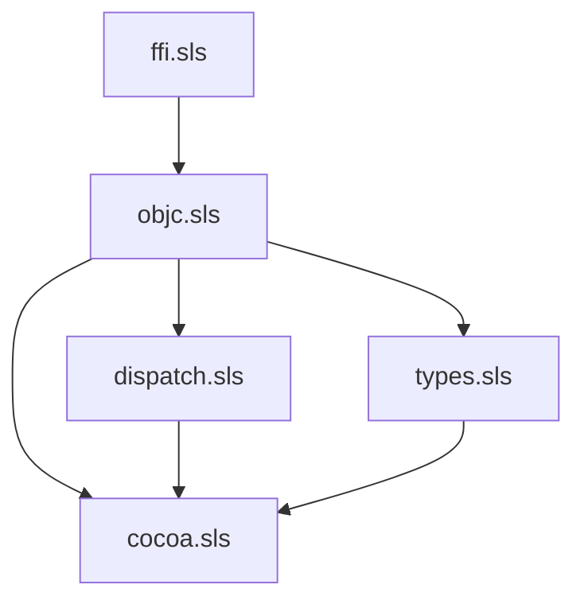

# Chez runtime — `(apianyware runtime …)`

Five-library cluster layout that supports the chez target. Reference:
`docs/specs/2026-05-27-chez-target-design.md` §2.

This is the **runtime build-out**. Scaffold landed in
`.grove/done/050-chez-target/020-runtime-scaffold.md`; `ffi.sls` and
`objc.sls` were filled in end-to-end by
`.grove/done/050-chez-target/030-runtime-ffi-objc.md` (mandatory dylib
load, libobjc surface, guardian + autoreleasepool lifetime model,
`nserror` record, `(values result error)` shape per ADR-0006).
`dispatch.sls` shipped its block / delegate / dynamic-class bridges in
`.grove/done/050-chez-target/040-runtime-dispatch.md` (eval-built
`foreign-callable`s, autoreleasepool wrap per ADR-0007, idempotent
free-* paths). `types.sls` and `cocoa.sls` still have stub bodies; the
follow-on leaf wires them up.

During the chez bring-up (030..060) the dylib loader points at
`generation/targets/racket/lib/libAPIAnywareRacket.dylib` because its
`aw_common_*` surface is target-agnostic. Leaf 060 builds the
chez-specific `libAPIAnywareChez.dylib` and the loader's candidate
order flips. This is the only point of cross-target borrowing in the
chez build; it disappears with 060.

## Cluster map

| Cluster file       | Library name                     | Imports from                                            | Absorbs (racket runtime)                                                                                                                                |
|--------------------|----------------------------------|---------------------------------------------------------|---------------------------------------------------------------------------------------------------------------------------------------------------------|
| `ffi.sls`          | `(apianyware runtime ffi)`       | `(chezscheme)`                                          | `swift-helpers.rkt` (full rewrite)                                                                                                                       |
| `objc.sls`         | `(apianyware runtime objc)`      | `ffi`                                                   | `objc-base.rkt`, `objc-interop.rkt` (forced rewrite, ADR-0007)                                                                                           |
| `dispatch.sls`     | `(apianyware runtime dispatch)`  | `ffi`, `objc`                                           | `block.rkt`, `delegate.rkt`, `dynamic-class.rkt` (forced rewrite, decision 6)                                                                             |
| `types.sls`        | `(apianyware runtime types)`     | `ffi`, `objc`                                           | `type-mapping.rkt`, `coerce.rkt`, `cf-bridge.rkt` (mechanical port)                                                                                       |
| `cocoa.sls`        | `(apianyware runtime cocoa)`     | `ffi`, `objc`, `dispatch`, `types`                      | `app-menu.rkt`, `main-thread.rkt`, `nsview-helpers.rkt`, `nsevent-helpers.rkt`, `cgevent-helpers.rkt`, `ax-helpers.rkt`, `spi-helpers.rkt`, `objc-subclass.rkt` |

`variadic-helpers.rkt` has **no** chez analog: Chez's `foreign-procedure`
supports trailing-args natively.



## Verifying the runtime

From the repository root, with `--libdirs` pointing at the target root
so Chez's library-name resolution finds the `apianyware/` namespace
(see `docs/specs/2026-05-27-chez-target-design.md` §8):

```bash
LIBDIRS=generation/targets/chez

# 1. All five clusters load cleanly.
chez --libdirs $LIBDIRS \
     --script generation/targets/chez/apianyware/runtime/verify.ss
# → [runtime scaffold] loaded

# 2. ffi.sls + objc.sls round-trip through libobjc and the dylib.
chez --libdirs $LIBDIRS \
     --script generation/targets/chez/apianyware/runtime/tests/smoke-objc.sls
# → [smoke] 1. NSObject alloc/init/wrap/drain OK
#   [smoke] 2. NSString autoreleasepool roundtrip OK
#   [smoke] 3. define-entry-point OK
#   [smoke] 4. (values result nserror) shape OK
#   [smoke] all tests passed

# 3. dispatch.sls block/delegate/dynamic-class bridges round-trip.
chez --libdirs $LIBDIRS \
     --script generation/targets/chez/apianyware/runtime/tests/smoke-dispatch.sls
# → [smoke-dispatch] 1. Block create+free OK
#   [smoke-dispatch] 2. Delegate invocation OK
#   [smoke-dispatch] 3. Dynamic subclass override OK
#   [smoke-dispatch] all tests passed
```

## What's not here yet

- **NSPoint et al. constructor wrappers.** ftypes are real; the
  constructor helpers are stubs. Real bodies land in
  `.grove/050-chez-target/050-runtime-types-cocoa.md`.
- **`runtime/cocoa.sls` helpers.** App-menu install, main-thread
  dispatch, AppKit/AX/SPI bridges — all stubs. Real bodies land in
  `.grove/050-chez-target/050-runtime-types-cocoa.md`.
- **`libAPIAnywareChez.dylib`.** The chez-specific dylib lands in
  `.grove/050-chez-target/060-swift-dylib.md`. Until then, the loader
  borrows `libAPIAnywareRacket.dylib`'s common surface.
- **Sibling `apianyware/<framework>/` libraries.** Not part of the
  runtime; they're produced by `emit-chez` and live alongside this
  `runtime/` directory under `generation/targets/chez/apianyware/` so
  that Chez's default library-name resolution finds both with one
  `--libdirs` flag. The gitignore keeps every sibling except this
  `runtime/` tree out of source control (they regenerate from the
  enriched IR).

## Notes on library naming and on-disk paths

Library names use the `(apianyware runtime …)` prefix per the design
spec §3, and the on-disk tree mirrors the name path:
`generation/targets/chez/apianyware/runtime/<cluster>.sls` resolves
`(apianyware runtime <cluster>)` directly with
`--libdirs generation/targets/chez`. Sample apps and tests no longer
hand-roll `(load …)` chains; they `(import …)` and let Chez follow the
dependency graph.
