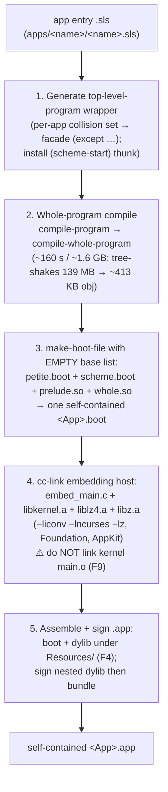

# chez — Target Reference

First-pass, written-after-the-fact learnings for the `chez` generation target,
captured at the close of the `050-chez-target` grove node (leaves 020–140). It
is opinionated and deliberately shorter than `racket.md`: where the two targets
agree (pipeline, IR, framework set, sample-app portfolio, TestAnyware bar) read
the racket reference; this file covers only what is *chez-specific* and was
*surprising in practice*. Per project convention, gotcha entries carry a date
and a 🔴/🟡/🟢 priority.

Companion design + decisions:

- Design spec: `docs/specs/2026-05-27-chez-target-design.md`.
- ADR-0005 — chez emits idiomatic Chez, not portable R6RS.
- ADR-0006 — `NSError**` surfaces as `(values result error)`.
- ADR-0007 — `objc-object` lifetime = guardian + entry-point autoreleasepool.
- ADR-0008 — `emit-chez` is a standalone sibling crate, not a fork of `emit-racket`.

## 1. Reader's mental model

The chez target is **maximally idiomatic Chez Scheme** (ADR-0005), not a
portable-R6RS or racket-shaped codebase. Inside every generated file you get
`(library …)` forms, `foreign-procedure`, `define-ftype`, `define-record-type`,
guardians, and `let-values`. Symmetry with racket is **on disk and at the
IR-decision level** (per-class files, `main`-equivalent re-export per framework,
same framework set, same 7 apps) — **never** at the source-form level. A future
port to Larceny/Loko/Sagittarius is a *new target*, not a flag on this one.

The runtime is **five clusters**, not racket's 18 files (design spec §2):

| Cluster | Holds |
|---|---|
| `runtime/ffi.sls` | mandatory dylib load, libobjc raw surface, `objc_msgSend`/`sel-register`, autoreleasepool primitives |
| `runtime/objc.sls` | `objc-object` record, the guardian, `wrap`/`borrow`/`unwrap`, `with-autorelease-pool`, `define-entry-point`, the `nserror` record |
| `runtime/dispatch.sls` | block bridge, delegate bridge, dynamic-class bridge — all over one `foreign-callable` substrate |
| `runtime/types.sls` | geometry ftypes + ctors/accessors, NSString/NSArray/NSDictionary marshalling, `coerce-arg`, CoreFoundation bridging |
| `runtime/cocoa.sls` | non-FFI-primitive helpers: app menu, main-thread dispatch, autoresizing, `nsevent-location-in-window` |

Import order is strict: `ffi` → `objc` → `{dispatch, types, cocoa}`.

## 2. Lifetime model — guardian + entry-point autoreleasepool (ADR-0007)

Two mechanisms are combined *on purpose*; a reader who knows only one will find
the other puzzling. The combination is the load-bearing piece of the runtime —
bugs here are use-after-free or unbounded RSS growth.

- **The guardian** (`objc-guardian`, one process-wide `make-guardian`) owns
  **retained, longer-lived** objects. `wrap-objc-object` registers each wrapper;
  `drain-objc-guardian` walks the guardian and sends one `objc_release` per
  wrapper whose Scheme value has been collected. The drain converts *Scheme GC
  events* into *ObjC releases*.
- **The outer autoreleasepool** owns **transient +0 returns**. They drain at the
  pool boundary and never reach the guardian — which is exactly what +0 calls
  for. Guardian-only would force a balancing retain on every method return and
  inflate the working set; pool-only would leak everything outliving one event
  tick.

`wrap-objc-object` ownership convention (read the source comments before
touching it):

- `(wrap-objc-object ptr)` — caller had **+0** (an autoreleased return). The
  runtime retains immediately, so the pool boundary can't drop the object before
  the eventual drain releases it.
- `(wrap-objc-object ptr #t)` — caller already owns **+1** (alloc/init/copy/new/
  mutableCopy). No retain. The emitter passes `#t` for constructor returns.

Either way the guardian-drain sends **exactly one** release, returning the
object to +0.

🔴 **2026-05-29 — `borrow-objc-object` does no retain and no guardian
registration.** It wraps a raw pointer valid *only for the borrow's lexical
scope* (delegate-callback args from the Swift trampoline, `NSNotification`
`userInfo` lookups). Storing a borrow beyond that scope is a use-after-free that
will crash much later, far from the cause. Delegate `sender` args arrive as raw
`void*` and are `borrow-objc-object`'d before being handed to generated setters
(see `ui-controls-gallery`).

## 3. The `(values result error)` calling convention (ADR-0006)

Every chez-emitted procedure whose ObjC signature takes a trailing `NSError**`
returns **two Scheme values**: the result, and `#f` on success or an `nserror`
record on failure. The procedure does **not** raise — the error path is in-band.
Callers use `let-values`:

```scheme
(let-values ([(data err) (nsdata-... )])
  (if err
      (handle (nserror-localised-description err))
      (use data)))
```

The `nserror` record fields are `domain`, `code`, `localised-description`,
`userinfo` (defined in `runtime/objc.sls`).

🟡 **2026-05-28 — class libraries must `(except …)` the nserror accessors.**
NSError's own ObjC instance properties (`-domain`, `-code`, `-userInfo`,
`-localizedDescription`) collide with the runtime's `nserror-*` Scheme record
accessors. Generated NSError-family libraries import `(apianyware runtime objc)`
with those four accessors plus `make-nserror`/`nserror?` excepted.

## 4. Sample-app authoring rules

These are the rules an app author must follow; they are not optional polish.

- **Wrap every entry into Scheme-from-ObjC in an autoreleasepool.** Use the
  `define-entry-point` macro — it defines a procedure whose body is wrapped in
  `with-autorelease-pool` (push pool → run → pop → drain guardian). Apps use a
  single `(define-entry-point (main) …)`; the macro also backs delegate-method
  and `foreign-callable` trampolines (the runtime does this for you inside
  `dispatch.sls`).
- **Keep delegate/block records reachable.** Cocoa holds delegates **weakly**.
  Define them as internal `define`/`letrec*` bindings inside `main` — they then
  live for the duration of `(nsapplication-run app)`. A collected delegate
  silently stops firing. Call `free-delegate` / `free-objc-block` only after the
  owner has dropped its reference (e.g. `setDelegate:nil`).
- **Off-run-loop loops must wrap themselves.** Code that loops *outside* the
  run-loop's entry-point wrapping (an offline data-prep script, a tight
  allocation loop) must wrap its body in `(with-autorelease-pool …)`, otherwise
  transient autoreleased objects accumulate until the process exits. This is the
  same rule Cocoa imposes on Objective-C command-line tools.
- **`lock-object` is handled for you — but you own it if you go raw.** Any
  closure handed across the C boundary as a `foreign-callable` must be
  `lock-object`'d or Chez's GC collects the code object mid-flight and the
  process crashes. The `build-callable` helper in `dispatch.sls` locks the code
  and stashes it in a `callable-handle`; dynamic-class IMPs are additionally
  pinned in a process-lifetime hashtable (`dynamic-class-imps`). If you build a
  bare `foreign-callable` yourself (escape hatch §5), **you** must `lock-object`
  it and keep the handle alive.
- **Background callbacks are safe; blocking waits on the main thread need
  `__collect_safe` (ADR-0016).** Every callback the runtime builds is a
  `__collect_safe` `foreign-callable`, so a delegate method or block that fires
  on a background thread (an `NSURLSession` completion, a `dispatch_async`
  block) activates the worker thread for Scheme and tears the context down on
  exit — no main-thread bounce required for non-UI work. **UI mutation still
  belongs on the main thread** (AppKit), so bounce UI updates via the
  `cocoa.sls` main-thread dispatch. The footgun is the *outbound* dual: if you
  ever make a **blocking** foreign call on a Scheme thread (`dispatch_sync`, a
  semaphore/`pthread_join` wait, a synchronous network call) while background
  callbacks may run, declare that `foreign-procedure` `__collect_safe` too —
  otherwise the blocked thread never reaches a GC safe point and a background
  callback's allocation deadlocks the stop-the-world collector. See
  `tests/smoke-dispatch.sls` test 4 for the canonical pattern.
- **Use the framework facades, not hand-defined constants.** Import
  `(apianyware appkit)` / `(apianyware coregraphics)` etc. and use the emitted
  enums (`NSWindowStyleMaskTitled`, `NSButtonTypeRadio`, …). The racket ports'
  inline `(define NS… …)` blocks are gone in the chez ports (idiom posture).
- **Delegate API is positional, not keyword-hash.** `make-delegate` takes a list
  of `(selector proc param-types return-type)` specs (contrast racket's
  keyword-hash shape). The proc receives **only the method args** — the Swift
  trampoline strips `self`/`_cmd`. `param-types` is almost always a list of
  `void*`; `return-type` must match a Swift trampoline variant
  (`void`/`bool`/`id`/`int`/`long` — see `return-type->cstring`).

## 5. Chez-only escape hatches

When the emitted surface doesn't cover what you need, drop down:

- **Raw `foreign-procedure`.** Declare your own typed binding for any C symbol
  in a loaded dylib. This is *normal* chez idiom (ADR-0005), not a hack — the
  emitted class libraries themselves declare a per-selector
  `objc_msgSend` `foreign-procedure` for each typed signature.
- **Direct `objc_msgSend` from `runtime/ffi.sls`.** The cluster exports the
  simplest `(id, SEL) -> id` form plus `objc_getClass`, `sel-register`
  (cached), `objc_retain`/`objc_release`, the class-pair/`class_addMethod`
  surface, and `method_getTypeEncoding`. Send any message the emitter didn't
  generate by composing these.
- **Custom blocks via `make-objc-block`.** `(make-objc-block proc param-types
  return-type)` → an `objc-block`; pass `(objc-block-ptr blk)` to a method
  expecting a block. **Do not** include the block-self pointer in `param-types`
  — it is prepended internally. For **synchronous** APIs (enumerate/sort) ObjC
  does not `Block_copy`, so call `free-objc-block` after the method returns (or
  use `call-with-objc-block`). For **async** APIs (completion handlers, GCD) the
  Swift dispose helper frees the GC handle when `Block_release` fires; the
  chez-side code object lives until you call `free-objc-block`. `proc = #f`
  yields a 0-ptr block (the ObjC "no block" sentinel); freeing it is a no-op.
- **`make-dynamic-subclass`** for ObjC subclasses (the `drawing-canvas`
  `NSView`). Specs are `(selector proc param-types return-type type-encoding)`;
  the IMP proc receives the full `(self _cmd arg …)` tuple. The type-encoding is
  supplied explicitly (not derived from FFI types) because nested struct
  encodings like `{CGRect={CGPoint=dd}{CGSize=dd}}` live outside what FFI tokens
  capture; the racket ports already carry the encodings.

## 6. Observed gotchas (020–140)

🔴 **2026-05-27 — `foreign-callable` is syntax; the runtime `eval`s it in
`(interaction-environment)`.** `foreign-callable`'s param/result types must be
*literal tokens*, but the three bridges need arbitrary runtime-determined
signatures. `dispatch.sls` builds the form with `quasiquote` and `eval`s it. The
trap: `(environment '(chezscheme) …)` is an **immutable snapshot** that cannot
see top-level bindings installed later, so the eval'd body's helpers
(`%aw-chez-callable-invoke`) are installed via `set-top-level-value!` and the
form is eval'd in **`(interaction-environment)`** (mutable). If you extend the
dispatch substrate, preserve this — a `(environment …)` snapshot will fail to
resolve the helpers at call time.
> **2026-05-30 (standalone) — this substrate survives whole-program optimisation
> and runs in a no-Chez binary.** `ui-controls-gallery` (leaf `060/050/020`)
> verified all three trampolines (`selectRadio:`, `sliderChanged:`,
> `stepperChanged:`) firing in a production open-world standalone `.app` on a VM
> with no Chez installed. This works *only because the open-world boot embeds the
> full `scheme`* (compiler + `eval` + `interaction-environment`), not `petite`.
> A `petite`-only boot would have no compiler and these `eval`s would fail —
> which is precisely why the dropped closed-world mode (ADR-0009) could not
> support dispatch-using apps. RSS stays flat across repeated dispatch, so the
> eval'd forms are cached, not re-synthesised per call.
> **2026-05-30 (standalone) — a struct-by-value IMP needs its ftype names
> re-`define-ftype`d into the interaction-environment.** `drawing-canvas` (leaf
> `060/050/070`) threw `unrecognized foreign-callable argument ftype name NSRect`
> in the standalone bundle: `drawRect:`'s IMP is `(& NSRect)`, and the
> `foreign-callable` form eval's in `(interaction-environment)`, so `NSRect` must
> resolve there. In a `--script` run the app's own top-level `(import (apianyware
> runtime types))` populated that env; the standalone **top-level-program wrapper
> seals the program** (`compile-whole-program`), importing into lexical scope and
> *de-registering* libraries — so the interaction-environment lacks the ftype
> **and** a runtime `(import (apianyware runtime types))` fails with "invisible
> library". Fix (`dispatch.sls`, `ensure-ftypes-visible!`): re-`define-ftype` the
> geometry structs (NSPoint/NSSize/NSRect/NSRange) directly into the
> interaction-environment, lazily on first `build-callable`. ftypes are
> structural, so re-declaring them depends only on `(chezscheme)` and is immune to
> library sealing. Keep these forms byte-for-byte in sync with `(apianyware
> runtime types)`. Only struct-by-value `foreign-callable` params hit this;
> scalar/`void*` tokens always resolve.

🔴 **2026-05-29 — every struct-by-value return needs Chez's hidden result-buffer
arg, regardless of size.** Leaf 025 implemented the textbook ABI rule (only
>16-byte structs return indirectly via `x8`) and it was **wrong for Chez**.
Chez's `(& ftype)` *result* convention takes a leading result-buffer argument
for **every** struct return — small ones (`NSPoint`, `NSSize`, `NSRange`,
`CGVector`) included. An `(& NSPoint)`-returning `foreign-procedure` called with
only the 2 visible args fails at runtime; this is why every mouse-event IMP in
`drawing-canvas` threw before drawing until leaf 140 made
`return_needs_indirect_result` flag *all* geometry struct returns. The wrapper
allocates the buffer (`foreign-alloc`), passes it as the implicit leading arg,
and yields it; the foreign-procedure's direct return is unspecified. The buffer
**leaks per call** (acceptable for short-lived geometry; a future runtime leaf
may add a drain hook).

🔴 **2026-05-27 — ftype-pointer params are *not* coerced like id values.**
Geometry params are ftype-pointers produced by `make-nsrect`/`make-nspoint`/…
and are passed to the `(& <ftype>)` `foreign-procedure` slot **directly**, with
**no** `coerce-arg`. `coerce-arg` is for ObjC `id` values only (it casts
wrappers/strings/`#f` to a pointer). Confusing the two — coercing an
ftype-pointer or forgetting to coerce an `id` — is the most common emit-time
type-shape error.

🟡 **2026-05-27 — library-name resolution is rigid; honour it on disk.** Chez
maps `(apianyware <cat> <name>)` to `<libdir>/apianyware/<cat>/<name>.sls` with
**no** per-library configuration and **no** `<dir>/main.sls` convention. The
chez target honours the convention rather than installing a
`library-search-handler`: one `apianyware/` namespace root, runtime under
`apianyware/runtime/`, every emitted library under `apianyware/<fw>/…`, and the
per-framework facade at `apianyware/<fw>.sls` — one level **above** the
framework directory (the file and same-stem directory coexist fine). The emitter
and bundler always pass `--libdirs <root>`. Do not invent per-app search hacks.

🟡 **2026-05-27 — class libraries must load their own framework dylib at
instantiation.** Otherwise `objc_getClass(...)` returns 0 unless something else
in the import graph (`constants.sls`/`functions.sls`) happened to be
instantiated first. Each generated class library carries a `%fw-lib-loaded`
dummy `define` whose RHS does the `load-shared-object` (R6RS requires
definitions before expressions, hence the dummy-define idiom — used for every
side-effecting load in the tree).

🟡 **2026-05-27 — enums import `(only (rnrs base) define)`, not `(chezscheme)`,
and disambiguate duplicate names.** Enum value names like `reverse`, `and`,
`or`, `error`, `force` collide with `(chezscheme)` builtins, and R6RS forbids
redefining imports — so `enums.sls` imports only `define`. Same-name/same-value
duplicates are deduped; same-name/different-value pairs get an `<EnumType>-`
prefix on *both* (e.g. `WeatherCondition-rain` vs `Precipitation-rain`). Racket
has the same source data loss but its `define` silently rebinds; **chez surfaces
the collision as a hard error**, which is why this is a chez-only concern.

🟡 **2026-05-29 — the dylib is mandatory and resolved via `(library-directories)`.**
`runtime/ffi.sls`'s `resolve-dylib-path` probes
`<libdir>/lib/libAPIAnywareChez.dylib` for each library dir; absence is a hard
error (ADR-0005 — chez assumes its environment). An earlier CWD-relative search
was a **false positive on CLI smoke** (CWD happened to be the repo root) that
only VM verification caught — the bundle aborted mid-compile. Mirror this
resolver for any future runtime asset whose load path differs between unbundled
CLI and bundled `.app` use.

🟢 **2026-05-30 — SUPERSEDED by ADR-0009: no precompile pass, no `.so`
objects, no version coupling.** The two entries below (the bundle-time `.sls`
→ `.so` precompile, and the `launch.ss` version-resilience bootstrap that
guarded against cross-version `.so` loads) described the **retired source-exec
bundle**. chez `.app`s now ship as self-contained binaries that embed the Chez
kernel and a whole-program boot image (design spec
`docs/specs/2026-05-29-chez-standalone-distribution-design.md`): the app's
entire import closure is `compile-whole-program`-baked into the boot at build
time, so there are no per-bundle `.so` siblings, no `--script`/`launch.ss`
indirection, no `skip_precompile` knob, and no runtime Chez whose version could
mismatch. The version-coupling follow-up (leaf-160) and the golden-image
pre-install note (050 brief) **evaporate** with the system-Chez dependency. The
original bodies survive in git history (this file, pre-2026-05-30) for the
source-exec rationale; do not act on them for a shipped bundle.

🟢 **2026-05-28 — `bundle-chez`'s deps walker skips `build/`.** A sibling app's
`build/<App>.app/…/chez-app/apianyware/*.sls` tree under the same source root
shadows the canonical sources during the `(library …)` registry walk, pointing
the dependency walk at a previous bundle's nested copies (symptom: zero `.so`
files produced). `find-sls-files` skips directories named `build`.

🟢 **2026-05-27 — `(chezscheme)` has no regexp; `(format …)` needs an explicit
destination.** `racket/base`'s regexp is gone, so URL normalisation
(`mini-browser`) and the Markdown renderer (`note-editor`) are hand-rolled
(trim + scheme-scan, byte-equivalent to the racket renderers). And `format`
requires the destination arg: `(format #f "Value: ~a" n)`.

🟢 **2026-05-26 — unbundled menu-bar name reads "chez" (bundle case moot
since 2026-05-30, ADR-0009).** The *dev-run* `chez --script` path still shows
the runtime process name in the menu bar — that is a property of running the
unbundled interpreter and is unchanged. But a shipped `.app` no longer execs a
`chez` process at all: the standalone binary *is* the executable, so macOS reads
`CFBundleName` directly and the menu-bar-name gotcha for bundles is gone (it was
a stub-launcher `execv` artifact, and the stub-launcher is no longer on the chez
bundle path). No per-app or runtime fix is owed.

## 7. Verification

CLI smoke (`chez --libdirs … --script …`) reaching `[NSApp run]` proves
*linking and import resolution* — it does **not** prove the GUI draws. Per
`[[feedback-use-testanyware]]` every sample-app port carries a dedicated
TestAnyware/VM-verify step, and the leaf does not retire until that run is green
(reports + screenshots under `generation/targets/chez/test-results/<app>/`,
matrix notes under `generation/targets/chez/apps/<app>/learnings.md`). Several latent runtime
defects (bundled dylib lookup, the all-sizes struct-return buffer) were
**invisible to CLI smoke and surfaced only in the VM**. RSS-flat-at-idle over
20–30 s of interaction is the standard leak check; async-callback apps
(`mini-browser`, `note-editor`) additionally watch for growth across repeated
re-entry, and `note-editor` confirms `aw_chez_gc_count` balances 0→N→0 across
block create/free.

## 8. When does each target shine?

- **racket** — richer batteries (regexp, `net/url`, places for off-main-thread
  I/O, a mature `ffi/unsafe/objc` `tell` macro). Per-object finalizers give
  fine-grained lifetime without an explicit drain. Best when an app wants stdlib
  reach with little hand-rolling.
- **chez** — fast steady-state execution and a small, predictable runtime;
  `foreign-procedure`/`foreign-callable`/`ftype` give a clean, explicit FFI with
  no `tell`-macro indirection. Lifetime is under explicit control (guardian
  drain timing) rather than GC-finalizer order. Apps ship as a **self-contained
  binary** that embeds the Chez kernel — no runtime interpreter to install, a
  ~0.29 s cold launch, and a ~4.5 MB `.app` (ADR-0009). The cost is fewer
  batteries (hand-rolled parsing) and a slow one-time whole-program compile at
  *build* time. Best when you want a tight, transparent native bridge with a
  dependency-free `.app` and are willing to write the glue.

## 9. Self-contained distribution (the standalone toolchain)

A chez `.app` is a **self-contained, open-world native binary**: its
`Contents/MacOS/<App>` embeds the Chez kernel and a whole-program boot image, so
it launches on a machine with **no Chez installed** — no `brew install
chezscheme`, no stub-launcher exec into a system `chez`. This is the *only* chez
bundle shape; the source-exec / precompile model it replaced is retired
(**ADR-0009**, `docs/adr/0009-chez-self-contained-bundle.md`). The deep design
rationale lives in `docs/specs/2026-05-29-chez-standalone-distribution-design.md`;
this section is the operational reproduction recipe. Racket's stub-launcher path
(§ racket.md 9) is untouched — only chez changed.

**Build vs. runtime dependency.** Chez is a **build-time-only** dependency: the
bundler discovers the kernel artifacts from the dev host's Chez install and bakes
them into the boot. The shipped `.app` depends on nothing but system frameworks
(`otool -L` on the binary shows only `Foundation`/`AppKit`/`libSystem`/
`libiconv`/`libncurses`/`libz` — no Chez/Scheme/petite).

### Required Chez kernel artifacts

From the Homebrew Chez install, under
`/opt/homebrew/Cellar/chezscheme/<ver>/lib/csv<ver>/tarm64osx/` (verified on
10.4.1):

| Artifact | Role |
|---|---|
| `petite.boot` | base boot (reader, evaluator, no compiler) |
| `scheme.boot` | the compiler / `eval` / `interaction-environment` — **required for open-world** (the dispatch substrate `eval`s `foreign-callable` trampolines at runtime; a `petite`-only boot cannot) |
| `libkernel.a` | the kernel static lib linked into the binary |
| `liblz4.a`, `libz.a` | compression libs the kernel needs |
| `scheme.h` | kernel C API header for `embed_main.c` |

`standalone.rs::discover_kernel_dir` finds these: it honours `AW_CHEZ_KERNEL_DIR`
if set, else globs the Cellar for a `csv<ver>/<arch>osx` dir containing both
`libkernel.a` and `scheme.h`. Build-time only.

### The build pipeline

Driven per-app by `bundle-chez/src/standalone.rs::bundle_app`:



Gotchas baked into the pipeline:
- **F9 — don't link the kernel's `main.o`.** It defines its own `main()` which
  collides with `embed_main.c`'s. Link `libkernel.a` + the compression libs only.
- **F4 — boot + dylib go under `Contents/Resources/`, not `MacOS/`.** `codesign
  --strict` rejects non-Mach-O files in `Contents/MacOS/` ("code object is not
  signed at all"), so the `.boot` data file is sealed as a resource. The host
  probes both a flat run-dir and the `.app` `../Resources` layout.
- **F2 — the top-level-program wrapper.** `--script` runs in the interaction
  environment (last-wins rebinding); `compile-whole-program` enforces strict R6RS
  where a name exported by two imported libraries is a hard duplicate-import
  error. The bundler computes the per-app collision set (a chez
  `environment-symbols` probe over the import closure) and emits `(except <facade>
  <names>…)` so framework facades yield to the curated runtime API and
  `(chezscheme)`. Per-app, not a fixed list — each app's import set determines its
  collisions.
- **F3 — the dylib-search prelude.** A tiny prelude object linked into the boot
  ahead of the app sets `(library-directories)` from an exe-relative
  `../Resources` path (via the `AW_RESOURCE_DIR` env var the host sets before
  `Sbuild_heap`), so `ffi.sls`'s `resolve-dylib-path` finds the bundled
  `libAPIAnywareChez.dylib` during boot load. A custom embedding host does *not*
  read `CHEZSCHEMELIBDIRS`.
- **F6 — banner suppression.** `(suppress-greeting #t)` before `Sscheme_start`
  (harmless in a windowed `.app`, noise in console runs).
- **ftype visibility under the seal (2026-05-30).** `compile-whole-program`
  de-registers libraries, so a struct-by-value IMP's `foreign-callable` ftype
  (e.g. `(& NSRect)` in `drawing-canvas`'s `drawRect:`) is invisible in the
  interaction-environment where the form eval's. `dispatch.sls`
  re-`define-ftype`s the geometry structs there (see § 6). Only struct-by-value
  callable params hit this.

### Bundle layout

```text
<App>.app/Contents/
  MacOS/<App>                       ← native binary: embed_main + libkernel + app boot
  Info.plist                        ← CFBundleName = "<App>"
  Resources/
    <App>.boot                      ← petite + scheme + prelude + app whole-program boot
    lib/libAPIAnywareChez.dylib     ← loaded at runtime by ffi.sls (mandatory; ADR-0005)
```

### Dev-repro recipe

Build one app's standalone `.app`:

```bash
cargo run --release --example bundle_app -p apianyware-macos-bundle-chez -- <script-name>
# → generation/targets/chez/apps/<script>/build/<App Name>.app
```

The display name comes from the H1 of `docs/apps/<script>/spec.md`; the
bundle id is `com.linkuistics.<NoSpaceTitle>`. Prereqs: a host Chez install
(kernel artifacts), `cc`, `codesign`, and the generated runtime tree +
`lib/libAPIAnywareChez.dylib` present under `generation/targets/chez/`.

Verify in a **no-Chez VM** ([[reference-testanyware-cli]]) — no provisioning, the
kernel is embedded:

```bash
vmid=$(testanyware vm start --platform macos); export TESTANYWARE_VM_ID=$vmid
testanyware exec "which chez || echo NO_CHEZ"          # confirm the bar
tar czf /tmp/app.tgz -C .../build "<App Name>.app"     # ~3–4 MB, single-shot upload
testanyware upload /tmp/app.tgz /Users/admin/app.tgz
testanyware exec "cd /Users/admin && tar xzf app.tgz && xattr -dr com.apple.quarantine '<App Name>.app' && open -n '<App Name>.app'"
testanyware screenshot -o /tmp/v.png --window "<Window Title>"
```

### Build-time cost

The whole-program compile is **~160 s / ~1.6 GB peak RSS per app** (it compiles
the full import closure, incl. the ~70k-line AppKit facade, then tree-shakes).
This is a **bundler/CI cost, not user-facing** — the shipped `.app` cold-launches
in ~0.29 s. Compared with the retired source-exec bundle (104 MB, ~13.9 s launch),
the standalone is ~30× smaller and ~50× faster to launch.
