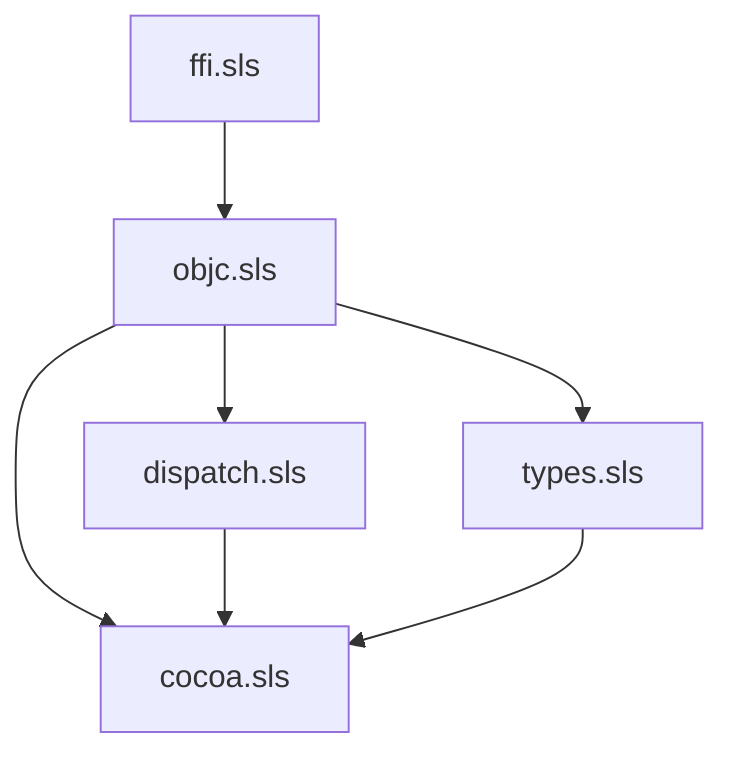

# Chez runtime — `(apianyware runtime …)`

Five-library cluster layout that supports the chez target. Reference:
`docs/specs/2026-05-27-chez-target-design.md` §2.

This is the **runtime scaffold** delivered by
`.grove/done/050-chez-target/020-runtime-scaffold.md`. All FFI-touching
bodies are stubs (`(error 'name "not yet implemented")`) until the
follow-on leaves wire them up. Pure-Scheme machinery (record types, the
`objc-guardian`, the `with-autorelease-pool` / `define-entry-point`
macros, geometry ftypes) is real.

## Cluster map

| Cluster file       | Library name                     | Imports from                                            | Absorbs (racket runtime)                                                                                                                                |
|--------------------|----------------------------------|---------------------------------------------------------|---------------------------------------------------------------------------------------------------------------------------------------------------------|
| `ffi.sls`          | `(apianyware runtime ffi)`       | `(chezscheme)`                                          | `swift-helpers.rkt` (full rewrite)                                                                                                                       |
| `objc.sls`         | `(apianyware runtime objc)`      | `ffi`                                                   | `objc-base.rkt`, `objc-interop.rkt` (forced rewrite, ADR-0007)                                                                                           |
| `dispatch.sls`     | `(apianyware runtime dispatch)`  | `ffi`, `objc`                                           | `block.rkt`, `delegate.rkt`, `dynamic-class.rkt` (forced rewrite, decision 6)                                                                             |
| `types.sls`        | `(apianyware runtime types)`     | `ffi`, `objc`                                           | `type-mapping.rkt`, `coerce.rkt`, `cf-bridge.rkt` (mechanical port)                                                                                       |
| `cocoa.sls`        | `(apianyware runtime cocoa)`     | `ffi`, `objc`, `dispatch`, `types`                      | `app-menu.rkt`, `main-thread.rkt`, `nsview-helpers.rkt`, `nsevent-helpers.rkt`, `cgevent-helpers.rkt`, `ax-helpers.rkt`, `spi-helpers.rkt`, `objc-subclass.rkt` |

`variadic-helpers.rkt` has **no** chez analog: Chez's `foreign-procedure`
supports trailing-args natively.



## Verifying the scaffold loads

From the repository root:

```bash
chez --script generation/targets/chez/runtime/verify.ss
```

Expected output:

```
[runtime scaffold] loaded
```

`verify.ss` pre-`load`s the five `.sls` files in dependency order so
that `(import (apianyware runtime cocoa))` resolves against the library
registry. Once a proper `library-directories` layout (or a bundler-
emitted `main.sls` aggregator) lands in a later leaf, this hand-rolled
boot becomes unnecessary.

## What's deliberately not here

- **Swift dylib load.** `libapianyware-chez-path` is a parameter today;
  the actual `load-shared-object` call lands in
  `.grove/050-chez-target/030-runtime-ffi-objc.md`.
- **Real `wrap-objc-object` / `objc_release`.** Stubs. Real bodies land
  in 030.
- **`make-objc-block` / `make-delegate` / `make-dynamic-subclass`.**
  Stubs. Real bodies (foreign-callable, Block_layout ftype) land in
  `.grove/050-chez-target/040-runtime-dispatch.md`.
- **NSPoint et al. constructor wrappers.** ftypes are real; the
  constructor helpers are stubs. Real bodies land in
  `.grove/050-chez-target/050-runtime-types-cocoa.md`.
- **`generated/` framework libraries.** Not part of the runtime; they
  arrive once `emit-chez` is built
  (`.grove/050-chez-target/070-emit-chez-scaffold-and-foundation.md`).

## Notes on library naming and on-disk paths

The library names use the `(apianyware runtime …)` prefix per the design
spec §3. The file paths under this directory are unprefixed
(`ffi.sls`, not `apianyware/runtime/ffi.sls`) — the scaffold relies on
the pre-load technique in `verify.ss` so that imports resolve from the
already-populated library registry. The bundler / sample-app launcher
landing in later leaves will choose between (a) restructuring the
on-disk tree to mirror library names, or (b) emitting an explicit
`main.sls`-style aggregator that `load`s the cluster files in order.
The decision earns its place when those leaves run, not here.
