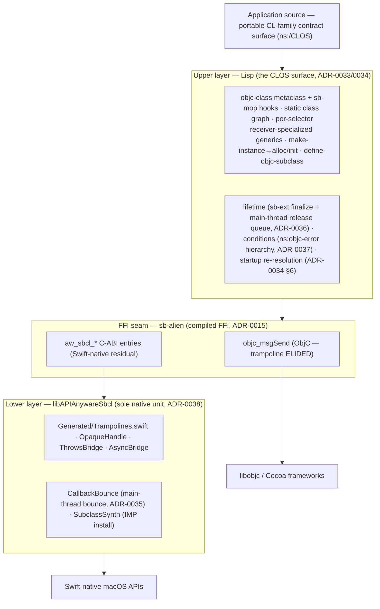

# Design spec — the SBCL (CLOS) target

**Date:** 2026-06-20
**Status:** the buildable technical design for the `sbcl` target, synthesizing the
four `030-design` child leaves. **Implemented by** the build leaves `040`–`080`.
**Authored by** `add-sbcl-clos-target` grove, leaf `030-design/040-trampoline-layer`.

This is the per-target (ADR-0024 unit-tier) technical design for **Steel Bank Common
Lisp** with a **CLOS** binding style — the fourth APIAnyware target after `racket`,
`chez`, and `gerbil`. It is the single document a build session reads to implement a
slice without re-deriving the design: it states *what is settled, by which ADR, and
how the pieces compose*, and points at the central ADRs + the main-tier CL-family
contract spec for the authoritative records.

It deliberately does **not** restate the upper-layer **CL-family interface contract**
(`docs/specs/2026-06-20-cl-family-interface-contract.md`, ADR-0033) — that is
cross-target within the CL family and main-tier. This spec is the *SBCL realization*
of that contract plus the SBCL-private mechanism below it.

---

## 1. The target at a glance

SBCL projects the macOS ObjC API into idiomatic CLOS, reaching ObjC **directly** and
the Swift-native delta through one native dylib. Two layers, the ADR-0025 framing:



**Posture (carried from `010-plan` D1–D5, `030-design` parent):** maximal CLOS idiom,
not a portable subset (ADR-0005 → `sb-alien`, not CFFI); the native library *is* the
binding (ADR-0010); per-target hermetic substrate (ADR-0011) with one scoped exception
— the **spec-level** CL-family interface contract (ADR-0033). Only **SBCL is built**
in this grove; CCL/AllegroCL/LispWorks shape what the contract abstracts over (D5a).

## 2. Object model + dispatch (ADR-0034)

The headline distinctive: ObjC's class system is **projected into CLOS through
`sb-mop`** — not a single wrapper class (gerbil pre-rejected as "vacuous", ADR-0018),
not a manifest `defclass` graph *without* the MOP (gerbil's shape, ADR-0020); SBCL
goes further to a real metaobject projection.

- **`objc-class` metaclass** (a `standard-class` subclass) backs every bound ObjC
  class; the runtime-owned root `ns:ns-object` carries the foreign `ptr` (the `id`).
  The full ancestor chain is reified as `defclass`es. **All required `sb-mop` hooks
  verified to exist and specialize** (ADR-0034 §1, first-hand on SBCL 2.6.5/arm64).
- **Dispatch (D6):** per-selector `defgeneric` (one, in `ns:`, the named surface) +
  one `defmethod` per (class × selector) **specialized on the receiver** over the real
  graph — CLOS generic dispatch + method combination + `call-next-method`; **not**
  multiple-argument dispatch (ObjC is single-receiver).
- **The generic-explosion risk is CLOSED — no mitigation (ADR-0034 §3).** A full
  AppKit+Foundation-scale spike (6,500 `defgeneric` + 40,000 `defmethod` over 2,000
  classes) compiled **cold in 8.4 s, single-threaded**. gerbil's ADR-0023 pathology
  lived in Gambit's `:std/generic` *macro library*, not the IR — SBCL's native CLOS
  lowers directly. So **no `generics.ss`-style sharding, no special flags, no
  parallel-compile** (the emitter is one ordinary compilation closure).
- **Slots / ivars (ADR-0034 §4):** `slot-value-using-class` over a custom foreign
  slot-definition class carrying a baked bit-offset (the research §5.1 refutation was
  about CCL, not SBCL — re-derived first-hand). Baked offsets are an SDK-drift-sensitive
  *fast path* over the always-safe accessor-selector path, opt-in not spine.
- **`make-instance` → `allocate-instance`(specialized on `objc-class`) → `alloc`/`init`**
  (no init initargs ⇒ alloc-only). **Subclassing** via the contract macro
  `define-objc-subclass` → `:metaclass objc-class` → `objc_allocateClassPair` + IMP
  install + `objc_registerClassPair` (verified).
- **Static emit + startup re-resolution (ADR-0034 §6):** the emitter bakes the class
  graph, selector strings, and opt-in ivar offsets at generation time; a dumped image
  keeps the baked Lisp metadata but loses live `Class`/`SEL` pointers, so the runtime
  carries a **mandatory startup re-resolution pass** — re-`dlopen` each framework, then
  re-resolve every `Class`/`SEL` from baked string identity (never reuse a baked
  pointer). Load-bearing for `070`. Composes with §5's dylib auto-reopen (ADR-0038 §5).

**Leaf split:** `040` emits the class graph / generics / slot specs / baked string
tables; `050` builds the metaclass + hooks + subclass-synthesis bridge + the
re-resolution pass.

## 3. Lifetime, threading, conditions (ADR-0036 / 0035 / 0037)

- **Lifetime (ADR-0036) — `sb-ext:finalize` + main-thread release queue + entry-point
  pool.** The two-mechanism chez/gerbil shape (ADR-0007/0019) with one SBCL twist:
  **finalizers run off-main** (a dedicated `"finalizer"` thread, verified). So a
  finalizer captures only the raw `id` and **enqueues** it onto a release queue; a
  **main-thread drain** (at the entry-point `with-autorelease-pool` boundary) sends
  `release`, keeping each `dealloc` UI-safe. Autoreleased `+0` transients drain at the
  same pool boundary. This is a *UI-affinity* fix, not the GC-safety concern of §3's
  threading — the finalizer thread is SBCL-native, hence suspendable.
- **Threading / callbacks (ADR-0035) — foreign-thread bounce, reached empirically.**
  The spike crashed **5/5** when concurrent GCD workers ran Lisp
  (`ENOTSUP` inside `GC-STOP-THE-WORLD` — SBCL cannot stop-the-world-suspend *foreign*
  threads on macOS arm64), so a foreign thread must **never** run Lisp. Callbacks bounce
  to main (`dispatch_sync` value-returning / `dispatch_async` void) **in
  `libAPIAnywareSbcl`** (§4, ADR-0038) before re-entering Lisp. chez's `Sactivate_thread`
  activation (ADR-0016) is **rejected** — the spike is the evidence. **Richer than
  gerbil:** SBCL-native `sb-thread` workers *do* run concurrent Lisp safely (the spike
  control survived) — so sample-app background compute uses `sb-thread`, and the bounce
  scopes to *foreign* entry only.
- **Conditions (ADR-0037) — flat `ns:objc-error` hierarchy.** Cocoa errors surface as
  **signalled CL conditions** (the contract's normative idiom, §3.7), not
  `(values result error)` tuples. Root `ns:objc-error : cl:error`; `ns:cocoa-error` (the
  `NSError**` path, `domain`/`code`/`user-info`/`localized-description` readers);
  `ns:objc-exception` (the `NSException` path). **One signaller** (`signal-cocoa-error`,
  `use-value`/`continue`/`return-nil` restarts) serves both the direct `NSError**` path
  **and** the Swift-`throws` trampoline's `ThrowsBridge` (§4). Keyed on the **primary
  return** indicating failure (`nil`/`NO`), per Apple's "check the return, not the error".
  `with-autorelease-pool` is `unwind-protect`-based so a signalled non-local exit still
  drains the pool.

**Leaf split:** all three are runtime (`050`); the `ThrowsBridge` half of conditions
lands with the dylib (this leaf's layer).

## 4. The trampoline lower layer — `libAPIAnywareSbcl` (ADR-0038, this leaf)

**`libAPIAnywareSbcl` is the SBCL target's sole native compilation unit** (SBCL compiles
neither ObjC nor Swift inline). It is broader than gerbil's *trampoline-only* dylib
(ADR-0029) because gerbil had a second native home (ObjC-in-`gsc`) and SBCL does not —
so the genuinely-native runtime concerns converge here. It still does **not** absorb the
MOP object model (§2 stays in Lisp); "trampoline-only" is preserved in that exact sense.

**Contents (one SwiftPM dynamic-library target `APIAnywareSbcl`):**

| File | Role |
|---|---|
| `Generated/Trampolines.swift` | the Swift-native residual `@_cdecl` re-exports (gitignored; written by `generate`) |
| `OpaqueHandle.swift` | `AwSbclValueBox` + uniform `aw_sbcl_box_free` |
| `ThrowsBridge.swift` | `NSError**` out-param bridge → feeds `ns:cocoa-error` (ADR-0037) |
| `AsyncBridge.swift` | async-method dispatch, completion delivered **on main** (ADR-0035) |
| `CallbackBounce.swift` | foreign-thread → main-thread bounce (`dispatch_sync`/`async`), then call the Lisp IMP |
| `SubclassSynth.swift` | build the native bounce-shim IMP and `class_addMethod` it (ADR-0034 §5) |

**Entry naming (content-addressed, ADR-0013 — emitter reconstructs, no shared counter):**
`aw_sbcl_swift_<Fw>_<name>` · `aw_sbcl_swift_const_<Fw>_<name>` ·
`aw_sbcl_swift_m_<Fw>_<Owner>_<base>` · `aw_sbcl_swift_init_<Fw>_<Owner>`
(short overload hash appended only on collision; racket spec §2/§8.4).

**Binding (ADR-0015 / ADR-0038 §3):** Lisp-side marshalling via typed `sb-alien`
(`define-alien-routine` / `alien-funcall`), one per trampoline signature — the same
compiled-FFI shape the direct `objc_msgSend` dispatch uses. `String` returns coerce via
the existing string bridge; **object returns wrap to their exact bound type via the
ADR-0034 MOP class registry** (gerbil ADR-0029 §2 analogue). The full Swift-type → C-ABI
rep → Lisp coercion taxonomy (scalars, Foundation-bridged value types, `Optional`,
`AwSbclValueBox` for non-class values, `Unmanaged` for class identity, pointer constants,
`throws`, async, receiver-handle methods/inits) is the **racket spec §3/§8/§9 taxonomy,
unchanged** — a property of the shared IR. **No lazy-load forcing reference** (the dylib
loads eagerly + auto-reopens; chez §3 not ported — gerbil §4 position).

**`save-lisp-and-die` relive-split (ADR-0038 §5):** SBCL auto-reopens the dylib (in
`*shared-objects*`) ⇒ `aw_sbcl_*` symbols re-link for free; dyld re-loads the
**residual-owning** frameworks the dylib links ⇒ those need no Lisp re-`dlopen`; the
**direct-msgSend** frameworks + **all** `Class`/`SEL` re-resolution stay the **Lisp**
startup pass over the baked graph (§2/ADR-0034 §6). The **dylib stays passive** — no
`aw_sbcl_revive` entry.

**Self-containment (ADR-0038 §6 / gerbil ADR-0029 §3):** `save-lisp-and-die :executable t`
embeds the SBCL runtime in the exe; the Swift runtime is OS-resident; `bundle-sbcl`
vendors + relocates `libAPIAnywareSbcl` into `Contents/Frameworks/` via `install_name_tool`
(the `bundle-gerbil` `relocate.rs` path), after which `otool -L` shows only `/usr/lib/*`,
system frameworks, and `@executable_path/..`.

**Scope — the §6d invariant (racket spec §6d):** the residual reproduces
**51 fn + 7 const + 576 init + 554 method** trampolines **exactly** (deterministic from
the shared IR), byte-identical deferred breakdown. sbcl inherits the **B1–B5
swift-residual close** (`.v26` floor, umbrella re-attribution, owner-availability fold,
`KNOWN_UNBINDABLE`) **through the IR** (racket spec §8.8) — not re-derived.

**Leaf split:** `040` routes `objc_exposed == false` decls to trampoline bindings + emits
the `run_sbcl_trampolines` global pass; `050` builds the dylib's six files + the `sb-alien`
bindings + the per-signature bounce-shim mechanism (a `@convention(c)` IMP is
signature-specific — generated per overridable selector or `NSInvocation`-forwarded, a
`050` choice); `070` extends `bundle-sbcl`'s vendor set.

## 5. Build pipeline + artifact map

```
generate (--target sbcl)                emit-sbcl: CLOS class graph, generics, slot specs,
   │                                     baked string tables, objc_exposed-routed bindings;
   │                                     run_sbcl_trampolines → Generated/Trampolines.swift
   ▼
swift build (APIAnywareSbcl)            libAPIAnywareSbcl.dylib (the six files of §4)
   ▼
load in SBCL                            runtime: sb-alien seam, objc-class metaclass + hooks,
   │                                     lifetime/threading/conditions, startup re-resolution,
   │                                     load-shared-object libAPIAnywareSbcl
   ▼
save-lisp-and-die :executable t  ───►   bundle-sbcl: standalone exe + stub-launcher .app
                                         skeleton + vendor/relocate dylib + codesign
```

| Artifact | Built by leaf | Notes |
|---|---|---|
| `emit-sbcl` crate (`TargetInfo`/`TargetEmitter`, `SbclFfiTypeMapper`, naming, emit_*) | `040` | registered in `cli/src/registry.rs`; `--target sbcl` |
| `run_sbcl_trampolines` global pass | `040` | model on `run_gerbil_trampolines` |
| sbcl runtime (`sb-alien` seam, MOP, lifetime, threading, conditions, re-resolution) | `050` | the upper layer |
| `libAPIAnywareSbcl` SwiftPM target (§4 six files) | `050` | the lower layer; new `Package.swift` target |
| 7 sample apps (the ladder), VM-verified | `060` | per `feedback-vm-verify-every-app`; decomposes per app |
| `bundle-sbcl` crate (`save-lisp-and-die :executable t` + relocation) | `070` | peers `bundle-chez`/`bundle-gerbil` |
| per-language docs (ADR-0024), repo README Current Status | `080` | |

## 6. Conformance to the CL-family contract (ADR-0033 / contract spec)

SBCL conforms to all of contract §3.1–§3.8 by the mechanisms above; the metaclass and FFI
are **below** the contract (C1 — observable behaviour normative, mechanism private):

| Contract element | SBCL realization |
|---|---|
| §3.1 `ns:` package, acronym-aware kebab-case | emitter naming (shared acronym table) |
| §3.2 keyword-list selectors, `#/`/`@` readers, D6 dispatch | per-selector generics; readers in runtime |
| §3.3 `make-instance`→alloc/init | `allocate-instance` on `objc-class` (§2) |
| §3.4 `define-objc-subclass` | → `:metaclass objc-class` + `objc_allocateClassPair` (§2) |
| §3.5 `define-objc-method` | `defmethod` on the synthesized subclass (§2) |
| §3.6 `slot-value` ivar access | `slot-value-using-class` over foreign slots (§2) |
| §3.7 `ns:objc-error` conditions | the ADR-0037 hierarchy (§3) |
| §5 lower-layer C ABI | `libAPIAnywareSbcl` (§4) |

## 7. Decision log (ADR index)

| ADR | Decision |
|---|---|
| **0033** | the CL-family interface-sharing axis (contract spec, main-tier) |
| **0034** | object model + dispatch — `objc-class` metaclass, D6, static emit + startup re-resolution |
| **0035** | callbacks bounce to main (foreign-thread Lisp entry is GC-unsafe — spiked) |
| **0036** | lifetime — `sb-ext:finalize` + main-thread release queue + entry-point pool |
| **0037** | `NSError**`/`throws`/`NSException` → flat `ns:objc-error` condition hierarchy |
| **0038** | `libAPIAnywareSbcl` is the sole native unit — trampolines + the runtime concerns gerbil kept in ObjC; the `save-lisp-and-die` relive-split |

Upstream: ADR-0005 (max idiom), 0010 (native library *is* the binding), 0011 (hermetic
isolation + the CL-family exception), 0013 (content-addressed entry naming), 0015
(compiled FFI), 0024 (doc placement), 0025/0026 (complete-API model + `objc_exposed`),
0027/0028/0029 (racket/chez/gerbil trampoline siblings), 0020/0023 (gerbil object-model /
generics-cost precedents the SBCL design diverges from). Evidence:
`docs/research/cl-cocoa-bridges-across-the-family.md`, the MOP + threading spikes under
`generation/targets/sbcl/docs/research/`.

## 8. Open items carried to build leaves

- ~~The per-signature **bounce-shim IMP mechanism** (generated-per-selector vs
  `NSInvocation` forwarding) — `050`.~~ **RESOLVED (`050/010-native-dylib`,
  2026-06-20): `NSInvocation` forwarding.** Per overridden selector the dylib
  installs libobjc's `_objc_msgForward` (obtained via `class_getMethodImplementation`
  on an unimplemented selector — no `dlsym`) and overrides two NSObject hooks once per
  synthesized class: `methodSignatureForSelector:` (pure Swift, builds the
  `NSMethodSignature` reflectively from the baked encoding — no Lisp, no bounce, since
  it runs pre-forwarding on the calling thread) and `forwardInvocation:` (bounces to
  main via `CallbackBounce`, then calls the **one** registered Lisp dispatcher with the
  `NSInvocation`). The ObjC runtime reifies args/return per the signature, so this
  single reflective trampoline is **ABI-correct for every selector shape** (structs,
  floats) with **no per-selector/per-signature codegen and no coupling to which
  selectors an app overrides** — unlike generated-per-selector (couples the dylib to
  the overridable surface) and unlike gerbil's fixed-family `void*`-tail shims (not
  ABI-correct for struct/float args on arm64). Verified end-to-end in
  `APIAnywareSbclTests` (arg-read + return-set round-trip). **Refines ADR-0038 §4:** the
  Lisp side registers **one** dispatcher (`aw_sbcl_subclass_register_dispatcher`) and
  routes by selector, not a `define-alien-callable` per selector; it drives
  `objc_allocateClassPair`/`objc_registerClassPair` itself and calls
  `aw_sbcl_subclass_add_forward(cls, sel, types)` per overridden selector. Code +
  rationale: `swift/Sources/APIAnywareSbcl/SubclassSynth.swift`. Gates `040-subclass-and-conformance`.
- **Baked-ivar-offset SDK drift** mitigation (re-resolve via `ivar_getOffset` at startup,
  or pin the SDK) — `050`; the accessor-selector path is the always-safe default.
- **`NSException` capture** (the native dispatch core `@catch`) — secondary, `050`
  (ADR-0037 — the `NSError**` path is the primary, load-bearing surface).
- **AllegroCL bridge maturity** — unverified (contract §4); close only before a *second*
  CL-family member is built, out of scope for this grove.
