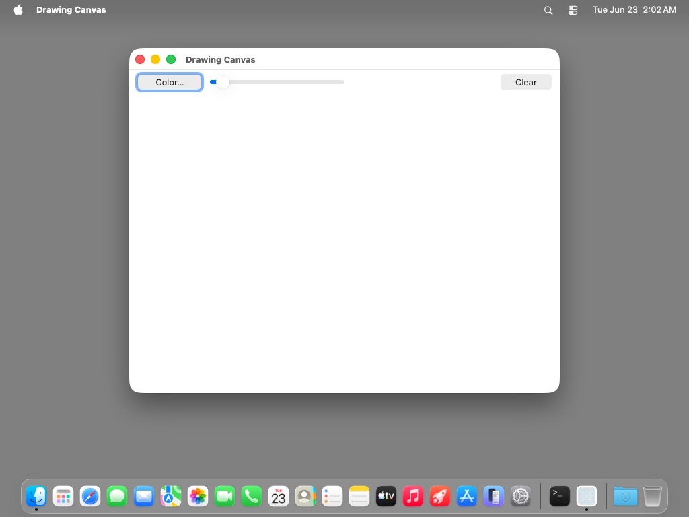
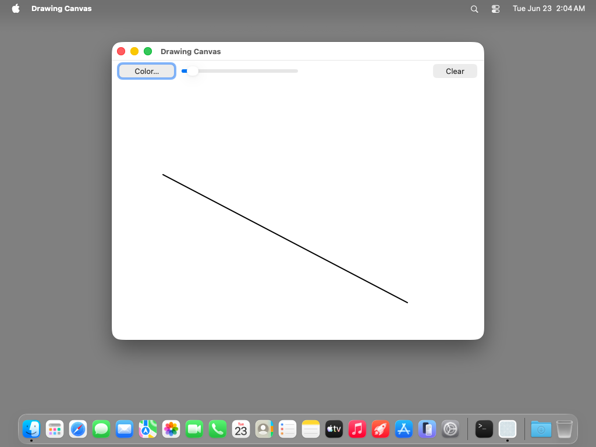
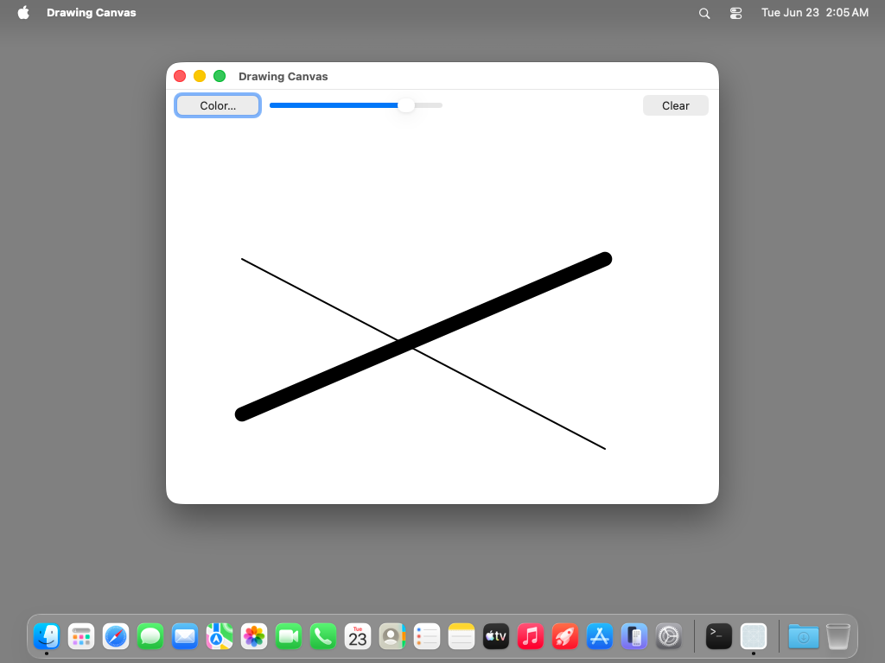
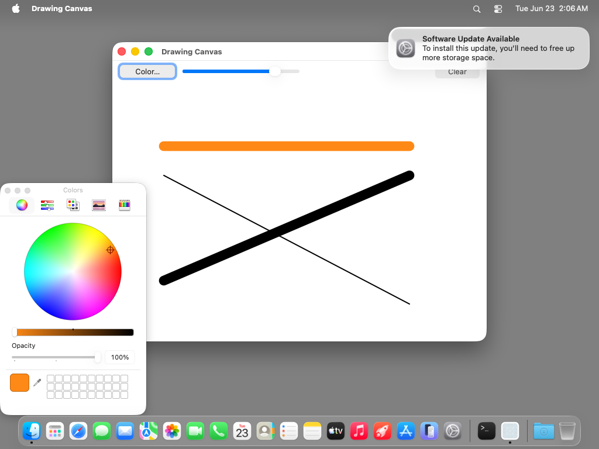
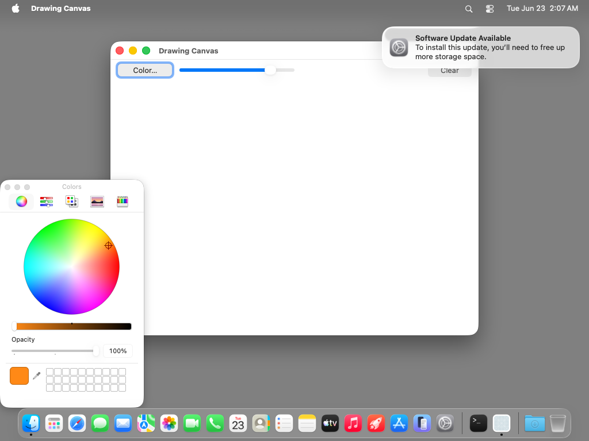

# drawing-canvas — TestAnyware VM verification report

**App:** `generation/targets/sbcl/apps/drawing-canvas/` (sbcl target, 060 ladder — app 9, the
transparent-subclass showcase and the ladder's final app)
**Date:** 2026-06-23
**Result:** ✅ PASS — a freehand drawing surface with per-stroke colour + line width. A REAL
ObjC subclass of `NSView` (`canvas-view`) overrides `drawRect:` + the three mouse selectors and
is driven by AppKit's own display/event loop; a second subclass of `NSObject`
(`canvas-controller`) carries the Color…/width-slider/Clear target-actions. Drag paints smooth
connected strokes, a single click paints a round dot, the width slider thickens subsequent
strokes, the `NSColorPanel` recolours them (live, continuous), Clear empties the canvas, and
Cmd-Q quits cleanly. All rendering is direct CoreGraphics (`ns:cg-*`), and the mouse→view
coordinate conversion reads a by-value `NSPoint` struct RETURN.
**Artifact:** `DrawingCanvas.app` (standalone `save-lisp-and-die :executable t` dump, 81 MB
exe), built by `apps/drawing-canvas/build.sh`.

## What this app proves

The FIRST sbcl app to **subclass NSView** and be driven by AppKit's own display/event loop —
three sbcl firsts, each diverging from the gerbil precedent:

1. **NSView subclass under live framework dispatch.** `(define-objc-subclass canvas-view
   (ns:ns-view) …)` synthesizes a real ObjC subclass (`objc_allocateClassPair` +
   `objc_registerClassPair`); each `(define-objc-method (canvas-view "sel") …)` routes the
   framework's callback through the ONE forwarding dispatcher (`_objc_msgForward` → bounce to
   main, ADR-0035 — a no-op here since display/events already run on main → the one Lisp
   dispatcher → CLOS). The note-editor/mini-browser controllers subclassed NSObject for
   target-action/notification callbacks; here AppKit calls INTO Lisp for `drawRect:` and the
   mouse events on its OWN schedule, for the view's lifetime. The instance is made with bare
   `(make-instance 'canvas-view)` (alloc/init — no `initWithFrame:` through make-instance for a
   subclass) then sized with `setFrame:`, and its ObjC-ptr → Lisp-instance back-reference is
   recorded so the override recovers the typed `self` (with its drawing-state slots).

2. **`drawRect:`'s NSRect arg IS delivered, not dropped.** The dispatcher reads the LIVE
   `NSInvocation` signature — recovered from NSView's real `drawRect:` encoding via
   `class_getInstanceMethod` (`aw-resolve-method-encoding` step 2) — so the override is
   `(self rect)` with `rect` a raw SAP we ignore (we repaint the whole bounds, as the
   racket/chez/gerbil ports do). Gerbil's generic trampoline instead DROPS the undeliverable
   struct, making its override `(self)`-only. The mouse selectors take a deliverable NSEvent
   object → `(self event)`.

3. **Direct CoreGraphics + a by-value struct RETURN.** Strokes render through `ns:cg-*`
   `define-alien-routine`s (`cg-context-set-rgb-stroke-color` / `-set-line-width` /
   `-set-line-cap` / `-set-line-join` / `-begin-path` / `-move-to-point` / `-add-line-to-point` /
   `-stroke-path`) on the CGContextRef from `(ns:cg-context (ns:current-context …))` — so
   CoreGraphics loads `:load-residual t` (the first ladder app needing that flag for FUNCTIONS,
   not constants). `-[NSEvent locationInWindow]` and `-[NSView convertPoint:fromView:]` return
   `(sb-alien:struct ns-point)` BY VALUE; arm64 routes the HFA return through `alien-funcall`
   cleanly, so x/y are read with a plain `(sb-alien:slot p 'x)` and a returned struct chains
   straight into the convert call's struct arg — NO `point-x`/`point-y` accessor helper (gerbil
   needed one).

Two synthesized subclasses, eight forwarded selectors (bounced to main, GC-safe):

| Class (super) | Selector | Role | Action |
|---|---|---|---|
| `canvas-view` (NSView) | `drawRect:` | framework display | repaint all strokes (whole bounds) via direct CoreGraphics |
| `canvas-view` (NSView) | `mouseDown:` | framework event | start a stroke at the view point (captures current RGB+width) |
| `canvas-view` (NSView) | `mouseDragged:` | framework event | append the view point to the in-progress stroke |
| `canvas-view` (NSView) | `mouseUp:` | framework event | end the stroke |
| `canvas-controller` (NSObject) | `openColor:` | target-action (Color… button) | open the shared `NSColorPanel`, route its continuous action back |
| `canvas-controller` (NSObject) | `colorChanged:` | `NSColorPanel` continuous action | panel colour → device RGB → capture into the canvas's current-RGB slots |
| `canvas-controller` (NSObject) | `widthChanged:` | target-action (slider) | `current-width` ← `NSSlider doubleValue` |
| `canvas-controller` (NSObject) | `clearCanvas:` | target-action (Clear button) | empty the strokes + `setNeedsDisplay:` |

Drawing STATE (strokes, current RGB+width, the drag flag) lives in the `canvas-view`'s CLOS
slots (the sbcl idiom; gerbil used top-level mutable bindings), accessed via `slot-value`; the
controller reaches into the same canvas slots. A stroke captures its colour+width at mouse-DOWN
time (a `defstruct`), so changing colour/width never retroactively alters existing strokes.

## Environment

- TestAnyware 2.0.x, golden `macos` clone (`testanyware-golden-macos-tahoe`).
- VM provisioning — no SBCL install (the image is embedded); **two dylibs, NO network**:
  1. `/opt/homebrew/opt/zstd/lib/libzstd.1.dylib` — SBCL core-compression dep (placed via
     `sudo` — the golden has no Homebrew, so `/opt/homebrew` is root-owned).
  2. `/tmp/libAPIAnywareSbcl.dylib` — the `aw_sbcl_subclass_*` bounce shim BOTH subclasses use.
     The dumped image records this path in `*shared-objects*` and auto-reopens it at revive
     (ADR-0038 §5). NO block bridge (no completion handlers) → no block factory needed.
  3. **No network** — all rendering is local CoreGraphics.
- macos-tahoe gotchas handled: `EnableStandardClickToShowDesktop` disabled; saved application
  state wiped; app de-quarantined; launched with `open -n` (a WindowServer session — a bare exec
  has none). A "Software Update Available" banner appeared mid-session and was ignored (it does
  not steal the app's key window). Drawing used `input drag` (a bare `input move` releases the
  VNC button mask → no `mouseDragged:`); the continuous `NSColorPanel` action likewise wants a
  `drag`. Targets came from `agent snapshot --window … --json` input-space coords, never
  screenshot pixels (the full-screen PNG scale varied across captures while the AX coords stayed
  stable).

## Verified (live in the VM)

| # | Check | Expected | Observed |
|---|---|---|---|
| 1 | launch layout | Color…/slider/Clear toolbar above an empty white canvas | ✅ as expected; window 640×512, slider value "2" |
| 2 | single-click dot | a bare click paints a round disc | ✅ black dot at the click point (round line cap on a 1-point path) |
| 3 | drag stroke | a drag paints a smooth connected polyline | ✅ connected black diagonal from drag-start to drag-end |
| 4 | **Clear** | Clear empties the canvas | ✅ `clearCanvas:` → canvas blank, `setNeedsDisplay:` repaint |
| 5 | width slider | dragging the slider thickens SUBSEQUENT strokes | ✅ slider → 16.6; new stroke thick + round-capped, prior thin line unchanged |
| 6 | per-stroke width | each stroke keeps its mouse-down width | ✅ thin (2px) + thick (16px) strokes coexist |
| 7 | **Color…** | opens `NSColorPanel`; its continuous action recolours | ✅ "Colors" panel (NSColorPanel) opened, owned by the app |
| 8 | colour change | picking a colour recolours subsequent strokes | ✅ wheel drag → orange; new stroke ORANGE, prior strokes still black |
| 9 | per-stroke colour | each stroke keeps its mouse-down colour | ✅ orange stroke over black strokes; none recoloured retroactively |
| 10 | final Clear | Clear empties the multi-colour canvas | ✅ canvas blank again |
| 11 | Cmd-Q | menu Quit (`terminate:`) ends the app cleanly | ✅ `pgrep` → TERMINATED_OK, zero errors in stderr |

Checks 5–9 are the crux: the width slider and the `NSColorPanel` mutate the canvas's
`current-width` / `current-r/g/b` slots through target-action / continuous-action callbacks, and
each new stroke snapshots those values at mouse-down — so the thin/black and thick/orange strokes
coexist with no retroactive recolour. The orange stroke (after the wheel drag) confirms the whole
colour path: `NSColorPanel color` → `colorUsingColorSpace: deviceRGB` → `redComponent` /
`greenComponent` / `blueComponent` (each a `double` return) → the canvas slots → the next
`drawRect:`'s `CGContextSetRGBStrokeColor`.

## Notable: zero runtime/emitter changes

Like note-editor, drawing-canvas needed **no runtime change and no emitter change** — every
binding (AppKit + Foundation + CoreGraphics) was already generated, and the 050 subclass
machinery + the FFI struct seam worked as designed for the new shapes (an NSView subclass under
framework dispatch; `drawRect:`'s delivered-then-ignored struct arg; the by-value `NSPoint`
return; direct `ns:cg-*` C calls). Its eight selector kebab-names (`draw-rect_`, `mouse-down_`,
…, `clear-canvas_`) are all fresh — none shadow an emitted 0-arg method (the `reload:`/`reload`
collision mini-browser fixed), so the ADR-0039-aligned runtime needed no further fix.

## Pre-flight gates (host, before the VM round-trip)

1. **Struct-return spike** (headless `sbcl --load`): created an NSView with a known frame, read
   `(ns:frame v)` / `(ns:bounds v)` slots, and chained `convertPoint:fromView:` struct returns —
   confirming arm64 delivers by-value `(struct ns-point)` returns to `sb-alien:slot` and accepts
   one as the next call's struct arg, BEFORE any app code was written.
2. **CoreGraphics load spike** (headless): `aw-app-load-framework "CoreGraphics" :load-residual t`
   loads cleanly and the `ns:cg-*` aliens are `fboundp` + their foreign symbols resolve.
3. **Construction pre-flight** (`AW_CANVAS_SMOKE=1 sbcl --load run.lisp`): synthesize BOTH
   subclasses, build the window + canvas + toolbar, wire target-action, assert the NSView
   subclass instance is live + back-referenced — every FFI crossing — without the run loop. Green
   (`### drawing-canvas construction pre-flight OK`).
4. **Revive smoke** (`AW_CANVAS_SMOKE=1 ./drawing-canvas` on the dumped image): re-synthesizes
   both subclasses via the startup re-resolution pass (frameworks, subclass dispatcher). Green
   (`### revived drawing-canvas construction OK`).
