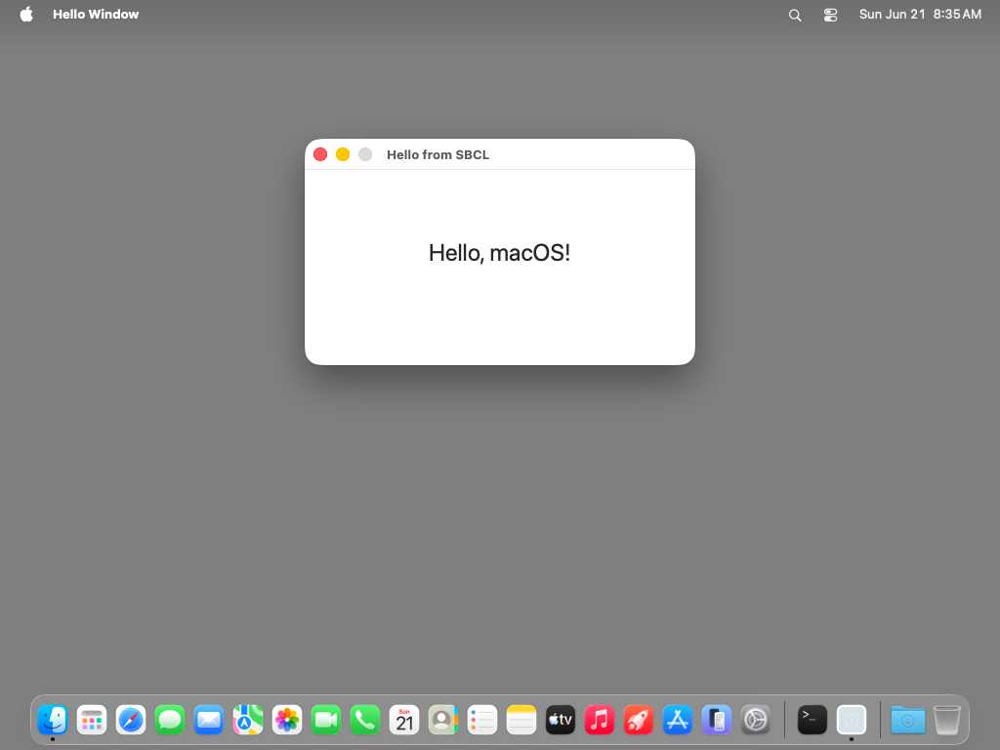

# hello-window — TestAnyware VM verification report

**App:** `generation/targets/sbcl/apps/hello-window/` (sbcl target, 060 ladder app 1/8)
**Date:** 2026-06-21
**Result:** ✅ PASS — window + centred label render correctly; Quit menu terminates.
**Artifact:** `HelloWindow.app` (standalone `save-lisp-and-die :executable t` dump,
79 MB exe), built by `apps/hello-window/build.sh`.

## Environment

- TestAnyware 2.0.0, golden `macos` clone, screen 1024×768, agent healthy.
- VM provisioning: **one** dylib — `/opt/homebrew/opt/zstd/lib/libzstd.1.dylib` (650 KB).
  The dumped SBCL exe links Homebrew's libzstd (SBCL's core-compression dep) at an
  absolute path the no-Homebrew golden lacks; everything else is system libs/frameworks.
  No SBCL install needed (the image is embedded). See learnings + the 070 findings.
- Desktop-click-to-reveal disabled (tahoe golden gotcha); app de-quarantined; launched
  with `open -n` (a WindowServer session — a bare exec has none).

## What was verified

**Semantic (accessibility agent):**

| Check | Expected | Observed |
|---|---|---|
| window appName | "Hello Window" (CFBundleName) | ✅ "Hello Window" |
| window title | "Hello from SBCL" | ✅ "Hello from SBCL" |
| window size | 400×200 content (+ title bar) | ✅ 400×232 |
| window position | centred | ✅ x=312 = (1024−400)/2 |
| label text | "Hello, macOS!" | ✅ `text value="Hello, macOS!"` |
| app menu | application menu + Quit item | ✅ "Hello Window" › "Quit Hello Window" |

**Visual (screenshot + OCR):** label "Hello, macOS!" centred horizontally and
vertically in the content area, 24 pt system font; OCR confidence 1.0. Title bar shows
the standard close/miniaturise buttons with the zoom button greyed (window is not
resizable — titled | closable | miniaturizable only — exactly per spec). Window centred
on screen; bold "Hello Window" app-name slot in the menu bar.

**Behaviour:** Cmd-Q terminated the app cleanly (`pgrep` → TERMINATED-OK), confirming
the menu item's `:action "terminate:"` SEL-arg init (ADR-0040 typed applier) wires to
`-[NSApplication terminate:]` end-to-end.

## Pre-flight gates (host, before the VM round-trip)

1. **Construction pre-flight** (`AW_HELLO_SMOKE=1 sbcl --load run.lisp`): every FFI
   crossing — the typed window/menu inits, property setters, `NSFont` class method,
   `makeKeyAndOrderFront:`/`activate` — succeeds without the run loop. No FP-trap crash.
2. **Revive smoke** (`AW_HELLO_SMOKE=1 ./hello-window` on the dumped image): the
   `*init-hooks*` startup re-resolution pass (re-`dlopen`, re-resolve `objc_msgSend`,
   re-mask FP traps) runs in the revived process and construction succeeds — the first
   exercise of that pass in a real dumped GUI image (ADR-0034 §6 / ADR-0038 §5).
3. **Runtime smoke suite** still all-green after the `@`-reader runtime addition
   (`run-integration-smoke.sh`: 7/7).
