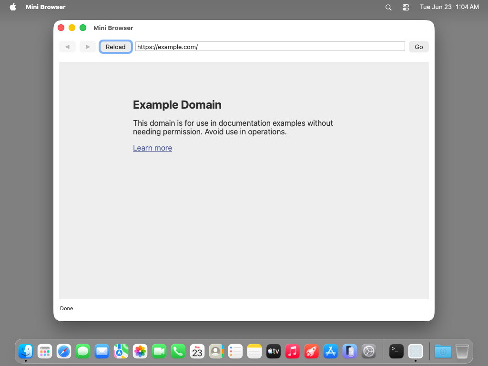
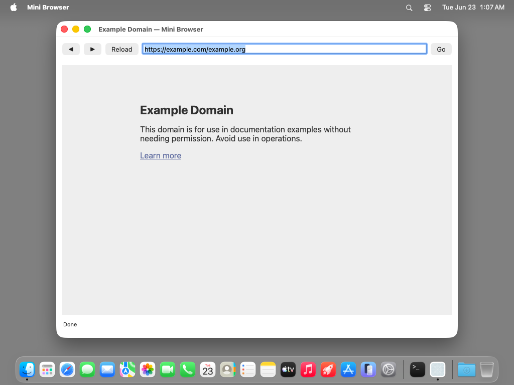
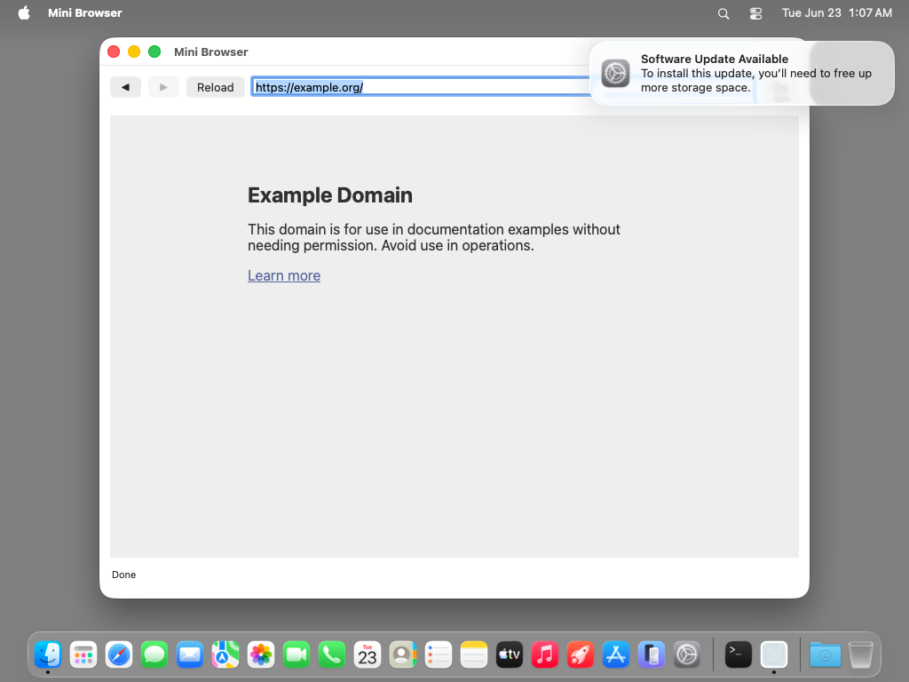

# mini-browser — TestAnyware VM verification report

**App:** `generation/targets/sbcl/apps/mini-browser/` (sbcl target, 060 ladder — app 6)
**Date:** 2026-06-23
**Result:** ✅ PASS — a `WKWebView` loads + renders `https://example.com`; the async
`WKNavigationDelegate` callbacks drive the status line (Loading…→**Done**) and resolve the
address bar to the canonical URL; a bare host typed into the address bar gets `https://`
prepended (`example.org` → `https://example.org/`); ◀/▶ walk the back-forward list
bidirectionally with correct enable/disable; Reload re-fetches; the window title tracks the
page title once WebKit's title KVO settles; Cmd-Q terminates cleanly. The dumped image's
re-synthesized subclass re-conforms to `WKNavigationDelegate` and the nav callbacks fire.
**Artifact:** `MiniBrowser.app` (standalone `save-lisp-and-die :executable t` dump, 84 MB
exe), built by `apps/mini-browser/build.sh`.

## What this app proves

First sbcl ladder app to use **WebKit** (freshly generated for this leaf) and the riskiest
delegate shape so far: the **async, multi-callback `WKNavigationDelegate`**. ONE synthesized
`browser-controller` (`define-objc-subclass` of `NSObject`) carries **EIGHT** forwarded
selectors — bounced to main, GC-safe — in two roles, and is the FIRST sbcl app whose
subclass **formally conforms to a framework protocol** (`(:protocols "WKNavigationDelegate")`
→ `class_conformsToProtocol` true; each nav selector's ABI read LIVE off the protocol):

| Selector | Role | Wired | Action |
|---|---|---|---|
| `go:` | target-action | build-time (Go button + address-field Return) | normalise the field text → `NSURLRequest` → `loadRequest:` |
| `back:` | target-action | build-time (◀) | `goBack` (guarded by `canGoBack`) |
| `forward:` | target-action | build-time (▶) | `goForward` (guarded by `canGoForward`) |
| `reload:` | target-action | build-time (Reload) | `reload` |
| `webView:didStartProvisionalNavigation:` | WKNavigationDelegate (2-arg `v@:@@`) | `setNavigationDelegate:` | status → "Loading…" |
| `webView:didFinishNavigation:` | WKNavigationDelegate (2-arg `v@:@@`) | `setNavigationDelegate:` | `refresh-chrome` (◀/▶ enable, title, address bar) + status → "Done" |
| `webView:didFailNavigation:withError:` | WKNavigationDelegate (3-arg `v@:@@@`) | `setNavigationDelegate:` | NSAlert from the NSError + status |
| `webView:didFailProvisionalNavigation:withError:` | WKNavigationDelegate (3-arg `v@:@@@`) | `setNavigationDelegate:` | NSAlert from the NSError + status |

The nav-delegate selectors are the FIRST with **two and three** object args; the one
forwarding dispatcher reads arg count + types live off the NSInvocation's
`NSMethodSignature`, so they marshal through the same path pdfkit-viewer's 1-arg notification
observer used — no per-arity machinery. WebKit delivers nav callbacks on the **main thread**,
so the ADR-0035 bounce is a no-op pass-through (no `dispatch_sync`, no deadlock).

## Environment

- TestAnyware 2.0.0, golden `macos` clone (`testanyware-golden-macos-tahoe`), 1024×768.
  Screenshot space and the `input click`/AX space were 1:1 aligned on this golden (as
  pdfkit-viewer's).
- VM provisioning — no SBCL install (the image is embedded); **two dylibs + network**:
  1. `/opt/homebrew/opt/zstd/lib/libzstd.1.dylib` — SBCL core-compression dep (placed via
     `sudo` — the golden has no Homebrew, so `/opt/homebrew` is root-owned).
  2. `/tmp/libAPIAnywareSbcl.dylib` — the `aw_sbcl_subclass_*` bounce shim. The dumped image
     records this path in `*shared-objects*` and auto-reopens it at revive (ADR-0038 §5).
  3. **Network** — the app loads `https://example.com` (VM `curl` → HTTP 200 confirmed). No
     sample file (unlike pdfkit-viewer's `.pdf`).
- macos-tahoe gotchas handled: `EnableStandardClickToShowDesktop` disabled; saved
  application state wiped; app de-quarantined; launched with `open -n` (a WindowServer
  session — a bare exec has none). Field select-all via **triple-click** (the NSTextField
  Cmd-A did not take reliably over VNC); a "Software Update Available" banner appeared
  mid-session and was ignored (it does not steal the app's key window).

## Verified (live in the VM)

| # | Check | Expected | Observed |
|---|---|---|---|
| 1 | initial load | WKWebView renders `https://example.com`, status "Done", ◀/▶ disabled | ✅ "Example Domain" page, "Done" |
| 2 | address resolution | address bar shows the canonical `https://example.com/` after load | ✅ via `didFinishNavigation:` → `refresh-chrome` |
| 3 | async delegate | the status line tracks the navigation to **"Done"** | ✅ "Done" (set only by `didFinishNavigation:`) |
| 4 | URL normalisation | a bare host `example.org` (no scheme) → loads `https://example.org/` | ✅ address bar resolved to `https://example.org/` |
| 5 | navigation | typing + Return (and Go) loads the URL | ✅ multiple navigations |
| 6 | back history | ◀ returns to the previous URL; ▶ becomes enabled | ✅ address → prior URL, ▶ enabled |
| 7 | forward history | ▶ enabled after going back (bidirectional) | ✅ both ◀ + ▶ enabled mid-history |
| 8 | boundary enable/disable | ◀/▶ reflect `canGoBack`/`canGoForward` | ✅ disabled at ends, enabled mid-history |
| 9 | window title | title tracks the page title once available | ✅ "Example Domain — Mini Browser" (back-nav, KVO settled) |
| 10 | Reload | re-fetches; status returns to "Done" | ✅ |
| 11 | Cmd-Q | app terminates cleanly | ✅ `pgrep` → TERMINATED-OK, no crash in stderr |

Check 3 is the crux: the status line changes ONLY through `webView:didFinishNavigation:`,
and the address bar resolves ONLY inside that callback's `refresh-chrome`. A correct "Done"
+ canonical URL after every load proves the async WKNavigationDelegate callback re-entered
Lisp through the bounce dispatcher, on the main thread, with its two object args marshalled.
Check 9 confirms the title-update path (`wkwebview-title` → window title) works once WebKit's
title KVO has populated — it only lags on the very first load (the same cosmetic
racket/chez/gerbil all noted), so a back-navigation to an already-titled page shows the full
"Example Domain — Mini Browser".

The "Loading…" set by `webView:didStartProvisionalNavigation:` is immediately superseded by
"Done" on these fast (cached) loads, so it was not captured in a still; it is the same
2-arg WKNavigationDelegate selector through the same proven dispatcher as `didFinishNavigation:`.
`didFailNavigation:`/`didFailProvisionalNavigation:` (3-arg, NSAlert from the NSError) were
not triggered live (no reliable failure injection without a captive network), but share the
identical conformance + dispatch path and were construction-verified in the pre-flight.

## The runtime gap this leaf fixed (`aw-selector->generic-name` ADR-0039 alignment)

mini-browser is the FIRST app with a hand-written delegate selector that **collides** with a
real emitted framework method differing only by arity: `reload:` (a 1-arg target-action) vs
WKWebView's 0-arg `reload`. The runtime's `aw-selector->generic-name` (used by
`define-objc-method`) still **dropped** colons — the pre-ADR-0039 convention — so `reload:`
mapped onto `ns:reload`, and `define-objc-method` tried to add a 2-arg method to the emitted
0-arg generic; CLOS rejected it (`FIND-METHOD-LENGTH-MISMATCH`). ADR-0039 had already fixed
the *emitter* (colon→`_`, so `reload`/`reload:` stay distinct `ns:reload`/`ns:reload_`) but
its parallel runtime reimplementation was never synced — a latent gap the earlier apps'
selectors (`openDocument:`, `pageChanged:`, `geometryChanged:`) never tripped. **Fix
(`lib/runtime/subclass.lisp`):** `aw-selector->generic-name` now emits `_` for each colon
(ADR-0039), matching the emitter's generic names exactly — so a delegate selector that names
a real method maps to the SAME-arity emitted generic (composes) instead of a colliding lower-
arity one. The seven-smoke runtime suite stays green with the change.

## Pre-flight gates (host, before the VM round-trip)

1. **Construction pre-flight** (`AW_BROWSER_SMOKE=1 sbcl --load run.lisp`): synthesize the
   controller (incl. `WKNavigationDelegate` conformance), build the window + controls, wire
   target-action + the nav delegate, kick the initial load — every FFI crossing — without
   the run loop. Green (`### mini-browser construction pre-flight OK`).
2. **Revive smoke** (`AW_BROWSER_SMOKE=1 ./mini-browser` on the dumped image): re-synthesizes
   the controller and re-conforms the protocol via the startup re-resolution pass. Green
   (`### revived mini-browser construction OK`).
3. **Runtime integration smoke** (`lib/runtime/tests/run-integration-smoke.sh`): all seven
   smokes green AFTER the `aw-selector->generic-name` change (incl. `smoke-subclass-conformance`,
   whose `copyWithZone:`/`handleNote:` selectors now map to `ns:copy-with-zone_`/`ns:handle-note_`).
