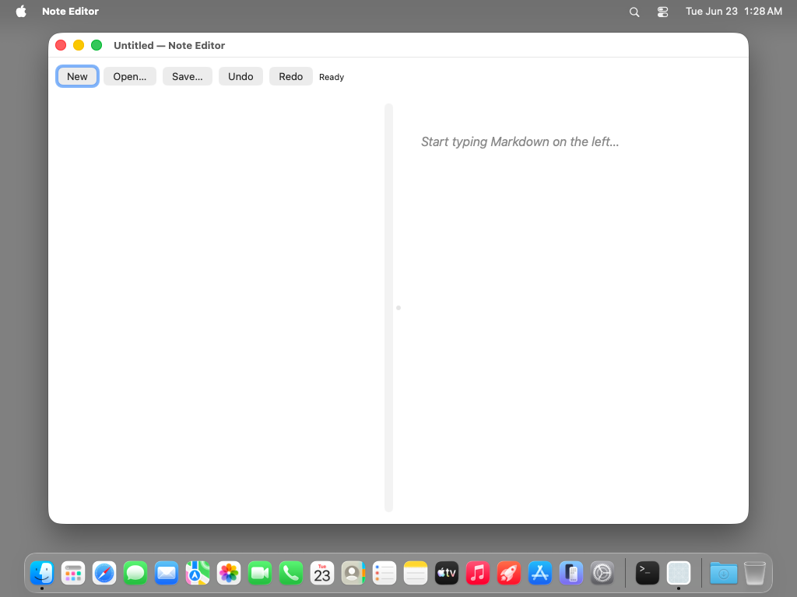
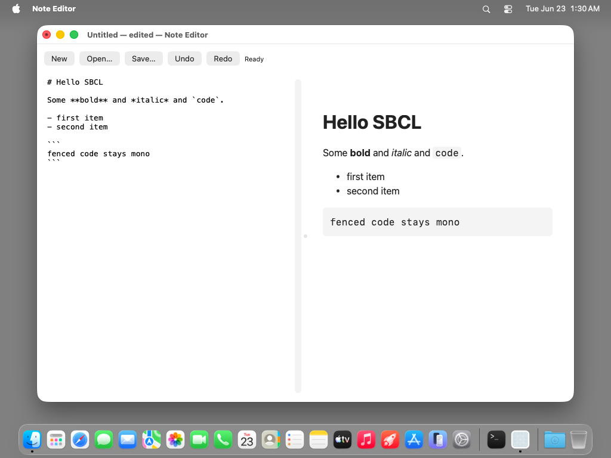
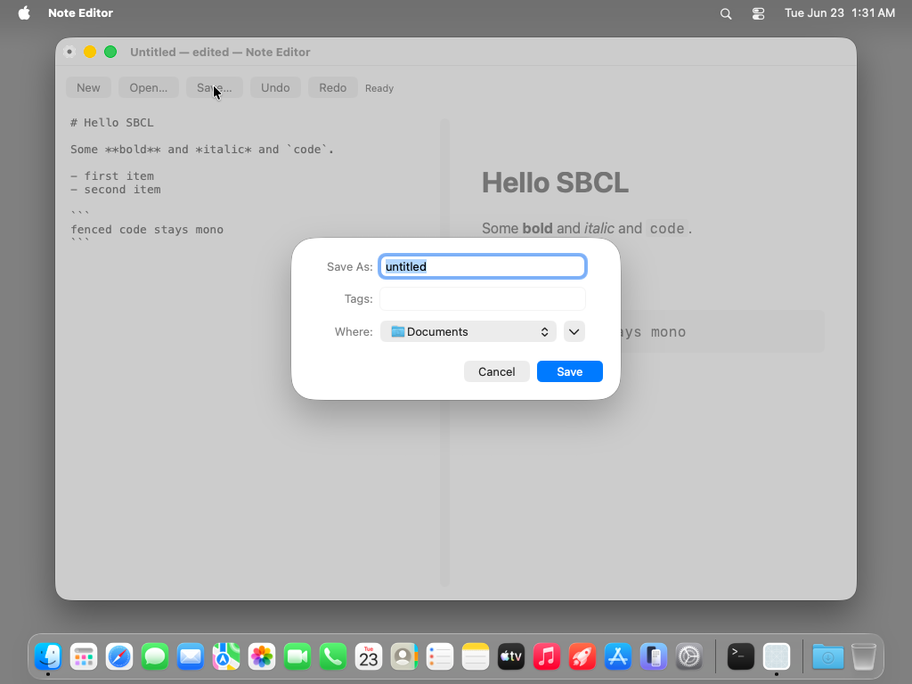
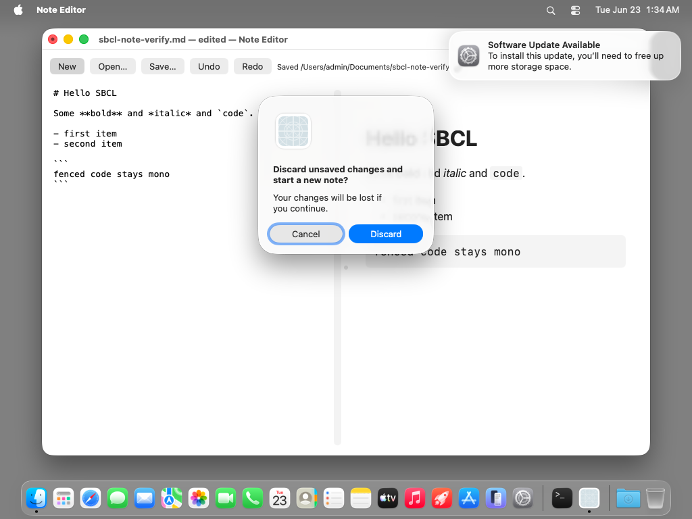
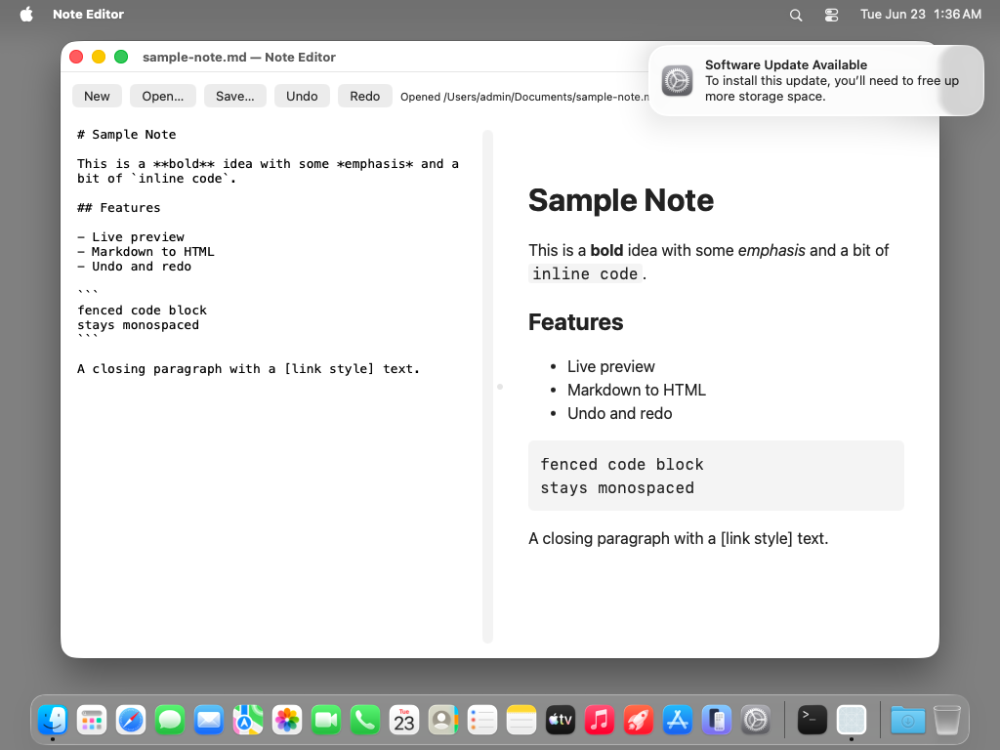

# note-editor — TestAnyware VM verification report

**App:** `generation/targets/sbcl/apps/note-editor/` (sbcl target, 060 ladder — app 7, the capstone)
**Date:** 2026-06-23
**Result:** ✅ PASS — a Markdown editor with a live HTML preview. The `NSTextView`
editor (left, in an `NSScrollView`) and the `WKWebView` preview (right) sit in an
`NSSplitView`; typing fires `NSTextDidChangeNotification`, the observer re-renders
Markdown→HTML and `loadHTMLString`s the preview. **Save…** crosses the first sbcl
**block bridge** — `beginSheetModalForWindow:completionHandler:` wrote
`~/Documents/sbcl-note-verify.md` with byte-exact editor content. Undo/Redo
(`NSUndoManager`), New (`NSAlert` discard confirmation), Open (`NSOpenPanel`), window
dirty-state (`setDocumentEdited:`), and Cmd-Q all verified live.
**Artifact:** `NoteEditor.app` (standalone `save-lisp-and-die :executable t` dump,
90 MB exe), built by `apps/note-editor/build.sh`.



## What this app proves

The widest feature surface of any sbcl sample, and the FIRST to cross a **block
bridge**: `NSSavePanel beginSheetModalForWindow:completionHandler:` takes an ObjC
block; the emitter wraps the handler arg in `(aw-block handler)` (token-less), so app
code passes a raw Lisp closure. The dylib builds a native block capturing an integer
id; on sheet dismiss the block bounces to main (ADR-0035 no-op here) and re-enters Lisp
through the one `aw-block-dispatcher`, handing the closure the `NSModalResponse` as a
raw SAP (`sb-sys:sap-int`). The block analogue of mini-browser's delegate callbacks.

ONE synthesized `note-controller` (`define-objc-subclass` of `NSObject`) carries SIX
forwarded selectors — bounced to main, GC-safe — in two roles:

| Selector | Role | Wired | Action |
|---|---|---|---|
| `newDoc:` | target-action | New button | `NSAlert` discard if dirty → clear editor + reset path |
| `openDoc:` | target-action | Open… button | `NSAlert` discard if dirty → `NSOpenPanel` runModal → load file |
| `saveDoc:` | target-action | Save… button | direct write if path known, else `NSSavePanel` **completion block** |
| `undoDoc:` | target-action | Undo button | `NSUndoManager undo` (via the text view, on NSResponder) |
| `redoDoc:` | target-action | Redo button | `NSUndoManager redo` |
| `textDidChange:` | `NSTextDidChange` observer (1-arg `v@:@`) | `addObserver:selector:name:object:` | mark dirty + re-render preview |

`textDidChange:` is the same 1-arg notification-observer shape pdfkit-viewer's
`pageChanged:` used; the five target-actions fall back to the synthesized default
`v@:@`. The completion-handler **block** is the genuinely new path.

## Environment

- TestAnyware 2.0.0, golden `macos` clone (`testanyware-golden-macos-tahoe`), 1024×768.
  Screenshot space and the `input click`/AX space were 1:1 aligned on this golden (the
  New button's AX-centre y=98 matched the screenshot), as mini-browser's.
- VM provisioning — no SBCL install (the image is embedded); **two dylibs, NO network**:
  1. `/opt/homebrew/opt/zstd/lib/libzstd.1.dylib` — SBCL core-compression dep (placed via
     `sudo` — the golden has no Homebrew, so `/opt/homebrew` is root-owned).
  2. `/tmp/libAPIAnywareSbcl.dylib` — the `aw_sbcl_subclass_*` bounce shim AND the
     `aw_sbcl_make_block` block factory. The dumped image records this path in
     `*shared-objects*` and auto-reopens it at revive (ADR-0038 §5).
  3. **No network** — the preview is local `loadHTMLString` (unlike mini-browser's
     `https://` loads). A sample `.md` was uploaded to `~/Documents/` for the Open test.
- macos-tahoe gotchas handled: `EnableStandardClickToShowDesktop` disabled; saved
  application state wiped; app de-quarantined; launched with `open -n` (a WindowServer
  session — a bare exec has none). A "Software Update Available" banner appeared
  mid-session and was ignored (it does not steal the app's key window).

## Verified (live in the VM)

| # | Check | Expected | Observed |
|---|---|---|---|
| 1 | launch layout | split view, empty editor, WKWebView placeholder | ✅ "Start typing Markdown on the left…" rendered |
| 2 | live preview — heading | typing `# Hello SBCL` renders an `<h1>` | ✅ bold H1 "Hello SBCL", title → "— edited" |
| 3 | live preview — inline | `**bold**` / `*italic*` / `` `code` `` render | ✅ bold, italic, gray code span |
| 4 | live preview — list | `- item` lines render a `<ul>` | ✅ bulleted "first item / second item" |
| 5 | live preview — fence | ```` ``` ```` block renders `<pre><code>` | ✅ gray monospace box "fenced code stays mono" |
| 6 | dirty state | edit → title "— edited" + close-box dot | ✅ `setDocumentEdited:` (title via `agent windows`) |
| 7 | **Save (block bridge)** | `NSSavePanel` sheet → Save → file written | ✅ `~/Documents/sbcl-note-verify.md` (112 B, byte-exact content) |
| 8 | post-save state | dirty cleared, title = filename, status "Saved …" | ✅ "sbcl-note-verify.md — Note Editor", status "Saved /Users/admin/Documents/sbcl-note-verify…" |
| 9 | Undo | reverts typing; preview re-renders | ✅ editor → empty, preview → placeholder, title "— edited" |
| 10 | Redo | restores reverted text | ✅ full content + preview restored |
| 11 | New (dirty) | `NSAlert` discard confirmation | ✅ "Discard unsaved changes and start a new note?" / "Your changes will be lost…" + Cancel/Discard |
| 12 | New → Discard | editor cleared, reset to Untitled | ✅ empty editor, placeholder, status "New document", title "Untitled — Note Editor" |
| 13 | Open | `NSOpenPanel` runModal → load file | ✅ loaded `sample-note.md`, preview rendered H1+H2+inline+list+fence, status "Opened …" |
| 14 | Cmd-Q | app terminates cleanly | ✅ `pgrep` → TERMINATED_OK, no errors in stderr |



Check 7 is the crux: the status line + file-on-disk change ONLY through the completion
**block**. The `NSSavePanel` opened as a modal (Save As "untitled.md" → renamed to
"sbcl-note-verify.md"), and clicking Save (via Return on the default button) fired the
block — bounced to main, re-entered Lisp, read `NSModalResponseOK` from the SAP, got the
panel URL, and wrote the editor text. The 112-byte file matched the typed Markdown
exactly, proving both the response value crossing the sync bounce AND the
`current-editor-text` read marshalling back.





## Notable: zero runtime/emitter changes

Unlike mini-browser (which fixed `aw-selector->generic-name` for the `reload:`/`reload`
collision), note-editor needed **no runtime change and no emitter change** — every
binding was already generated, and the 050 block + subclass machinery worked as
designed. Its six selector names (`new-doc_`…`text-did-change_`) are all fresh (none
shadow an emitted 0-arg method), so the ADR-0039-aligned runtime needed no further fix.

## Pre-flight gates (host, before the VM round-trip)

1. **Construction pre-flight** (`AW_NOTE_SMOKE=1 sbcl --load run.lisp`): synthesize the
   controller, build the window + split view + controls, wire target-action + the
   text-change observer, render the initial preview, AND construct an `aw-block`
   (block-bridge liveness gate) — every FFI crossing — without the run loop. Green
   (`### note-editor construction pre-flight OK`).
2. **Revive smoke** (`AW_NOTE_SMOKE=1 ./note-editor` on the dumped image): re-synthesizes
   the controller via the startup re-resolution pass (frameworks, subclass dispatcher,
   block dispatcher, AppKit constant surface). Green (`### revived note-editor
   construction OK`).
3. **Runtime integration smoke** unaffected (no runtime files changed this leaf).
