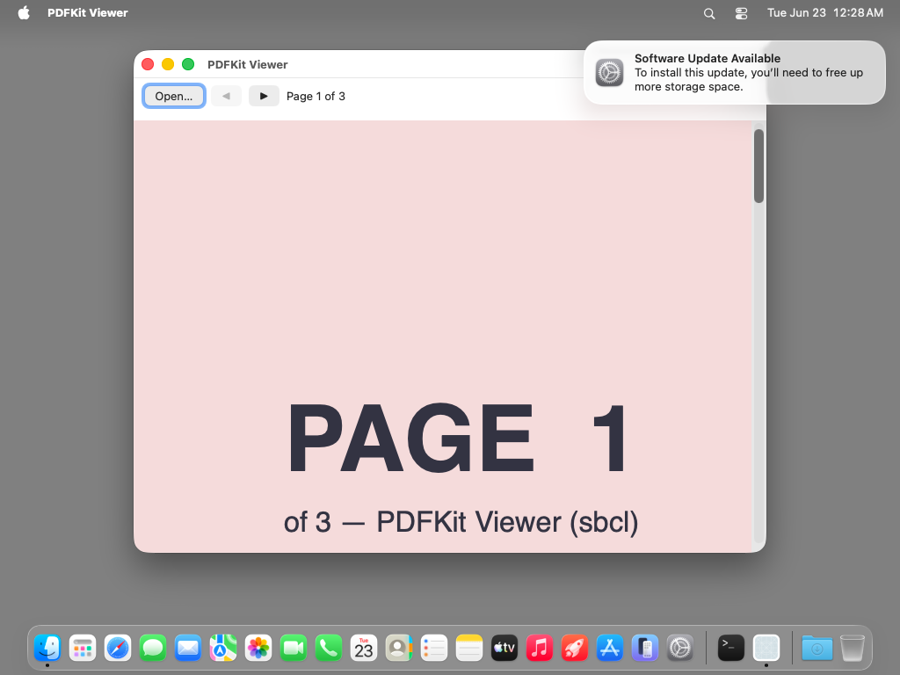
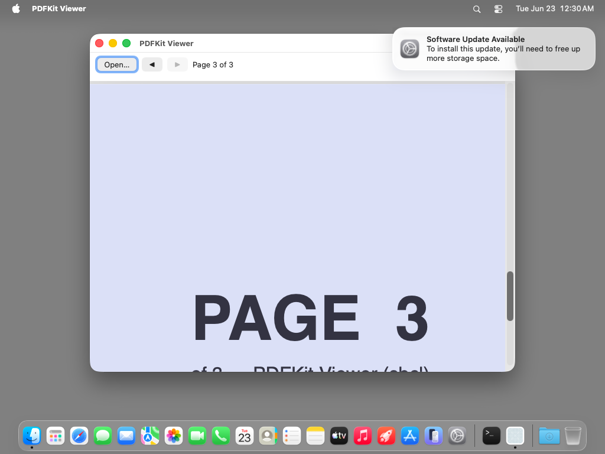
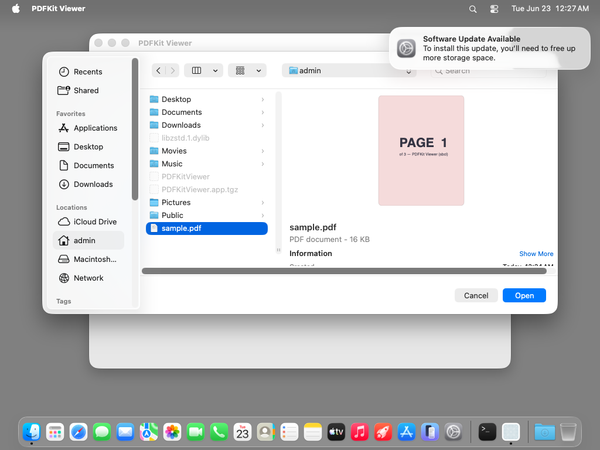
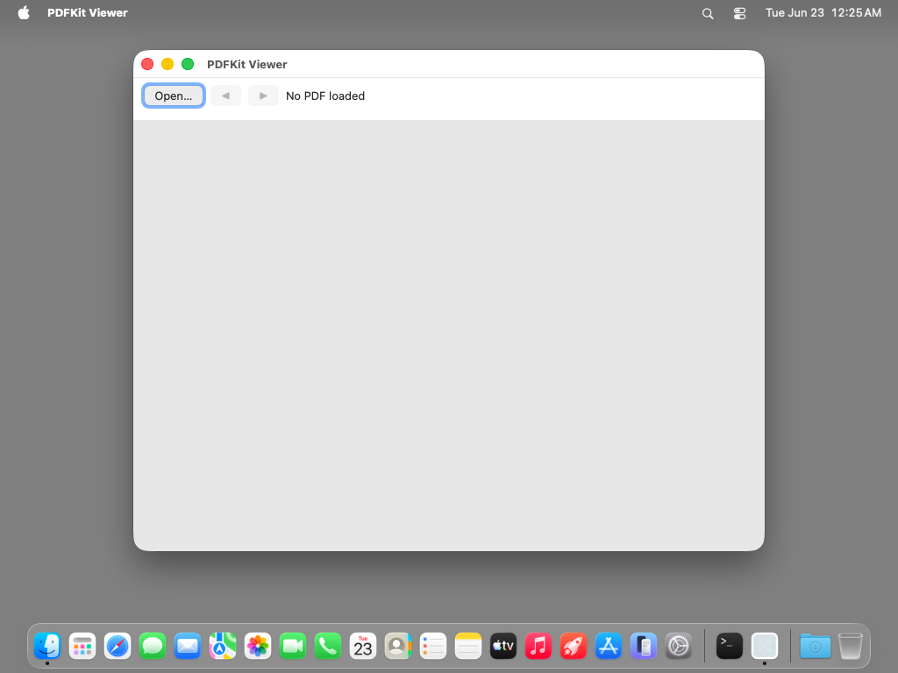

# pdfkit-viewer — TestAnyware VM verification report

**App:** `generation/targets/sbcl/apps/pdfkit-viewer/` (sbcl target, 060 ladder — app 5)
**Date:** 2026-06-23
**Result:** ✅ PASS — modal `NSOpenPanel` opens a PDF; `PDFView` renders it; ◀/▶ navigate;
the "Page n of N" label tracks **every** page change via the
`PDFViewPageChangedNotification` observer, with correct boundary enable/disable; Cmd-Q
terminates cleanly. The dumped image's re-resolved framework string constant works.
**Artifact:** `PDFKitViewer.app` (standalone `save-lisp-and-die :executable t` dump, 80 MB
exe), built by `apps/pdfkit-viewer/build.sh`.

## What this app proves

First sbcl ladder app to use **PDFKit** (freshly generated for this leaf), a **modal
`NSOpenPanel`** (`runModal`, inherited from `NSSavePanel`), and an **`NSNotificationCenter`
observer**. ONE synthesized `pdf-controller` (`define-objc-subclass` of `NSObject`) carries
FOUR forwarded selectors — bounced to main, GC-safe — and is simultaneously the
target-action target AND the notification observer:

| Selector | Wired | Action |
|---|---|---|
| `openDocument:` | build-time (on the `Open…` `NSButton`) | modal `NSOpenPanel` (.pdf filter) → `PDFDocument(initWithURL:)` → `setDocument:` |
| `goPrev:` | build-time (on ◀) | `goToPreviousPage:` (sender ignored) |
| `goNext:` | build-time (on ▶) | `goToNextPage:` (sender ignored) |
| `pageChanged:` | runtime (`addObserver:selector:name:object:` on the default center) | `refresh-pdf-ui` — re-reconcile label + button enable/disable |

The label update flows through the **notification**, not an explicit call: `goNext:`/`goPrev:`
only turn the page; PDFKit posts `PDFViewPageChangedNotification`; the observer's
`pageChanged:` fires and refreshes. So the label stays correct however the page turned.

## Environment

- TestAnyware 2.0.0, golden `macos` clone (`testanyware-golden-macos-tahoe`), 1024×768.
- VM provisioning — no SBCL install (the image is embedded); **two dylibs + a sample PDF**:
  1. `/opt/homebrew/opt/zstd/lib/libzstd.1.dylib` — SBCL core-compression dep (placed via
     `sudo` — the golden has no Homebrew, so `/opt/homebrew` is root-owned).
  2. `/tmp/libAPIAnywareSbcl.dylib` — the `aw_sbcl_subclass_*` bounce shim. The dumped image
     records this path in `*shared-objects*` and auto-reopens it at revive (ADR-0038 §5).
  3. `/Users/admin/sample.pdf` — a 3-page CoreGraphics-generated PDF (each page a distinct
     colour + big "PAGE n" text, so navigation is visually unambiguous).
- macos-tahoe gotchas handled: `EnableStandardClickToShowDesktop` disabled; saved
  application state wiped; app + PDF de-quarantined; launched with `open -n` (a WindowServer
  session — a bare exec has none). NSOpenPanel runs out-of-process
  (`com.apple.appkit.xpc.openAndSavePanelService`), so its AX tree is not under the app —
  drove the panel via Cmd-Shift-G + the default (Return) Open button rather than AX clicks.

## Verified (live in the VM)

| # | Check | Expected | Observed |
|---|---|---|---|
| 1 | empty state | "No PDF loaded", ◀ + ▶ disabled, empty PDFView | ✅ both disabled |
| 2 | Open… | `Open…` opens a modal `NSOpenPanel` (`runModal`) | ✅ panel modal |
| 3 | file filter / preview | panel previews the selected `sample.pdf` (PAGE 1) | ✅ preview shown |
| 4 | load + render | opening loads `PDFDocument(initWithURL:)`, `PDFView` renders page 1 | ✅ PAGE 1 (pink) |
| 5 | label initial | "Page 1 of 3" | ✅ |
| 6 | lower boundary | page 1: ◀ disabled, ▶ enabled | ✅ |
| 7 | ▶ → page 2 | label "Page 2 of 3" **via the notification**, both enabled | ✅ PAGE 2 (green) |
| 8 | ▶ → page 3 | label "Page 3 of 3", ▶ disabled (upper boundary) | ✅ PAGE 3 (blue) |
| 9 | ◀ → page 2 | label tracks **down** to "Page 2 of 3", both enabled | ✅ |
| 10 | Cmd-Q | app terminates cleanly | ✅ `pgrep` → TERMINATED-OK |

Check 7 is the crux: the label changes ONLY through `pageChanged:`, so a correct
"Page 2 of 3" after a ▶ click proves the observer fired — which in turn proves the
**re-resolved** `PDFViewPageChangedNotification` constant is the correct live name.

## The runtime gap this leaf fixed (`define-objc-constant` re-resolution)

pdfkit-viewer is the FIRST ladder app to need a framework STRING CONSTANT inside a dumped
image. `define-objc-constant` expanded to `(defparameter NAME <foreign-read>)`, read once at
load — a dead pointer across `save-lisp-and-die` (its section comment had deferred the fix to
070-distribution). The macro now ALSO registers a re-evaluator; the mandatory startup pass
(`startup.lisp`, after framework re-`dlopen`) re-runs each value form, re-deriving the
constant surface in a revived image. Without it the observer would register with a stale
notification name and never fire. Proven three ways: the host **revive smoke**
(`### revived pdfkit-viewer construction OK`); a discriminating assertion in
`smoke-startup-reresolution.lisp` (the dump corrupts a baked constant to nil — only the pass
can restore it); and check 7 above (the label tracking page changes live in the VM).

## Pre-flight gates (host, before the VM round-trip)

1. **Construction pre-flight** (`AW_PDFKIT_SMOKE=1 sbcl --load run.lisp`): synthesize the
   delegate, build the window + controls, wire target-action, register the observer — every
   FFI crossing — without the run loop. Green.
2. **Revive smoke** (`AW_PDFKIT_SMOKE=1 ./pdfkit-viewer` on the dumped image): re-synthesizes
   the delegate and re-registers the observer using the **re-resolved** constant. Green
   (`### revived pdfkit-viewer construction OK`).
3. **Runtime integration smoke** (`lib/runtime/tests/run-integration-smoke.sh`): green,
   including the extended `smoke-startup-reresolution` constant round-trip (CONST OK).
