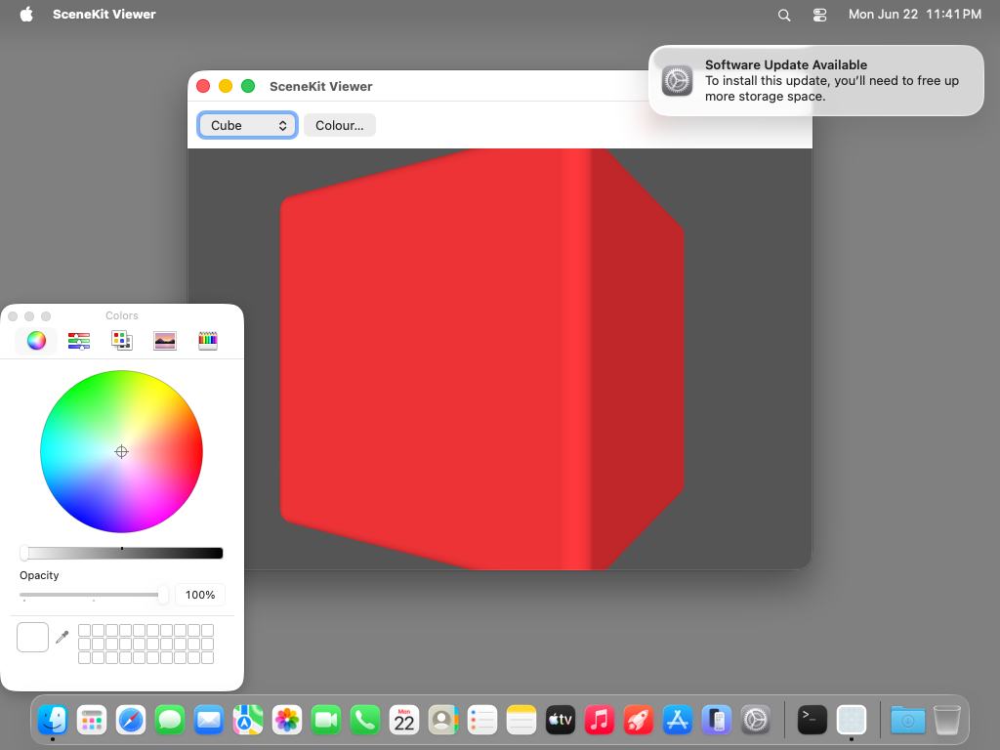
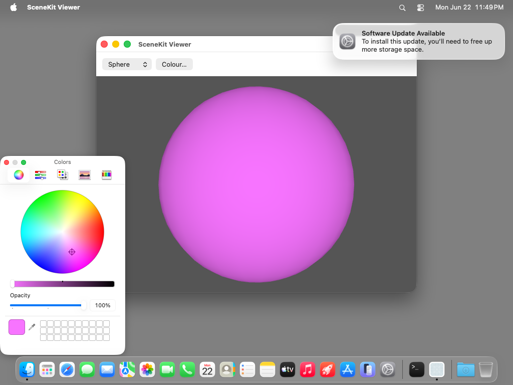
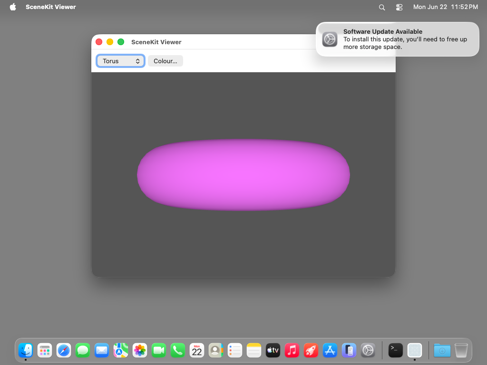

# scenekit-viewer — TestAnyware VM verification report

**App:** `generation/targets/sbcl/apps/scenekit-viewer/` (sbcl target, 060 ladder — app 4)
**Date:** 2026-06-23
**Result:** ✅ PASS — lit, spinning 3D geometry; popup geometry swap; live `NSColorPanel`
recolour; **colour persists across geometry swaps** (the fixed bug); Cmd-Q terminates
cleanly; dump+revive of a synthesized subclass green.
**Artifact:** `SceneKitViewer.app` (standalone `save-lisp-and-die :executable t` dump, 83 MB
exe), built by `apps/scenekit-viewer/build.sh`.

## What this app proves

First **GUI ladder app with a custom Lisp target-action delegate** and first to
**dump+revive a synthesized subclass**. `scene-controller` (a `define-objc-subclass` of
`NSObject`) routes three forwarded selectors — bounced to main — into CLOS `defmethod`s:

| Selector | Wired | Action |
|---|---|---|
| `geometryChanged:` | build-time (`set-target_`/`set-action_` on the popup) | swap `node.geometry`, re-apply colour |
| `openColor:` | build-time (on the `Colour…` `NSButton`) | open + wire the shared `NSColorPanel` |
| `colorChanged:` | runtime (`setTarget:`/`setAction:`/`setContinuous:` in `openColor:`) | device-RGB normalise + recolour the live material |

Both the build-time-wired and runtime-wired target/action paths reach the synthesized
delegate through the same main-bounced forwarding dispatcher.

## Environment

- TestAnyware 2.0.0, golden `macos` clone (`testanyware-golden-macos-tahoe`), 1024×768.
- VM provisioning — no SBCL install (the image is embedded); **two dylibs**:
  1. `/opt/homebrew/opt/zstd/lib/libzstd.1.dylib` — SBCL core-compression dep (absolute path
     the no-Homebrew golden lacks).
  2. `/tmp/libAPIAnywareSbcl.dylib` — the `aw_sbcl_subclass_*` bounce shim. The dumped image
     records this path in `*shared-objects*` and auto-reopens it at revive (ADR-0038 §5),
     re-linking the subclass machinery; the runtime then re-registers the forwarding
     dispatcher with the reopened dylib.
- macos-tahoe gotchas handled: `EnableStandardClickToShowDesktop` disabled; saved
  application state wiped for a clean windowed launch; app de-quarantined; launched with
  `open -n` (a WindowServer session — a bare exec has none).

## Verified (live in the VM)

**Visual + behavioural (screenshots + AX agent):**

| # | Check | Expected | Observed |
|---|---|---|---|
| 1 | initial render | red chamfered `SCNBox`, lit (default lighting), spinning | ✅ red cube, shaded, rotating |
| 2 | scene graph | scene → root node → geometry node → material | ✅ renders |
| 3 | geometry swap | popup Cube→Sphere swaps geometry (`geometryChanged:`) | ✅ sphere |
| 4 | colour on initial swap | Cube→Sphere keeps the initial red (not white) | ✅ red sphere |
| 5 | open colour panel | `Colour…` opens + wires the shared `NSColorPanel` (`openColor:`) | ✅ panel wired |
| 6 | live recolour | picking a colour recolours the material live (`colorChanged:`) | ✅ red→magenta |
| 7 | **colour persists across swap** | recoloured magenta survives Sphere→Torus→Sphere | ✅ **magenta, not white** |
| 8 | spin survives swap | continuous rotation continues after `setGeometry:` | ✅ spinning torus/sphere |
| 9 | Cmd-Q | app terminates cleanly | ✅ `pgrep` → TERMINATED-OK |

## The bug this leaf fixed (verified by check 7)

`firstMaterial.diffuse.contents` is kept alive only by the material that retains it.
`color-using-color-space_` returns a **+0 autoreleased** `NSColor`, so the Lisp slot merely
*borrowed* it. SceneKit allocates a **fresh `firstMaterial` per geometry**, so
`geometryChanged:`'s `setGeometry:` deallocates the old material — dropping the colour's last
owner — before the new material is recoloured; the slot dangled and the re-apply read freed
memory → **white**. Fix (`own-color`): retain to +1 (`%objc-retain`) and re-wrap with
`aw-wrap … t` (arms the main-thread release finalizer, ADR-0036), decoupling the stored
colour's lifetime from any material's. VM-verified: magenta now survives Sphere→Torus→Sphere.

## Pre-flight gates (host, before the VM round-trip)

1. **Construction pre-flight** (`AW_SCENEKIT_SMOKE=1 sbcl --load run.lisp`): synthesize the
   delegate, build the scene graph + every control, wire target-action — every FFI crossing —
   without the run loop. Green.
2. **Revive smoke** (`AW_SCENEKIT_SMOKE=1 ./scenekit-viewer` on the dumped image): the FIRST
   ladder app to dump+revive a **synthesized subclass** — the revived image re-synthesizes
   the delegate (startup re-resolution pass + dispatcher re-registration with the reopened
   dylib) and rebuilds the scene. Green (`### revived scenekit-viewer construction OK`).
3. **Runtime integration smoke** (`lib/runtime/tests/run-integration-smoke.sh`): green with
   the `subclass.lisp` dispatcher-re-registration change.
