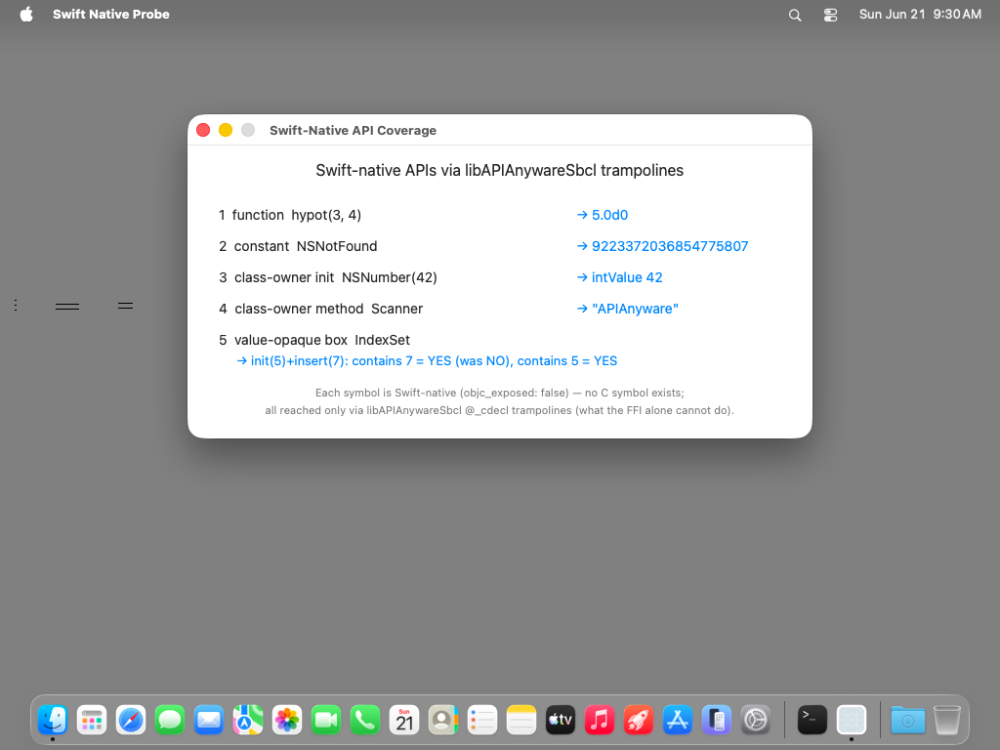

# swift-native-probe — TestAnyware VM verification report

**App:** `generation/targets/sbcl/apps/swift-native-probe/` (sbcl target, 060 ladder — the §6d exemplar)
**Date:** 2026-06-21
**Result:** ✅ PASS — all four Swift-native trampoline shapes resolve + render live values in a *dumped, revived* GUI app; Cmd-Q terminates cleanly.
**Artifact:** `SwiftNativeProbe.app` (standalone `save-lisp-and-die :executable t` dump, 82 MB exe), built by `apps/swift-native-probe/build.sh`.

## What this probe proves (the §6d invariant, ported to sbcl — ADR-0038)

A verification **probe**, not a portfolio app: it is the project done-bar the in-process
050 integration smoke (`lib/runtime/tests/smoke-integration.lisp`, GATE D — shapes proven
*by shape* against a `FixtureKit` stand-in) does **not** satisfy. Here the **real**
`objc_exposed: false` symbols from Foundation/CoreGraphics — each with **no** C symbol in
its framework, reachable only through `libAPIAnywareSbcl`'s `aw_sbcl_swift_*` `@_cdecl`
trampolines — are bound from the **generated** bindings and rendered live in a loaded app.
It is the sbcl analogue of racket/chez/gerbil's `swift-native-probe`, merging their
function/constant slice with the method/init slice (sbcl defers the value-STRUCT-owner
shape to 090 and the async-method shape by design).

Four shapes (045/050 wired), each a labelled row — values verified visually (OCR) and the
window/app identity semantically (accessibility agent):

| # | Shape | Symbol (Swift-native, no C symbol) | Live value shown |
|---|---|---|---|
| 1 | free **function** | `CoreGraphics.hypot(_:_:)` | `→ 5.0d0` |
| 2 | **constant** | `Foundation.NSNotFound` | `→ 9223372036854775807` (NSIntegerMax) |
| 3 | class-owner **init** | `NSNumber(integerLiteral: 42)` | `→ intValue 42` (a real wrapped `ns:ns-number`) |
| 4 | class-owner **method** | `Scanner.scanUpToString(_:)` | `→ "APIAnyware"` (from `"APIAnyware:SBCL"`) |
| 5 | **value-opaque box** | `IndexSet.init/contains/insert` | `→ init(5)+insert(7): contains 7 = YES (was NO), contains 5 = YES` |

The value-opaque round-trip (5) drives ONE `AwSbclValueBox` handle through producer →
read → mutate → re-read → `aw-box-free`, exactly the 050 smoke's D5 shape, against a real
Foundation value struct as a raw opaque handle (no CLOS class — that modelling is 090).

## Environment

- TestAnyware 2.0.0, golden `macos` clone, screen 1024×768, agent healthy.
- VM provisioning — **two** dylibs (no SBCL install; the image is embedded):
  1. `/opt/homebrew/opt/zstd/lib/libzstd.1.dylib` (650 KB) — SBCL's core-compression dep,
     an absolute path the no-Homebrew golden lacks (the hello-window finding, unchanged).
  2. `/tmp/libAPIAnywareSbcl.dylib` (374 KB) — **the §6d residual dylib**, NEW for this app.
     The dumped image records this path in `*shared-objects*` and auto-reopens it at revive
     (ADR-0038 §5), re-linking every `aw_sbcl_*` symbol for free. (The bundle also vendors a
     copy in `Contents/Frameworks/`; the exe-relative relocation is `bundle-sbcl`/070's job.)
- Desktop-click-to-reveal disabled (tahoe golden gotcha); app de-quarantined; launched with
  `open -n` (a WindowServer session — a bare exec has none).

## Verified

**Semantic (accessibility agent + launch log):**

| Check | Expected | Observed |
|---|---|---|
| window appName | "Swift Native Probe" (CFBundleName) | ✅ "Swift Native Probe" |
| window title | "Swift-Native API Coverage" | ✅ |
| window size | 640×300 content (+ title bar) | ✅ 640×332 |
| window state | shown, focused/key | ✅ `[focused]` |
| residual values (VM launch log) | the 5 rows above | ✅ all five, computed in-VM |

(The five labels are bezel-less non-selectable `NSTextField`s, so AppKit does not surface
them as separate AX text elements — the screenshot OCR is the value evidence; the launch
log independently prints the same five live values computed in the VM process.)

**Visual (screenshot + OCR):** heading "Swift-native APIs via libAPIAnywareSbcl trampolines";
five rows, each name (left, label colour) → live value (right, system-blue accent); a
two-line secondary-label footer ("Each symbol is Swift-native (objc_exposed: false) — no C
symbol exists; all reached only via libAPIAnywareSbcl @_cdecl trampolines …"). Intentional
layout, not just a window (`feedback-sample-apps-perfect`). Window centred; standard
close/miniaturise buttons with zoom greyed (titled | closable | miniaturizable).

**Behaviour:** Cmd-Q terminated the app cleanly (`pgrep` → TERMINATED-OK), via the same
SEL-arg menu init (`:action "terminate:"`, ADR-0040 typed applier) hello-window proved.

## Pre-flight gates (host, before the VM round-trip)

1. **Construction pre-flight** (`AW_PROBE_SMOKE=1 sbcl --load run.lisp`): every Swift-native
   trampoline is called and the whole UI built without the run loop — all 5 shapes green,
   no FP-trap crash.
2. **Revive smoke** (`AW_PROBE_SMOKE=1 ./swift-native-probe` on the dumped image): the FIRST
   ladder app to dump+revive **with** the dylib — `save-lisp-and-die` keeps the dylib in
   `*shared-objects*`, the revived image auto-reopens it, and all five `aw_sbcl_*` shapes
   re-link + return correct values (the §6d residual surviving the dump, ADR-0038 §5).
3. **Emitter regression** (`cargo test -p apianyware-macos-emit-sbcl`): green, incl. the new
   CL-reserved-formal naming test; the TestKit/Foundation goldens are unchanged.

## Forcing-function findings (surfaced by being the first app to load a `functions.lisp`)

- **BLOCKER, FIXED — `t` as a generated formal.** `coregraphics/functions.lisp` named nine
  `CGAffineTransform*` formals `t` (the C param name), and `t` is a CL defined constant, so
  the file raised `SIMPLE-PROGRAM-ERROR` at load — `:load-residual t` for CoreGraphics could
  not load at all. hello-window dodged it (`:load-residual nil`, pure ObjC). Fixed in the
  emitter (`naming::is_cl_reserved_formal`, applied in both `arg_name`s): a `t`/`nil` formal
  falls back to the positional `argN`, like an empty label. Regenerated; the file now loads.
- **FINDING (cross-cutting) — Swift-overlay class names broke auto-wrap. ✅ FIXED in k38.**
  `NSScanner` reached the IR under its Swift-overlay name `"Scanner"`, *separate* from the
  clang `NSScanner` (the merge matched by `name`), so the Swift-native methods and the ObjC
  methods landed on two different CLOS classes and the overlay-named `ns:scanner` (registered
  `"Scanner"`) matched no live object. The probe originally worked around it with
  `(make-instance 'ns:scanner :ptr id)`. **Fixed at the shared collection layer**
  (`extract-swift` `map_class` keys ObjC-bridged classes on the ObjC runtime name from the
  USR), unifying each overlay with its clang twin into one `ns:ns-scanner` (registered the live
  `"NSScanner"`, carrying both the init and `ns:scan-up-to-string`) — fixes all targets and
  collapses ~31 Foundation duplicates. The probe now uses the **natural** path
  `(make-instance 'ns:ns-scanner :init-with-string @"…")`, no `:ptr` workaround. Never
  affected the AppKit GUI ladder (NSButton/NSWindow/… keep their names). See learnings + the
  repo-root `TODO.md` (item resolved).
