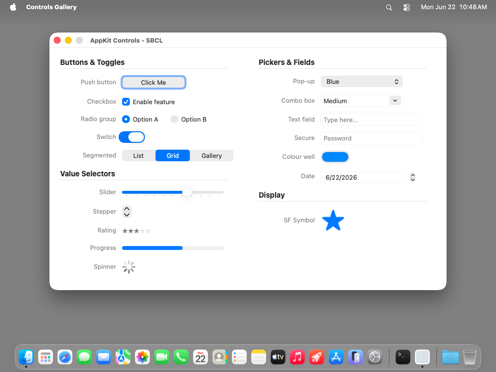

# ui-controls-gallery — TestAnyware VM verification report

**App:** `generation/targets/sbcl/apps/ui-controls-gallery/` (sbcl target, 060 ladder app 3/8)
**Date:** 2026-06-22
**Result:** ✅ PASS — all 18 controls render with their configured states; controls are
live (checkbox/segment/slider state changes verified); Cmd-Q terminates cleanly.
**Artifact:** `UIControlsGallery.app` (standalone `save-lisp-and-die :executable t` dump,
82 MB exe), built by `apps/ui-controls-gallery/build.sh`.

## Environment

- TestAnyware 2.0.0, golden `testanyware-golden-macos-tahoe` clone (macOS 26.3, arm64),
  screen 1024×768, agent healthy + accessibility granted.
- VM provisioning: **one** dylib — `/opt/homebrew/opt/zstd/lib/libzstd.1.dylib` (650 KB),
  the same single dep hello-window needed (SBCL core-compression, absolute Homebrew path
  the no-Homebrew golden lacks). `otool -L` of the dumped exe shows only
  `libSystem` + `libzstd` — **no `libAPIAnywareSbcl`** (pure ObjC, no Swift-native
  residual), so no dylib provisioning beyond libzstd.
- App de-quarantined (`xattr -cr`); launched with `open -n` (a WindowServer session).

## What was verified

**Window (agent windows):**

| Check | Expected | Observed |
|---|---|---|
| appName | "Controls Gallery" (CFBundleName) | ✅ "Controls Gallery" |
| title | "AppKit Controls - SBCL" | ✅ "AppKit Controls - SBCL" |
| size | 820×500 content (+ title bar) | ✅ 820×532 |
| position | centred | ✅ x=102 = (1024−820)/2 |

**Semantic (accessibility snapshot, 43 elements):** every control resolved with its
configured state — the binding marshalling is exact, not just non-crashing:

| Control | Class / construction | Verified state |
|---|---|---|
| Push button | `+buttonWithTitle:target:action:` | label "Click Me", AXButton, enabled |
| Checkbox | `+checkboxWithTitle:…` + `setState:` | label "Enable feature", value **1** (on) |
| Radio A / B | `+radioButtonWithTitle:…` (grouped) | A value **1**, B value **0** (mutually exclusive) |
| Switch | `make-instance` + `setState:` | AXButton value **1** (on) |
| Segmented | `setSegmentCount:`/`setLabel:forSegment:` | 3 segments [List\|Grid\|Gallery], **Grid** selected |
| Slider | `setMin/Max/DoubleValue:` + ticks | value **65**, 11 tick marks |
| Stepper | `setMin/Max/Increment/DoubleValue:` | spin-button value **3** |
| Rating | NSLevelIndicator `rating` style | value **3** → ★★★☆☆ |
| Progress (bar) | `setStyle:bar` `setIndeterminate:NO` | progress value **0.6** (60/100) |
| Spinner | `setStyle:spinning` + `startAnimation:` | indeterminate progress, animating |
| Pop-up | `addItemWithTitle:`×3 + `selectItemAtIndex:2` | value **"Blue"** |
| Combo box | `addItemWithObjectValue:`×3 + `setStringValue:` | value **"Medium"** |
| Text field | `make-instance` + `setPlaceholderString:` | placeholder "Type here..." |
| Secure field | NSSecureTextField + placeholder | placeholder "Password" |
| Colour well | `setColor:` systemBlue | "System systemBlueColor" |
| Date picker | `setDatePickerStyle:`/`-Elements:`/`-Value:` | today's date (2026-06-22) |
| SF Symbol | `+[NSImage imageWithSystemSymbolName:…]` + tint | image "star" rendered, accent-tinted |

**Visual (screenshot):** clean two-column layout under bold section headers
("Buttons & Toggles", "Value Selectors", "Pickers & Fields", "Display") with NSBox
separator lines; right-aligned secondary-label captions; controls correctly aligned. The
focus ring on "Click Me", the blue checkbox/radio/switch fills, the **Grid** segment
highlight, the ★★★☆☆ rating, the 60 % progress bar, the spinning indicator, the blue
colour well, and the accent-tinted SF star all render as configured.

**Behaviour (VNC input):** the controls are live — clicking the checkbox toggled its
value **1 → 0**; clicking the "List" segment moved the selection Grid → List; dragging the
slider knob changed its value **65 → 20.3** (re-read from the accessibility tree + a
second screenshot). Cmd-Q terminated the app cleanly (`pgrep` → TERMINATED_OK),
confirming the menu item's `:action "terminate:"` SEL-arg init reaches
`-[NSApplication terminate:]` end-to-end.

## Pre-flight gates (host, before the VM round-trip)

1. **Construction pre-flight** (`AW_GALLERY_SMOKE=1 sbcl --load run.lisp`): every FFI
   crossing — all 16+ control constructors, every setter, the typed window/menu inits —
   succeeds without the run loop. No FP-trap crash.
2. **Revive smoke** (`AW_GALLERY_SMOKE=1 ./ui-controls-gallery` on the dumped image): the
   `*init-hooks*` startup re-resolution pass runs in the revived process and the full UI
   constructs — the broadest exercise yet of that pass (16+ controls across NSControl
   subclasses), after hello-window's single window+label.
