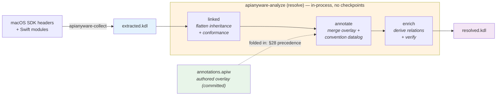

# Annotation Workflow

API annotations classify each Objective-C / Swift method with the semantic
metadata the emitter needs but the headers do not state outright — parameter
ownership, block-invocation style, threading constraints, and error patterns.
They drive the emitter's wrapping decisions and the Datalog verification rules.

Annotations live in **one authored, committed overlay per framework**,
`platforms/macos/api/<Framework>/annotations.apiw` (KDL — the `.apiw` DSL,
ADR-0046). Everything below is the operating layer over that overlay: how it is
produced, regenerated when the SDK drifts, reviewed, and accepted (ADR-0050).

## The spec triad

Each framework family has three artifacts under
`platforms/macos/api/<Framework>/`:

| Artifact | Produced by | Committed? | Role |
|---|---|---|---|
| `extracted.kdl` | `apianyware-collect` | no (gitignored) | mechanical extraction facts — the Datalog fact base |
| `annotations.apiw` | the LLM side-channel (this doc) | **yes** | the one authored semantic overlay — manual + accepted-LLM facts, KDL |
| `resolved.kdl` | `apianyware-analyze` (resolve) | no (gitignored) | the resolved graph — the generator input |

`extracted.kdl` and `resolved.kdl` are regenerable from the SDK + the
committed overlay, so they are gitignored; **only `annotations.apiw` is
authored and committed.** It *is* the cache: there is no separate staging store.

## Pipeline overview

`apianyware-analyze` (the resolve flow) reads a family's `extracted.kdl`, folds
in its committed `annotations.apiw`, and writes `resolved.kdl`. The three passes
— `linked` (inheritance/conformance flattening, ownership families), `annotate`
(merge the overlay + the convention-tier Datalog facts under §28 precedence), and
`enrich` (annotation-derived relations + verification) — all run **in-process**;
only `extracted.kdl` and `resolved.kdl` touch disk.



### Source precedence (§28)

`annotate` merges every producing tier per fact-slot — one semantic claim, e.g. a
parameter's ownership or a method's threading — under the precedence ladder

```
manual  >  accepted-LLM  >  convention  >  extraction  >  unknown
```

`accepted-LLM` is simply a `source llm` fact in the *committed* overlay (see
[Git is the accept boundary](#git-is-the-accept-boundary)). The **convention**
tier is pure Datalog (ADR-0047) recomputed every run from `extracted.kdl` —
nothing to cache. The winning *value* is what the generator sees; the audit
(below) additionally stamps each winner's `source` and records disagreeing losers
as `superseded-by`, **provenance only** — emit projects the facts, never their
`source`, so provenance is emit-invisible and the goldens cannot move.

### Two source vocabularies, two homes

| | tokens | home |
|---|---|---|
| **authored overlay** | `llm`, `manual` | `annotations.apiw` (committed) |
| **resolved graph** | `extraction`, `convention:<rule>`, `llm`, `manual`, `unknown` | `resolved.kdl` `fact_provenance` (derived) |

Subagents author `source llm`; `manual` is a human hand-edit. The full ladder
(with `convention:<rule>` stamps and `superseded-by` losers) exists only in the
derived `resolved.kdl`, never in the overlay.

## When to run

`annotate` runs **once per SDK update** — keep the workflow lean.

| Event | What to run |
|---|---|
| **SDK update** (new Xcode / macOS) | `collect` → `resolve` → `annotations stale` → regenerate stale families → `resolve` → `annotations audit` → commit |
| **Adding a framework** | `collect --only NewFramework` (with its deps) → `resolve` → `annotations stale --only NewFramework` → regenerate → `resolve` → commit |
| **Editing convention rules / `annotate` code** | `resolve` — recomputes the convention tier; the overlay is unaffected |
| **Normal development** | nothing — the overlay is committed and stable |

## Step 1 — Collect

```
cargo run -p apianyware-collect                    # all SDK frameworks
cargo run -p apianyware-collect -- --only Foundation
cargo run -p apianyware-collect -- --list
```

Writes `platforms/macos/api/<Framework>/extracted.kdl`.

## Step 2 — Resolve

```
cargo run -p apianyware-analyze                    # resolve every family
cargo run -p apianyware-analyze -- --only Foundation
```

Writes `platforms/macos/api/<Framework>/resolved.kdl` — the inheritance- and
conformance-flattened, Swift-renamed surface the overlay is authored over, plus
the per-fact-slot `fact_provenance` carriage the audit populates.

## Step 3 — Detect staleness

Staleness is computed **live** — set-diffing each committed overlay against the
current **resolved API surface** (`resolved.kdl`), with no stored content hash.
The comparison surface is the *resolved* graph, not raw `extracted.kdl`: the
overlay is authored over the flattened/renamed surface, so diffing against
pre-resolve `extracted.kdl` mis-reports ~⅓ of facts as orphaned (a fact keyed
under a subclass for an inherited method; `FileManager` vs `NSFileManager`).
`resolved.kdl` is self-contained, so the check is a pure file read — **resolve
must be current first**.

```
cargo run -p apianyware-analyze -- annotations stale            # every family; gates (exit 1 if any stale)
cargo run -p apianyware-analyze -- annotations stale --only Foundation --json
```

Three signals per family:

- **orphaned** — an overlay fact names a `(receiver, selector)` absent from the
  current surface (the method was removed/renamed) → drop the fact.
- **new-surface** — a current method of *annotatable shape* with no overlay fact
  → add a fact.
- **shape-changed** — an overlay fact targets a `param_index` that no longer
  holds its kind (block / object) → fix or re-evaluate.

**Annotatable shape** is the *structural* predicate
(`apianyware_annotate::surface::is_annotatable`): a method carries a **block
parameter** or an **`NSError **` out-param**. These are the two shapes the LLM
reliably annotates; the legacy `delegate` / `observer` **selector-substring**
signal is excluded (it surfaces accessor getters the LLM declines — ~75%
steady-state noise).

`stale` exits 1 when any family is stale, so it gates in CI / `make`. The
`--json` form emits a stable-schema worklist (`worklist: [<family>, …]` plus the
per-family slot lists) for the orchestrator to consume.

## Step 4 — Regenerate (LLM side-channel, in Claude Code)

Regeneration runs **inside Claude Code** — never an external paid API (the
economic constraint, [[llm_annotation_constraint]]). The `/analyze` command is
the orchestration skill: it runs `annotations stale --json`, then dispatches one
**Claude Code subagent per stale family**. Each subagent reads its family's
resolved surface + Apple headers/docs, classifies the four fact kinds, and writes
its `annotations.apiw` **directly** with `source llm` (+ optional `confidence` /
`provenance`), scoped to the annotatable shape.

The per-family subagent prompt is
[`annotation-subagent-prompt.md`](annotation-subagent-prompt.md). To drive the
whole loop, run `/analyze` (see `.claude/commands/analyze.md`).

The `.apiw` shape one subagent authors:

```kdl
framework Foundation {
    class NSURLSession {
        method dataTaskWithURL:completionHandler: is-instance=#true {
            block-param 1 invocation=async_copied
            threading any_thread
            source llm
        }
    }
    class NSArray {
        method writeToURL:error: is-instance=#true {
            error-pattern error_out_param
            source llm
        }
    }
}
```

## Step 5 — Review and accept

There is **no propose/accept state machine**: git is the boundary. A freshly
regenerated overlay is an uncommitted diff in the working tree; the human reviews
it and commits (accept) or discards (reject). A committed `source llm` fact *is*
`accepted-LLM` (the §28 tier) — the human accepted it by committing.

Re-resolve, then read the disagreement audit before committing:

```
cargo run -p apianyware-analyze                                 # re-resolve with the new overlay
cargo run -p apianyware-analyze -- annotations audit            # disagreements + per-tier win distribution
cargo run -p apianyware-analyze -- annotations audit --only Foundation --json
git diff platforms/macos/api                                    # the review surface
git add -p && git commit                                        # = accept
```

`audit` is informational (always exits 0). Per family it reports, from the
`resolved.kdl` `fact_provenance`:

- **disagreements** — every fact-slot whose winner superseded ≥1 *disagreeing*
  lower tier: the winning `{source, value}` plus each loser. The high-value
  review targets.
- **win distribution** — how many producing slots each §28 tier won.
- **redundancy** — `convention-won` slots (convention sufficed, the LLM
  annotation was unneeded) and `uncontested-llm` slots. The carriage records only
  *disagreeing* losers, so `uncontested-llm` cannot separate LLM-original facts
  from LLM facts that merely reproduce convention — the report says so.

## Verifying coverage

After re-resolving, confirm the regenerated families are no longer stale:

```
cargo run -p apianyware-analyze -- annotations stale --only Foundation
# ok: ... no orphaned / new-surface / shape-changed slots
```

A remaining `new-surface` count is expected when a method is *structurally*
annotatable but Apple's docs do not support a fact — partial annotation is
correct, and the convention tier fills defensible gaps at resolve time.
