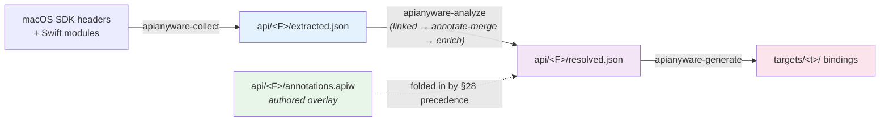

# API extraction — how a family's spec triad is produced

A map over the authoritative co-located references, not a re-author. Each macOS API
family under [`api/`](../api/) is described by a three-stage **spec triad**
(ADR-0046, as amended by the k17 machine-KDL no-go); this page sketches how the
triad is produced and points at the authoritative docs for each stage.

| File | Producer | Tracked? | Role |
| --- | --- | --- | --- |
| `extracted.json` | `apianyware-collect` | gitignored | mechanical extraction facts (the datalog fact base) — JSON |
| `annotations.apiw` | manual + accepted-LLM | **committed** | the one authored semantic overlay — KDL (`.apiw`) |
| `resolved.json` | `apianyware-analyze` | gitignored | the deterministic merged graph; the generator input — JSON |

The authoritative reference for the three files — what each carries, why the
machine artifacts are JSON while the overlay is KDL, and which are gitignored — is
[`api/README.md`](../api/README.md). Read it first; this page only frames the
pipeline around it.

## The pipeline

Three stages, one triad per family (the four phase-shaped checkpoints under the
former `collection/ir/` + `analysis/ir/` are retired — the intermediate stages run
in-process, not on disk; `pipeline-cutover-k20`):

1. **collect** — `apianyware-collect` extracts mechanical facts from the SDK
   headers and Swift modules into `extracted.json` (the datalog fact base). The
   extraction subtleties — non-UTF-8 `CXString` panics, `API_UNAVAILABLE(macos)`
   drops, the Swift-overlay-name vs. ObjC-runtime-name unification, the
   synthetic-framework pattern for headers outside the `.framework` tree — are
   recorded in [`collection.md`](collection.md).
2. **analyze** — `apianyware-analyze` runs the in-process passes (`linked` datalog
   cross-reference → annotate-merge → enrich), **folding in** the authored
   `annotations.apiw` overlay by the §28 precedence (`manual > accepted-LLM >
   convention > extraction`), and writes `resolved.json`. The convention tier is
   now `ascent` datalog rules (ADR-0047), not the retired imperative
   `heuristics.rs`.
3. **generate** — `apianyware-generate` consumes `resolved.json` to emit each
   target's bindings (ws6 / `targets/`).

When to run each stage — first-time setup, an SDK update, adding a framework — is
tabulated in [`annotation-workflow.md`](annotation-workflow.md) (see the caveat
below).

## The authored overlay vs. the machine artifacts

Only `annotations.apiw` is authored and committed; `extracted.json` and
`resolved.json` are **regenerable** from the SDK + the overlay and so are
gitignored. The overlay is the one place human and accepted-LLM semantic facts
enter — parameter ownership, block-invocation style, threading constraints, error
patterns, and the pattern-instances ws3 carries. The format is KDL (`.apiw`); the
machine artifacts reverted to JSON after the k17 spike found the production-grade
KDL-2.0 library ~80–100× slower to parse than `serde_json` on the real multi-MB IR
(ADR-0046 §5's JSON retreat). Full detail: [`api/README.md`](../api/README.md) and
[ADR-0046](../../../adr/0046-spec-interchange-format-kdl-everywhere.md).

## Caveat: the annotation *workflow* is reworked by ws5

[`annotation-workflow.md`](annotation-workflow.md) is **superseded** — it describes
the *retired* flat `_llm-annotations/*.llm.json` side-channel and the four
phase-shaped IR checkpoints, both gone as of `pipeline-cutover-k20`. Its *when to
run* table and the heuristic-classification reference are still useful, but its
file paths and the side-channel flow are stale. The richer LLM side-channel
workflow over the `.apiw` overlay — caching, regeneration, propose→review→accept,
diff/provenance/confidence tooling — is **workstream 5**; that workstream owns the
rewrite of `annotation-workflow.md` over the new triad.
