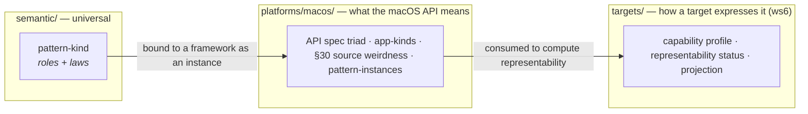
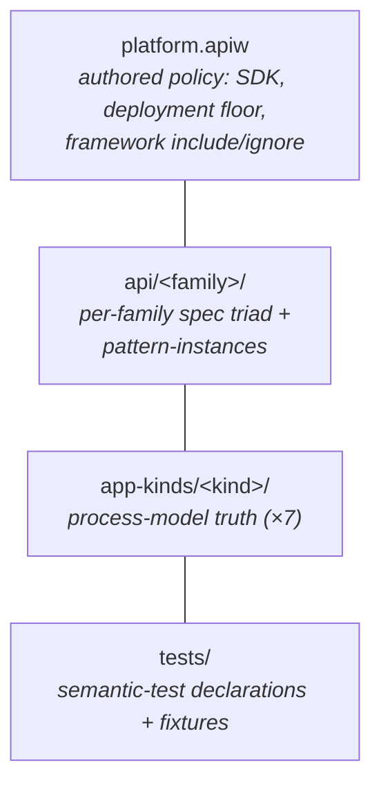

# The macOS platform model — overview

The `platforms/macos/` domain holds APIAnyware's **macOS source-platform truth**:
what the platform's APIs *mean*, expressed once and kept **projection-free** — with
*no* statement about how any target language exposes them (REFACTOR.md §7.1, §8,
§13). It is the macOS half of the `platforms/` domain; a second platform
(`platforms/linux/`, `platforms/dotnet/`) reuses the same shape without redesign
(§45.8).

This page is the conceptual entry point. It says what the domain *is*, how its
pieces fit, and where the boundary to the neighbouring domains runs. The companion
pages go deeper into one sub-model each:

- **[`api-extraction.md`](api-extraction.md)** — how a family's spec triad is
  produced (the `collect → analyze → generate` pipeline).
- **[`app-kinds.md`](app-kinds.md)** — the seven kinds of macOS application a
  target can be asked to build (process-model truth).
- **[`testing-obligations.md`](testing-obligations.md)** — the platform-level
  semantic-test declarations and the declare-now / execute-later seam.

The authoritative vocabulary is the glossary (`CONTEXT.md → "Platform model"`),
read every session; the design decisions are the running log in the
`platform-model-k32` grove brief, with [ADR-0046](../../../adr/0046-spec-interchange-format-kdl-everywhere.md)
(the `.apiw` overlay format) and [ADR-0049](../../../adr/0049-app-kinds-as-distinct-platform-process-model-entity.md)
(app-kinds as a distinct entity) the two that earned an ADR.

## The defining rule: platform = meaning, not projection

The macOS domain states what an API **means** — its types, operations, ownership,
lifetimes, threading, error and callback conventions, the patterns it participates
in, and the kinds of application it can build (REFACTOR §13). It deliberately does
**not** state how any target language *expresses* that meaning. That is a
**target** concern (`targets/`, workstream 6): the projection of a kind to a
`.app` layout, the choice of a target idiom, and — crucially — the
**representability** of a meaning in a given target.

That last point is the sharp edge of the boundary. A macOS API can carry a *hard
source property* — a fork-unsafe call, a method that may re-enter, an
ownership rule no header states — and recording that property **is** platform
truth. But the *status* of how representable that property is in racket vs. sbcl
(`fully-`/`conventionally-`/`lossily-represented`, `unsafe-only`, `unsupported`,
`research`, §7.7) is per **target × platform** and lives in ws6's capability
profiles, never here. So `platforms/macos/` carries the §30 **source-weirdness
vocabulary** (`fork-unsafe`, `may-reenter`, `ownership-unknown`,
`requires-message-pump`, …) that ws6 *consumes* to compute a status — and no
representability status of its own.

The same rule keeps `semantic/` and `platforms/` apart. A **pattern-kind** (a
`bracket`, an `observer`, a `parent-child` ownership edge) is universal and
framework-independent, so it lives in `semantic/`. Its **instance** — CGPath's
particular bracket, NSView's subview ownership — is *macOS knowledge*, so it lives
here, carried inside the per-family `resolved.kdl` (workstream 3's D1). Universal
definition in `semantic/`, concrete macOS binding in `platforms/macos/`.

## The four sub-models

The macOS platform is described by four authored bodies of truth plus the tools
that read them and this prose:

1. **The platform manifest** — a single authored, **policy-only**
   [`platform.apiw`](../platform.apiw) describing the platform *itself*: the SDK
   name, the source-availability `deployment-target` floor, and the framework
   roster as a curated **include/ignore policy**. It is `.apiw` (KDL), not
   `platform.yaml` — REFACTOR §14's literal name predates ADR-0046's no-YAML
   retreat. The *resolved* 153-family roster and the cross-family dependency graph
   are **derived and uncommitted** (recomputable from the SDK scan + the `api/`
   tree, so materializing them would duplicate derivable facts; constraint 4). See
   [`../README.md`](../README.md).

2. **The per-family API specs** — one directory per API family under
   [`api/`](../api/), each holding the three-stage **spec triad** (`extracted.kdl`
   → `annotations.apiw` → `resolved.kdl`, ADR-0046). This is the bulk of platform
   truth, and where ws3's **pattern-instances** are carried (inside
   `resolved.kdl`). [`api-extraction.md`](api-extraction.md) covers how the triad
   is produced; [`api/README.md`](../api/README.md) is the authoritative reference
   for the three files.

3. **The app-kinds** — the seven kinds of macOS application a target can be asked
   to build (`cli-tool`, `gui-app`, `menu-bar-daemon`, `launch-agent`,
   `spotlight-importer`, `quicklook-extension`, `finder-sync-extension`), each an
   authored `.apiw` registry under [`app-kinds/`](../app-kinds/) stating its
   process / run-loop / termination / activation / bundle model (ADR-0049). See
   [`app-kinds.md`](app-kinds.md).

4. **The platform-level test declarations** — projection-free, target-independent
   statements of what a macOS semantic or app-kind obligation *must hold*, under
   [`tests/`](../tests/), with the raw fixtures they read. ws4 **authors and
   schema-validates** these but does **not execute** them; execution is ws9. See
   [`testing-obligations.md`](testing-obligations.md).

The Rust crates that produce or read this material live under
[`../tools/`](../tools/) (the crate-home convention — a crate lives in the domain
it serves, ADR-0043): the extractors and annotate/collect crates that build the
triad, the `app-kinds` registry crate, and the `platform-tests` crate.

## Platform-neutral by construction

The directory shape — `platforms/<platform>/{api, app-kinds, docs, tests, tools}`
plus a `platform.apiw` manifest — carries nothing macOS-specific in its *layout*.
A second platform slots in by creating `platforms/linux/` (or `dotnet/`) with the
same five children and its own manifest; the manifest schema
([`schemas/spec-format/platform.kdl-schema`](../../../schemas/spec-format/platform.kdl-schema))
is already platform-neutral. macOS-specific knowledge lives only in the *contents*
of these directories, never in their structure — which is exactly the grove's
platform-neutrality success criterion (§45.8).

## Where this sits relative to the neighbours

| Domain | Owns | Boundary with `platforms/macos/` |
| --- | --- | --- |
| `semantic/` | pattern-**kinds** (universal definitions) | kinds are universal; their **instances** are macOS knowledge, carried here |
| `targets/` (ws6) | projection, idiom, **representability** | platform states *meaning* incl. hard §30 properties; ws6 states how representable that meaning is per target |
| `apps/` (ws7) | common app-**specs** (one concrete app) | an app-spec *names* an app-kind defined here (category ↔ instance) |
| (ws9) | the test **runner** + TestAnyware/AppSpec | ws4 *declares* the platform tests; ws9 *executes* them |

This `docs/` directory also holds the pre-existing operational prose
([`collection.md`](collection.md) — extraction learnings;
[`annotation-workflow.md`](annotation-workflow.md) — the LLM analysis side-channel
over the `annotations.apiw` overlay (ADR-0050);
[`codesigning-identity.md`](codesigning-identity.md) — the local signing identity).
See [`README.md`](README.md) for the full map of this directory.
