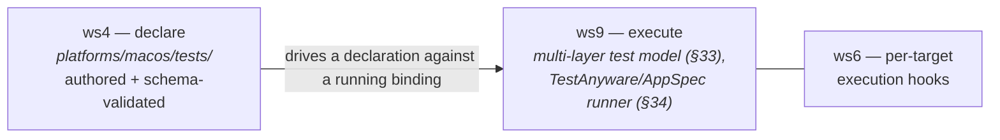

# Testing obligations — the platform-level test declarations

A map over the authoritative test directory, not a re-author. `platforms/macos/`
owns the **declaration half** of macOS platform-level semantic tests: authored,
projection-free, target-independent statements of what a macOS API semantic or
app-kind obligation *must hold*. They are **schema-validated here but NOT
executed** — this is platform truth, not a test runner.

The authoritative reference — the directory layout, the two grammars with worked
examples, and the fixtures table — is [`../tests/README.md`](../tests/README.md).
Read it for the detail; this page frames the model and the seam.

## Declare now, execute later

The defining seam. Workstream 4 (this domain) **authors and schema-validates** the
declarations and the raw fixtures they read. The *execution* half is split off:

- **ws9** owns the multi-layer test model (§33) and the TestAnyware / AppSpec
  integration (§34) that drives a declaration against a *running target binding* in
  a VM;
- **ws6** owns the per-target execution hooks.

A declaration says what the **platform** semantic/obligation is — never how any
target satisfies it (`targets/`, ws6), never how it is run (ws9). This mirrors the
ws3→ws8 declare-now / execute-later seam (the semantic model declared its schema;
ws8 builds the validation machinery).

## Two declaration families, one mechanism

The two families are **distinct entities sharing only the mechanism** (the ADR-0049
distinct-entity precedent), each with its own sibling KDL-Schema under
[`schemas/spec-format/`](../../../schemas/spec-format/) and its own focused validator
submodule, both in the one `apianyware-platform-tests` crate
([`../tools/platform-tests/`](../tools/platform-tests/)). A standing guard in that
crate loads and validates every committed file on `cargo test`.

1. **`tests/api-semantics/<facet>.apiw`** — per convention facet (`ownership`,
   `callbacks`, `threading`, `errors` — the facet is the file stem, aligned with
   the four `apianyware-conventions` datalog maps), the §30 source-semantic
   **weirdness** a concrete `(receiver, selector)` shape exhibits plus the
   projection-free expectations a binding must preserve.
2. **`tests/app-kinds/<kind>.apiw`** — the obligation **bodies** that resolve the
   `test-obligation` refs each of the seven app-kinds declares; each body is a set
   of projection-free `expect`ations plus the `fixture`s it reads. The standing
   guard cross-resolves every body against the app-kind registry — no orphan body,
   no unresolved ref.

## §30 weirdness is facet-conditional platform truth

The `weirdness` token on an `api-semantics` declaration is a REFACTOR **§30**
source-semantic-weirdness term, and its allowed set is **facet-conditional** (the
facet selects the token set — `ownership` unions §30 ownership + lifetime; the
others map 1:1). Because a KDL-Schema cannot state a conditional enum, `weirdness`
is a plain string in the schema and is enforced by the crate's **focused validator
vocab** (`api_semantics::vocab`) — the crate keeps its *own* copy of the §30 table
in lockstep with REFACTOR §30, deliberately **not** reusing `apianyware-patterns`'
table (the domain rule: the platforms domain does not depend on `semantic/`).

Crucially, the §30 weirdness is the platform truth that **ws6 consumes** to compute
a representability status — it is **never itself a status**. The §7.7 statuses
(`fully-`/`conventionally-`/`lossily-represented`, `unsafe-only`, `unsupported`,
`research`) are per target × platform and live in ws6's capability profiles, not
here (see [`overview.md`](overview.md) → *the defining rule*).

## Fixtures are lazy and assertable

Fixtures are inert inputs an obligation reads, authored **lazily** — a directory
exists only when a committed declaration references it (constraint 4). Each is the
*smallest* input that makes its obligation meaningful (a tiny text document with
known, assertable metadata), so the ws9 runner can assert the extracted values
*match the fixture*, not merely that *some* value was produced. The committed set
covers exactly today's fixture-reading obligations
(`fixtures/sample-documents/sample.txt` for quicklook/finder-sync,
`fixtures/spotlight/sample.txt` for spotlight); the `api-semantics` family
references none. The crate's standing guard checks every committed `fixture` ref
resolves to a real file. Full table: [`../tests/README.md`](../tests/README.md).
