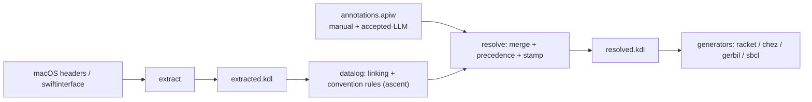

# PRD — Spec format & data model (`.apiw` + KDL interchange)

**Date:** 2026-06-24
**Status:** Agreed (grilling complete; see `.grove/03-spec-format-k16/BRIEF.md` running log) —
**amended 2026-06-24 by the k17 spike: the "Open risk" retreat is invoked.** Machine
`extracted`/`resolved` stay **JSON** (`extracted.json`/`resolved.json`); the KDL is the **authored
`annotations.apiw`** only. KDL parse measured ~80–100× slower than `serde_json` on the real
multi-MB IR (lossless but too slow). Evidence + numbers:
`semantic/docs/research/2026-06-24-kdl-machine-serde-spike/`; ADR-0046 "Update — spike outcome".
Read this PRD's "One format: KDL everywhere" and the triad table as **authored-KDL + machine-JSON**.
**Grove:** `structural-refactoring`, workstream 2 (`spec-format-k16`)
**Decisions:** [ADR-0046](../adr/0046-spec-interchange-format-kdl-everywhere.md) ·
[ADR-0047](../adr/0047-convention-heuristics-as-datalog-rules.md)
**Evidence:** [KDL authoring eval](../semantic/docs/research/2026-06-24-kdl-authoring-eval/README.md)

## Problem

The pipeline carries its API model as **JSON** through four phase-shaped, gitignored
checkpoints (`collected → resolved → annotated → enriched`), with the only human/LLM-authored
input being committed `_llm-annotations/*.llm.json` merged by 1,236 lines of imperative
heuristics. REFACTOR §29 wants a *pleasant human DSL* + a *stable, readable canonical
interchange* (the `.apiw` DSL → canonical → resolved flow), and §28 wants annotations that are
provenance-tracked, confidence-scored, and reviewable. This workstream replaces the JSON
interchange and introduces the first human-authoring surface. It is the **spine** workstreams
3–6 and 8 consume.

## Goals

1. A human/LLM-pleasant authoring surface (`.apiw`) and a readable canonical interchange.
2. Provenance, precedence, and confidence expressible **in the format**.
3. Legible, extensible convention rules (replacing opaque imperative heuristics).
4. A language-neutral schema so non-Rust tools can consume the artifacts.
5. A staged cutover that keeps the pipeline buildable + goldens green at every step.

## The model

### One format: KDL 2.0 everywhere (ADR-0046)

Both the authored overlay and the machine artifacts are **KDL**. There is no YAML; JSON is
retired from the interchange. Rationale: `serde_yaml` is deprecated (Mar 2024) while the
official `kdl` crate is maintained; and the authoring eval showed KDL is *more* escaping-robust
than YAML for the realistic, prose-heavy annotation payload (KDL raw strings → 0 escapes vs
YAML's 34 / JSON's 96; 6/6 well-formed). The Rust serde types are *one conforming implementation*
of the schema, not the source of truth.

### Per-family triad (REFACTOR §14, KDL filenames)

Under `platforms/macos/api/<Framework>/`:

| File | Producer | Role |
|------|----------|------|
| `extracted.kdl` | extractors (`extract-objc`/`extract-swift`) | mechanical fact base — no judgments |
| `annotations.apiw` | manual + accepted-LLM (the `_llm-annotations` fold in) | the one authored semantic overlay |
| `resolved.kdl` | resolve stage | deterministic merged graph; generator input (≈ today's `enriched`) |



The datalog cross-reference stage (today confusingly also called *"resolved"*) is renamed
**`linked`** to free the word `resolved` for `resolved.kdl` (the final merged graph). Today's
intermediate `resolved`/`annotated` checkpoints become **in-process stages**, not files.

### Producers → files, and conventions as datalog (ADR-0047)

Four producers, three files: extraction → `extracted.kdl`; manual + accepted-LLM →
`annotations.apiw`; **convention heuristics → declarative `ascent` datalog rules** (replacing
imperative `heuristics.rs`), run in-process; all merged → `resolved.kdl`. Convention rules are
compile-time, legible, and — because datalog tracks derivations — supply per-fact provenance
for free.

### Provenance / precedence / confidence carried in-format (ADR-0046 §4)

- Every `resolved.kdl` fact: `source ∈ {extraction, convention:<rule>, llm, manual}`.
- Authored facts: `confidence` enum `high|medium|low` (not a float) + `provenance` (doc URL / rationale).
- Precedence `manual > accepted-LLM > convention > extraction > unknown` (§28) applied in resolve;
  winner stamped, losers retained as `superseded-by` (auditable).
- No producer ⇒ explicit `unknown`, never silently defaulted.
- The *workflow* over this (caching, regeneration, review→accept, diff) is **workstream 5**;
  this workstream defines only the carriage.

Authored `.apiw` example:

```kdl
framework "Foundation" {
  method "sortedArrayUsingComparator:" is-instance=#true {
    returns-ownership "owned"
    block-parameters { param 0 invocation="sync" }
    rationale #"The comparator is invoked synchronously during the call — it does not "escape"."#
    source "llm" confidence="high" provenance="Foundation Release Notes"
  }
}
```

### Schema: language-neutral contract (KDL Schema Language)

The **KDL Schema Language** (KDL-in-KDL) defines the authoritative, language-neutral contract for
all three artifacts, so any KDL consumer in any language can validate them (no JSON projection).
Authored in this workstream, living in `schemas/spec-format/`. Workstream 8 owns the validation
*tooling/CI* and schemas for the *other* artifacts (app-kinds, AppSpecs, capability profiles,
conformance reports).

### Crate home

A new **`semantic/tools/spec-format`** crate houses the `.apiw` parser + IR-as-KDL serde + schema
validation + converters (json→kdl, `_llm-annotations`→`annotations.apiw`). It depends on
`apianyware-types` + `kdl`; the foundational `types` crate stays dependency-light (no `kdl`).

## Migration (staged; co-move; ws2 owns the relocation)

The old IR paths are gitignored/regenerable and `_llm-annotations` already lives at
`platforms/macos/api/`, so format + location are one operation — **ws2 takes over ws4's
relocation TODO** and lands the KDL triad directly at `platforms/macos/api/<Framework>/`.
ws4 then inherits a populated tree and owns platform *content* (app-kinds, platform tests,
semantic enrichment). Staged child leaves, each buildable + goldens-green:

1. **spike** — prove KDL machine-serde + large-IR perf on one framework. JSON retreat if it fails.
2. **parser + serde crate** — `semantic/tools/spec-format`: `.apiw` parser + IR-as-KDL serde.
3. **schema** — KDL Schema for the triad → `schemas/spec-format/`.
4. **cutover** — rewire collect/linked/annotate/resolve/generate to KDL at the new per-family
   paths; collapse 4→3; rename the `resolved`→`linked` stage; convert `_llm-annotations`→`annotations.apiw`.
5. **conventions→datalog** — retire imperative `heuristics.rs` for ascent rules (ADR-0047);
   goldens guard equivalence before extending.

## Open risk

The official `kdl` crate is document-model, not serde-derive; large-IR serialization (perf +
serde-adapter maturity) is **unproven** and gated to leaf 1. If it fails, `extracted`/`resolved`
fall back to JSON (a serde back-end swap); the authored `.apiw` KDL — the eval-backed,
hard-to-reverse choice — proceeds regardless.

## Out of scope (other workstreams)

Pattern-kind/relationship *semantic* entities (ws3), platform *content* and IR-relocation
follow-on (ws4), the LLM side-channel *workflow* (ws5), target *consumption* of `resolved.kdl`
(ws6), validation *tooling* + non-spec-format schemas (ws8).
