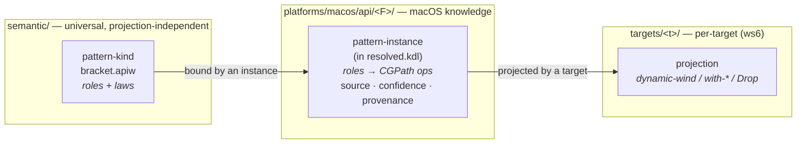

# The semantic model — overview

The `semantic/` domain holds APIAnyware's **projection-independent source
semantics**: the meaning of platform APIs expressed once, with *no* statement
about how any target language exposes them (REFACTOR.md §7.1, §8). It is the
shared language of meaning that every target draws on — and, deliberately, the
only domain shared across targets (the rest of the system is hermetically
per-target).

This page is the conceptual entry point. It says what the domain *is* and how
its pieces fit; the companion pages go deeper:

- **[`pattern-model.md`](pattern-model.md)** — the pattern-kind taxonomy: roles,
  laws and the controlled vocabularies they draw from, ordering, the
  behavioral-vs-structural distinction, composition, and the kind/instance split.
- **[`api-pattern-catalog.md`](api-pattern-catalog.md)** — the catalogue of the
  authored kinds, each with its roles/laws and canonical macOS examples.
- **[`../pattern-kinds/README.md`](../pattern-kinds/README.md)** — the `.apiw`
  authoring shape and the crate/schema mechanics.

The authoritative vocabulary is the glossary (`CONTEXT.md → "Semantic model"`),
read every session; the design decisions are [ADR-0048](../../adr/0048-first-class-semantic-pattern-kind-model.md)
and the PRD [`prd/2026-06-25-semantic-pattern-kind-model.md`](../../prd/2026-06-25-semantic-pattern-kind-model.md).

## What the domain holds

Two things, both *projection- and platform-independent*:

1. **Pattern-kinds** — reusable, authored definitions of recurring API shapes
   (a `bracket`, an `observer`, a `parent-child` ownership edge). These are the
   first-class semantic entities REFACTOR §7.5/§12/§31/§32 ask for. They live as
   `semantic/pattern-kinds/<kind>.apiw` files and are documented by the catalogue.
2. **The vocabulary** — the prose (these docs) and the glossary that name and
   define the model so a reader can learn it without reading code.

What it does **not** hold: any framework-specific binding. CGPath's particular
bracket, NSView's subview ownership — those are *instances*, and an instance is
platform knowledge, so it lives in the platform domain, not here. That boundary
is the model's defining rule.

## The two levels: kind vs. instance

- A **pattern-kind** (`bracket`) is the reusable definition — its set of *roles*
  (typed participant slots) and *laws* (constraints). Authored once in
  `semantic/`, framework- *and* target-independent.
- A **pattern-instance** binds a kind's roles to a concrete framework's
  participants — CGPath's bracket is `acquire = CGPathCreateMutable`,
  `release = CGPathRelease`. It carries a provenance stamp
  (`source`/`confidence`/`provenance`) and lives in the **platform spec triad**
  (`platforms/macos/api/<Framework>/resolved.kdl`), because a binding to a
  concrete API is macOS knowledge, not universal vocabulary.
- The **projection** — how that bracket becomes a Scheme `dynamic-wind`, a Lisp
  `with-*` macro, a Rust `Drop` — is a *target* concern (ws6), never part of the
  semantic model. The model captures structure; targets render it.

This split keeps `semantic/` clean: it carries only the universal half, and it
rhymes with the ws2 spec-format split (a neutral schema in `schemas/` vs.
per-family annotation *instances* in `platforms/macos/api/`).

## How instances arise — three provenance tiers

A pattern-instance is never hand-maintained per framework as the only option.
Three producers feed instances into the platform triad, resolved by the ws2
precedence **`manual > llm > convention > extraction`**:

- **convention** — cheap structural detection: the [`apianyware-pattern-detection`](../../platforms/macos/tools/pattern-detection)
  crate runs `ascent` datalog rules over the extracted fact base and emits
  `source=convention` instances. Each derived tuple names the rule that produced
  it, so a `convention:<rule>` stamp falls out of the derivation trace for free
  (ADR-0047). This is the structural-coverage workhorse.
- **llm** — guide-derived instances, for the relationships and patterns that
  prose describes but naming conventions cannot reveal.
- **manual** — an authored override in `annotations.apiw`, winning over the rest.

A higher tier overrides a lower one for the same occurrence. ws3 defines this
*carriage* (the stamp on disk); the cache / regenerate / review-accept / diff
*workflow* and the disagreement-precedence audit are **ws5's** concern.

## Where the code lives

The model is realized by a small set of crates (crate-home convention,
ADR-0043 — Rust co-locates with the domain it serves):

| Concern | Home |
|---|---|
| Kind registry + `.apiw` parse + §30 vocabularies + validator | `semantic/tools/patterns` (`apianyware-patterns`) |
| Pattern-kind `.apiw` KDL Schema (source of truth) | `schemas/spec-format/pattern-kinds.kdl-schema` |
| Convention-tier instance detection (datalog) | `platforms/macos/tools/pattern-detection` |
| Instance carriage (the `resolved.kdl` fields) | `semantic/tools/types` + `semantic/tools/resolve` |

The schema is the language-neutral source of truth (ADR-0046 §3); the Rust types
are one conforming implementation. ws8 owns the *machine* KDL-Schema for
`extracted.kdl`/`resolved.kdl` and the validation tooling; ws3 authored only
the pattern-kind `.apiw` KDL Schema plus a focused in-crate validator, mirroring
how ws2 authored `annotations.kdl-schema`.

## Who consumes the model

- **ws6 (target model)** projects kinds to target idioms through the
  `emit/pattern_dispatch` seam — this is where a `bracket` becomes a
  `dynamic-wind`. The semantic model is its input; it is *not* the projection
  spec.
- **ws9 (testing architecture)** uses the model to drive semantic-layer tests.

Both read the model; neither lives in `semantic/`. The domain stays the
universal middle, knowing nothing of macOS bindings below it or target idioms
above it.
