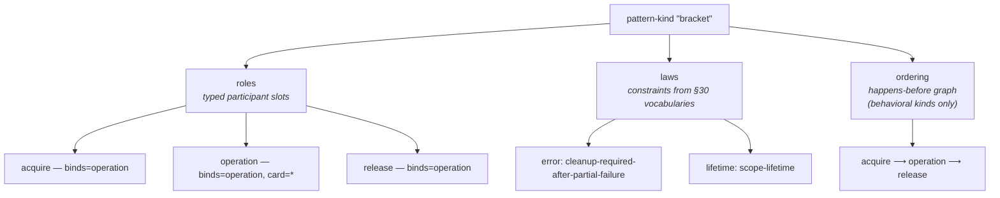
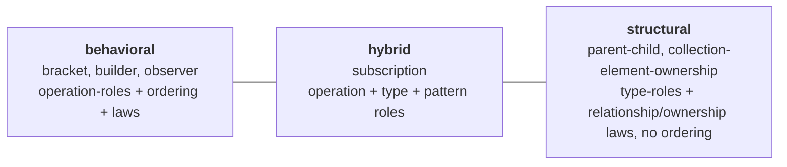

# The pattern-kind model

This is the conceptual taxonomy behind `semantic/pattern-kinds/`. It explains
what a pattern-kind *is*, what it is made of, and why one entity covers both the
multi-operation contracts (REFACTOR §32) and the typed-edge relationships
(REFACTOR §31). For the `.apiw` authoring syntax see
[`../pattern-kinds/README.md`](../pattern-kinds/README.md); for the per-kind
roster see [`api-pattern-catalog.md`](api-pattern-catalog.md); for how the model
sits in the domain see [`overview.md`](overview.md).

## One entity, not two

REFACTOR presents patterns (§32) and relationships (§31) as if they were
different kinds of thing. The model **unifies them**: a relationship is just a
**degenerate pattern-kind** — typed roles plus ownership/lifetime/invalidation
laws, with no operation sequence (ADR-0048 D4). A behavioral pattern adds
operation-roles and an ordering. One schema, one registry, one provenance path
serve both. The single concession is a vocabulary stretch — the word
*pattern-kind* is **broad**, spanning typed edges, not only multi-operation
contracts. The glossary pins exactly that breadth.

This buys *less machinery*: relationship facts ride the exact pattern-instance
carriage, with no second store and no parallel mechanism.

## Anatomy of a kind

A pattern-kind is two sets — **roles** and **laws** — optionally with an
**ordering**:

### Roles — typed participant slots

A kind declares **roles**; `bracket` has `acquire`, `operation`, `release`. Each
role fixes, via its **`binds`**, *what kind of participant* fills it when an
instance is created:

| `binds` | The role is filled by | Enables |
|---|---|---|
| `type` | an object type | structural relationships (`parent-child`'s `parent`/`child`) |
| `operation` | a method / selector / function | behavioral contracts (`bracket`'s `acquire`) |
| `parameter` | one parameter of one operation | single-operation-scoped relationships (DP2) |
| `pattern` | another pattern-instance | composition (DP5, see below) |

The `parameter` binding is what lets a relationship live *inside* a single call:
`callback-destroy-notifier` has `callback`/`user-data`/`destroy` roles that all
bind to parameters of one registration operation. The `pattern` binding is how
patterns compose (next section).

Each role also carries a **cardinality** — `1` (exactly one, the default), `?`
(optional), `*` (zero or more), `+` (one or more). `bracket`'s `operation` role
is `*`: many operations may run between acquire and release.

One schema serves behavioral and structural kinds alike. The difference between a
`bracket` and a `parent-child` is *only* which roles they declare (operation- vs.
type-bound) and which laws they assert — not two different shapes.

### Laws — constraints, not free prose

A kind's constraints are **laws**, and a law is deliberately **not free text**.
Each law names a **category** and asserts one or more **tokens** drawn from that
category's *controlled vocabulary* — the enumerated "source semantic weirdness"
sets of REFACTOR **§30**. The seven categories:

| Category | Governs | Example tokens |
|---|---|---|
| `ownership` | who owns / borrows a value | `owned`, `borrowed`, `weak`, `retained`, `autoreleased`, `transfer-container-only` |
| `lifetime` | how long a value stays valid | `scope-lifetime`, `callback-lifetime`, `until-object-invalidation`, `autorelease-pool-lifetime` |
| `threading` | thread / reentrancy constraints | `main-thread-only`, `callback-on-main-thread`, `not-reentrant`, `may-block` |
| `error` | failure signalling | `cleanup-required-after-partial-failure`, `nserror-out-param`, `out-error-valid-only-when-failure` |
| `callback` | callback wiring | `escaping-callback`, `callback-with-destroy-notifier`, `callback-with-user-data-pointer` |
| `buffer` | buffer / sizing contracts | `buffer-length-in-bytes`, `callee-allocates-buffer`, `output-null-terminated-if-space` |
| `relationship` | typed-edge ownership/invalidation | `parent-owns-child`, `delegate-weakly-held`, `collection-owns-elements`, `view-invalidated-by-mutation` |

That controlled-token discipline is the **non-vacuity guarantee** (doubt-pass
DP1): a law cannot say something the model doesn't understand. If the laws were
free prose, the registry would be decorative — every emitter would have to
re-parse English. A free-text `doc` field rides alongside the tokens to carry
nuance the tokens cannot, but it is never the load-bearing part.

The validator enforces that each token belongs to its law's category. This is a
*conditional enum* — the legal token set depends on the sibling `category` value
— which a KDL Schema cannot express on its own, so the focused in-crate
validator in `apianyware-patterns` checks it (the §30 tables live in that crate's
`vocab` module). This mirrors how ws2 paired a neutral KDL Schema with a focused
semantic validator.

### Ordering — a separate, behavioral-only construct

Sequencing is **not** a law. A kind that constrains *order* declares an
**`ordering`** block: a happens-before graph over role names (`before "acquire"
"operation"`). `bracket` orders acquire → operation → release. Structural
relationships have no operations to sequence, so they carry no ordering — that
absence is exactly what makes a relationship "degenerate."

Keeping ordering distinct from laws matters: a law is a *property* of
participants (this pointer is weak), an ordering is a *temporal* constraint
between roles (acquire happens first). Conflating them would muddy both.

## Behavioral ↔ structural: a spectrum, not a wall

The unified entity spans a spectrum:

- **Behavioral** kinds (`bracket`, `builder`, `observer`, `delegate`,
  `factory-cluster`, `paired-state`, `target-action`, `enumeration`,
  `error-out`, `two-call-sizing`, `buffer-fill`, `typestate`) are
  operation-centric: they bind operations and usually carry an ordering.
- **Structural** kinds (`parent-child`, `callback-destroy-notifier`,
  `collection-element-ownership`) are the §31 relationships: type- or
  parameter-roles, ownership/lifetime/invalidation laws, no operation sequence.
- A kind like `subscription` sits between — an operation `register`, an optional
  `token` type, and a `destroy` role that binds to *another pattern* (below).

## Composition — patterns referencing patterns

REFACTOR §32 wants patterns to "compose operations **plus relationships**." With
relationships folded into pattern-kinds, that is just a role whose `binds` is
`pattern` (ADR-0048 D5):

A `subscription` instance binds its `destroy` role not to an operation but to a
**`callback-destroy-notifier` relationship-instance**. Following that
pattern-instance-ref reads the referenced relationship's own laws — ordinary
graph composition, not opaque nesting. A reader (or an emitter) walks the ref the
same way it reads any other participant.

This is why composition needs *no* extra mechanism: a relationship is a
pattern-instance, so "compose a pattern with a relationship" is "bind a role to a
pattern-instance," using the carriage that already exists.

## Instances: identity, home, provenance

Pattern-*instances* live in the platform triad, not here (see
[`overview.md`](overview.md) for the full kind/instance story). Two properties of
an instance are worth naming because they keep the model stable under
re-detection:

- **Content-derived identity (DP4).** An instance's id is a function of its
  `(kind, sorted role-bindings)` — a content hash, not a sequential label. Re-run
  detection after an SDK bump and the same occurrence yields the same id, so
  composition refs (a `subscription` pointing at its `destroy` relationship) stay
  valid. This echoes the convention datalog's `(receiver, selector)` keying.
- **Deterministic cross-framework home (DP3).** When an instance's roles span two
  frameworks (an AppKit `NSView` parenting a CoreAudio type), it homes to the
  framework of the kind's **designated primary role** — `parent-child` marks
  `parent` as `primary`. Ties are broken deterministically. The home rule is
  explicit precisely so a cross-framework instance is never placed ambiguously.

These are realized by the instance-carriage code (`types` + `resolve`); they are
noted here because they are part of *understanding* the model, even though the
mechanics live in the crate rustdoc.

## What the model is not

- **Not a theorem prover.** Laws *capture* structure; they are not a law-algebra
  with a contradiction checker. Emitters *project* captured structure (§32); they
  do not prove it consistent. Carriage stays minimal on purpose.
- **Not the projection spec.** How a `bracket` becomes a `dynamic-wind` or a
  `Drop` is a *target* concern (ws6, the `emit/pattern_dispatch` seam). These
  docs explain the model; they do not prescribe its rendering.
- **Not a closed enum.** The 10 legacy `PatternStereotype` variants are gone as a
  Rust enum; the authored `.apiw` files are an *open data registry* — adding a
  kind is authoring a file, not editing code.
