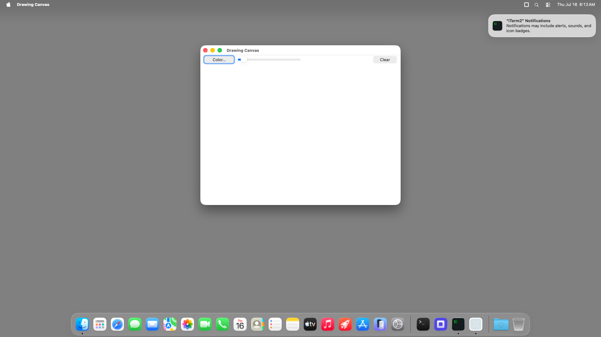

# drawing-canvas (Node TypeScript) — bundled `.app` TestAnyware VM verification report

**App:** `targets/typescript/app-implementations/macos/drawing-canvas/build/Drawing Canvas.app`
**Date:** 2026-07-16
**Result:** ✅ PASS — the shipped bundle launches, shows its toolbar (Color…/width slider/Clear)
over the drawing surface, and quits cleanly on Cmd-Q.
**Artifact:** the `bundle-typescript` Step-8 output, same shape as `hello-window`'s own bundle.

## Environment

Same shared VM session as `ui-controls-gallery`'s own report.

## What was verified

- `agent windows` shows the real window, title "Drawing Canvas", focused.
- The screenshot confirms the toolbar (Color…/width slider/Clear) and blank drawing surface
  render correctly.
- `otool -L` shows only `@executable_path/../Frameworks/{libnode,libuv}.*.dylib` — no Homebrew
  absolute paths.
- Cmd-Q terminated the process cleanly — `pgrep` found no match afterward.

## Not covered by this session

Full drawing/colour-picker interaction was already verified against the dev launcher in Step 7
(`report.md`); this session verifies bundling mechanics only.

## Ladder complete

This is the seventh and last sample app to run through `bundle-typescript` — all seven
(`hello-window`, `ui-controls-gallery`, `scenekit-viewer`, `pdfkit-viewer`, `mini-browser`,
`note-editor`, `drawing-canvas`) now have a real, self-contained, TestAnyware-VM-verified `.app`,
closing Step 8 (bundling/distribution) of `adding-a-language-target.md` for the Node TypeScript
target.
