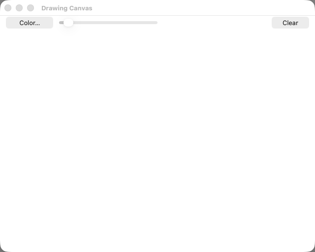

# drawing-canvas (Node TypeScript) — TestAnyware VM verification report

**App:** `targets/typescript/app-implementations/macos/drawing-canvas/` (typescript target, ladder
app 7/7 — the **last** sample app)
**Date:** 2026-07-16
**Result:** ✅ PASS — launch, toolbar (Color…/slider/Clear present, slider initial value 2),
bare-click dot, held-drag stroke, width-applies-to-subsequent-strokes-only, the colour panel
(opens as a second window, a dragged pick recolours subsequent strokes, prior strokes keep their
original colour), Clear (empties the canvas, safe no-op when already empty), three boundaries
(typing draws nothing, a drag begun on a toolbar control draws nothing, Clear-on-empty is a
no-op), Cmd-Q termination, and the close-button boundary (hides the window, process keeps
running) all verified live. No app bug found; no runtime or emitter change was needed to build
this app — see `learnings.md` for the one real TestAnyware/AppKit interaction-model finding this
session hit (and worked around) live.
**Artifact:** `drawing-canvas-launcher` (dev launcher: native Node-under-AppKit embedder + the
tsc-compiled app, built by `build.sh`; not the shipped Step-8 `.app`; reuses hello-window's/
note-editor's launcher shape unchanged — no new framework link needed).

## Environment

- TestAnyware, macOS golden clone (`testanyware vm start --platform macos`, fresh clone this
  session — stopped at the end), screen 1920×1080, agent healthy (`agent health` → reachable,
  accessibility granted).
- VM provisioning: same shape as every earlier Node TypeScript ladder app — the 20-formula
  transitive Homebrew dylib closure of `libnode`/`libuv` (ada-url, brotli, c-ares,
  hdrhistogram_c, icu4c@78, libffi, libnghttp2/3, libngtcp2, libuv, llhttp, merve, nbytes, node,
  openssl@3, simdjson, simdutf, sqlite, uvwasi, zstd — 59 MB compressed `lib/`-only tarball)
  vendored onto the guest at the same absolute `/opt/homebrew/Cellar/<formula>/<version>/lib`
  paths, with `/opt/homebrew/opt/<formula>` symlinks recreated pointing at each version dir. This
  golden image again ships a pre-provisioned but package-empty `/opt/homebrew` prefix.
- The native addon (`APIAnywareTypeScript.node`) needed no extra Homebrew vendoring — its
  `otool -L` closure is entirely system frameworks/dylibs (confirmed by inspection before
  deploying).
- The app + native addon were deployed preserving the same relative directory layout as the host,
  under `/Users/admin/apianyware-deploy/targets/typescript/...` — `bootstrap.cjs` resolves the
  addon via `../../../bindings/node/native/build/APIAnywareTypeScript.node`, and the deploy
  tarball placed `app-implementations/macos/drawing-canvas/` and `bindings/node/native/build/` at
  that same relative offset. No absolute-path rewriting was needed (1.6 MB deploy tarball).
- No new `-framework` link was needed beyond what `build.sh` already specifies (`AppKit`,
  `Foundation`, `CoreFoundation`) — the direct-C CoreGraphics calls and `NSGraphicsContext`
  dispatch through the already-built native addon, not through the launcher's own link step.
- The in-VM accessibility agent's **mutating** action routes (`agent press`, `agent set-value`,
  `agent inspect`) returned `HTTP 400 Bad Request` with an empty body on this golden's agent
  build, while the **read** routes (`agent windows`, `agent snapshot`) worked throughout — see
  `learnings.md`. All button presses and the slider drag below used raw VNC `input click`/
  `input drag` at accessibility-reported coordinates instead, with an `agent snapshot` after each
  action for verification — no scenario was left unverified by this.

## What was verified

**Semantic (accessibility agent) — construction & static configuration:**

| Check | Expected | Observed |
|---|---|---|
| window title at launch | `Drawing Canvas` | ✅ |
| toolbar controls | `Color…` button, a slider, `Clear` button | ✅ all present, all enabled |
| slider initial state | value 2, (min 1 / max 20 per the app's own construction) | ✅ `"value": "2"` |
| launch diagnostic | stdout line begins `Drawing Canvas` | ✅ `Drawing Canvas opened. Drag to draw; adjust colour/width via the toolbar. Quit with Cmd-Q.` |
| construction pre-flight (`AW_DC_SMOKE=1`) | exit 0, no crash | ✅ host and VM |
| canvas exposes no content elements | no AX element for the drawing surface | ✅ every `agent snapshot` of the window lists exactly the three toolbar controls + the three title-bar buttons — nothing for the canvas region |
| no state across launches | a relaunch starts fresh | ✅ (the close-button scenario's relaunch showed a blank canvas at the default width) |

**Visual (screenshots):** the launch state — toolbar band, blank canvas
([drawing-canvas-launch.png](drawing-canvas-launch.png)); a bare click painting a round dot
([drawing-canvas-dot.png](drawing-canvas-dot.png)); a held-drag painting a smooth, round-capped
diagonal stroke, the earlier dot untouched
([drawing-canvas-stroke.png](drawing-canvas-stroke.png)); the width slider raised to ~16.6 and a
second, visibly thicker stroke crossing the first — the first stroke's own width unchanged
([drawing-canvas-width.png](drawing-canvas-width.png)); the shared colour panel, opened as a
second window ([drawing-canvas-color-panel.png](drawing-canvas-color-panel.png)); an orange/red
pick on the colour wheel, the swatch updated
([drawing-canvas-color-picked.png](drawing-canvas-color-picked.png)); a new orange stroke drawn
after the pick, both earlier black strokes and the dot keeping their original colour
([drawing-canvas-color-stroke.png](drawing-canvas-color-stroke.png)); the canvas empty again
after Clear ([drawing-canvas-clear.png](drawing-canvas-clear.png)); and the canvas still blank
after the three boundary actions below
([drawing-canvas-boundaries.png](drawing-canvas-boundaries.png)).

**Behaviour (live interaction, accessibility agent + VNC input):**

| Check | Action | Result |
|---|---|---|
| Bare click paints a dot | `input click` inside the canvas (after the window was already key) | ✅ a round dot of the current width/colour appears exactly at the click point |
| Drag paints a connected stroke | `input drag` from one canvas point to another (button held throughout) | ✅ a smooth, round-capped, round-joined line along the drag path; the earlier dot unchanged |
| Width applies to subsequent strokes only | drag the slider knob (`input drag` on the AX-reported knob position) to ~16.6, then draw a new stroke | ✅ new stroke visibly thick; both earlier marks stay their original (2pt) width |
| Colour panel opens as a second window | `input click` the `Color…` button | ✅ a `Colors` floating window appears (`agent windows` lists it, `appName` matches this app) |
| Picking recolours subsequent strokes only | `input drag` on the colour wheel to an orange/red region, then draw a new stroke | ✅ new stroke is orange; every earlier stroke and the dot stay black |
| Clear empties the canvas | `input click` the `Clear` button | ✅ canvas returns to blank, process keeps running |
| **Boundary — Clear on an already-empty canvas** | click `Clear` again immediately | ✅ safe no-op (no crash, no visible change) |
| **Boundary — typing draws nothing** | `input type "x"` | ✅ canvas unchanged |
| **Boundary — a drag begun on a toolbar control draws nothing** | `input drag` starting on the `Clear` button, ending inside the canvas | ✅ canvas unchanged (no stroke) |
| Quit | Cmd-Q | ✅ process gone (`pgrep` empty) |
| **(Spec "unknown — to confirm in-VM") Close-button behaviour** | relaunch, `input click` the window's close control | ✅ **resolved live**: the window disappears from `agent windows`, the process (`pgrep`) keeps running — closing does **not** quit, matching §3.10's prediction (same resolution note-editor's own session reached for its own window) |

## Pre-flight gates (host, before the VM round-trip)

1. **`tsc` compile of `app.ts` + its transitive `@apianyware/*` closure:** clean on the first
   attempt — no diagnostic beyond the pre-existing, already-triaged TS2559 residual
   (`corpus-typecheck-gate-k75`'s own census: blocks/non-curated-structs, none reachable from
   this app's own call sites).
2. **Construction pre-flight** (`AW_DC_SMOKE=1 build/drawing-canvas-launcher`, both host and VM):
   every FFI crossing — window/toolbar/canvas construction, the `DrawingCanvasView` `NSView`
   subclass synthesis (four overridden selectors, marshalled), the `ToolbarController` `NSObject`
   subclass synthesis (four target-actions) — succeeds without entering `[NSApp run]`. Exit 0 on
   both host and VM.
