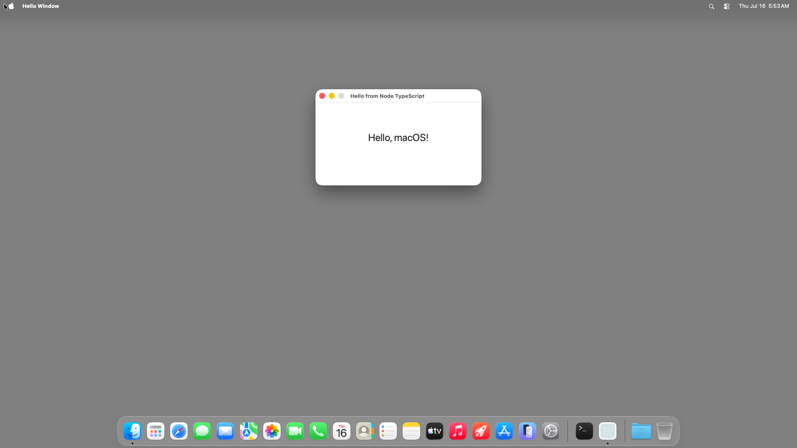

# hello-window (Node TypeScript) — bundled `.app` TestAnyware VM verification report

**App:** `targets/typescript/app-implementations/macos/hello-window/build/Hello Window.app`
**Date:** 2026-07-16
**Result:** ✅ PASS — the shipped bundle (not the dev launcher) launches, shows the window +
centred label, carries the correct `CFBundleName`, and quits cleanly on Cmd-Q.
**Artifact:** the Step-8 `bundle-typescript` output — a per-app native launcher at
`Contents/MacOS/hello-window` with a vendored, relocated `libnode` + Homebrew closure and the
native addon under `Contents/Frameworks/`, and the app's JS under `Contents/Resources/app/`
(ADR-0060). See `report.md` for the earlier dev-launcher verification this supersedes for
distribution purposes (Step 7); this report is Step 8's own done-bar.

## What's different from the dev-launcher report

- **Self-contained, not host-vendored.** `report.md`'s VM provisioning manually vendored the
  launcher's 23-dylib transitive Homebrew closure onto the guest at absolute host paths (a
  test-provisioning shortcut for Step 7, `learnings.md`'s own note). This bundle instead carries
  its own `Contents/Frameworks/` — vendored and relocated to `@executable_path` at **build time**
  by `bundle-typescript` — so the guest needed **zero** manual provisioning: the whole `.app` was
  zipped, copied over with `file upload`, unzipped, and run as-is.
- **`CFBundleName` now drives the app identity.** The dev launcher had no `Info.plist`, so the
  bold menu-bar name and the Quit item fell back to the process name
  (`hello-window-launcher`), noted in `report.md` as "expected pre-Step-8". The bundle's
  `Info.plist` (`CFBundleName`/`CFBundleDisplayName` = "Hello Window") fixes this — see below.

## Environment

- TestAnyware, golden `macos` clone, screen 1920×1080, agent healthy.
- Transfer: `ditto -c -k --sequesterRsrc --keepParent "Hello Window.app"` on the host (preserves
  the code signature), `file upload` the zip, `unzip` in the guest. No toolchain, no Homebrew, no
  manual dylib vendoring in the guest.
- `codesign --verify --deep --strict` passed both on the host (post-build) and again on the
  unzipped copy in the guest — confirming the ad-hoc signature and relocated load commands
  survive the transfer unmodified (no absolute host path baked in anywhere).

## What was verified

**Pre-flight (both host and guest), `AW_APP_SMOKE=1`:** the launcher boots the embedded Node
environment, loads `Contents/Frameworks/APIAnywareTypeScript.node`, resolves `loader.mjs`/
`bootstrap.cjs` under `Contents/Resources/app/` (a path containing a space — "Hello Window.app" —
which surfaced and fixed a real pre-existing double-percent-encoding bug in every sample app's
`loader.mjs`, see below), and runs to completion. Exit code 0, both times.

**Real run (guest only — `open "Hello Window.app"`):**

| Check | Expected | Observed |
|---|---|---|
| window title | "Hello from Node TypeScript" | ✅ "Hello from Node TypeScript" |
| window size | 400×200 content (+ title bar) | ✅ 400×232 (same as `report.md`) |
| window position | centred | ✅ x=760, y=215 (same as `report.md`) |
| label text | "Hello, macOS!" | ✅ `value="Hello, macOS!"` |
| **menu bar bold app name** | **"Hello Window" (from `CFBundleName`)** | ✅ **"Hello Window"** — the pre-Step-8 gap closed |
| Quit menu item | "Quit Hello Window" | ✅ present, `id="terminate:"` |
| title bar buttons | close/minimise enabled, zoom disabled | ✅ 2 enabled + 1 disabled |

**Behaviour:** Cmd-Q (window explicitly focused first) terminated the process cleanly — `pgrep`
found no match afterward.

**Relocation (the done-bar from ADR-0060 §5 / `bundle-typescript`'s own "Done when"):**
`otool -L Contents/MacOS/hello-window` shows only `@executable_path/../Frameworks/*` and system
libraries — zero `/opt/homebrew` references, both before transfer (host) and after (guest).

## A real bug this session surfaced and fixed (not a bundle-typescript defect)

`loader.mjs` (identical across all seven sample apps) computed its own directory as
`path.dirname(new URL(import.meta.url).pathname)` — `URL.pathname` is **percent-encoded**, so
treating it as a raw filesystem path double-encodes any character `pathToFileURL` later escapes
again (a literal space in `.../Hello Window.app/...` became `%2520` — a `%` re-encoded — and every
generated-framework import failed `ERR_MODULE_NOT_FOUND`). Every dev app-implementations directory
so far has had no space in its path, so this never fired until bundling introduced one (every
target's `.app` is named with a literal space, e.g. `Hello Window.app`). Fixed at the root in all
seven `loader.mjs` files: `fileURLToPath(import.meta.url)` (correctly decoded) replaces the
`new URL(...).pathname` construction. No other behaviour changed.

## A measured correction to ADR-0060 §2 (already flagged by `report.md`'s own `learnings.md`)

`report.md`'s `learnings.md` companion already measured that this Homebrew `node@26` build is
**not** minimally linked (18 further Homebrew dylibs, 23 in the full transitive closure, two —
`libicudata`/`libbrotlicommon` — reachable only via `@loader_path`/`@rpath`, invisible to a naive
absolute-path scan) and flagged this as exactly what `bundle-typescript` would need to handle.
Confirmed here: `bundle-typescript`'s `relocate.rs` walks `@loader_path`/`@rpath` references (not
just absolute Homebrew paths) recursively against each dylib's own real location, vendoring 22
dylibs + the native addon into `Contents/Frameworks/` for hello-window.

## Not covered by this session

- The remaining six ladder apps are not yet bundled — this is the "first app through the
  pipeline" scope `bundle-typescript-k126` set for itself.
- Notarization / hardened runtime (`com.apple.security.cs.allow-jit`) — ADR-0060 §5 records this
  as a future concern the dev/VM-verified loop does not need.
