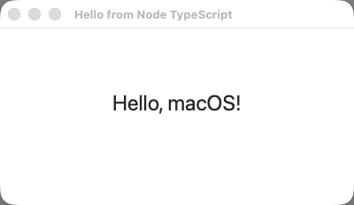

# hello-window (Node TypeScript) — TestAnyware VM verification report

**App:** `targets/typescript/app-implementations/macos/hello-window/` (typescript target, ladder app 1/7)
**Date:** 2026-07-15
**Result:** ✅ PASS — window + centred label render correctly; app menu present; Cmd-Q terminates cleanly.
**Artifact:** `hello-window-launcher` (dev launcher: native Node-under-AppKit embedder + the tsc-compiled
app, built by `build.sh`; not the shipped Step-8 `.app`).

## Environment

- TestAnyware, golden `macos` clone, screen 1920×1080, agent healthy.
- VM provisioning: the launcher links the *host's* Homebrew `libnode.147.dylib` + `libuv.1.dylib`
  at their absolute paths (no `--shared` static-linking assumption held for this Homebrew build —
  a correction to ADR-0060 §2's "minimal transitive vendoring" premise, see `learnings.md`); the
  full 24-file transitive Homebrew dylib closure (ICU, brotli, c-ares, nghttp2/3, ngtcp2, sqlite,
  openssl, zstd, …) was vendored onto the guest at the same absolute paths. The `@apianyware/*`
  generated corpus + the runtime were compiled once on the host (`tsc`, real emit — enums need
  transformation, not Node's strip-only type stripping) and copied over as plain files; no toolchain
  (Xcode/Swift/cargo/tsc) was installed in the VM itself.
- Desktop-click-to-reveal / Notification Center panels intermittently steal frontmost-app status in
  this golden image, unrelated to the app (see `learnings.md`) — worked around by explicitly
  clicking the window / re-focusing before each interaction that needs it frontmost.

## What was verified

**Semantic (accessibility agent):**

| Check | Expected | Observed |
|---|---|---|
| window title | "Hello from Node TypeScript" | ✅ "Hello from Node TypeScript" |
| window size | 400×200 content (+ title bar) | ✅ 400×232 |
| window position | centred | ✅ x=760 = (1920−400)/2, y=215 |
| label text | "Hello, macOS!" | ✅ `text value="Hello, macOS!"` |
| app menu | application menu + Quit item | ✅ "hello-window-launcher" › "Quit Hello Window" (no CFBundleName yet — the bold app-name slot falls back to the process name, expected pre-Step-8) |
| title bar buttons | close/miniaturise enabled, zoom disabled (not resizable) | ✅ 2 enabled + 1 `[disabled]` button |

**Visual (screenshot, cropped to the window region):** label "Hello, macOS!" centred horizontally
and vertically in the content area, clean white background, standard title bar.

**Behaviour:** Cmd-Q (with the window explicitly brought frontmost first) terminated the process
cleanly (`pgrep` → gone), confirming the "Quit Hello Window" menu item's nil-targeted `terminate:`
action reaches `-[NSApplication terminate:]` through the standard responder chain — no delegate or
explicit target wiring needed.

**Idle stability:** RSS read twice ~5s apart while idle (no interaction): 273424 KB → 273440 KB —
flat, no churn (expected: nothing runs after initial construction — no timers, no repeated dispatch).

## Pre-flight gates (host, before the VM round-trip)

1. **`npm test` (runtime package):** 118/118 passing, including a new test for `__alloc` (the
   shared `+alloc` runtime primitive this app's construction path needed — see `learnings.md`).
2. **`npm run typecheck` (runtime package):** clean.
3. **`tsc` compile of `app.ts` + its transitive `@apianyware/*` closure:** clean except the
   pre-existing, already-triaged 33 TS2559 residual (`corpus-typecheck-gate-k75`'s own posture —
   blocks/non-curated-structs/vacuous-conformance, none reachable from this app).
4. **Construction pre-flight** (`AW_HELLO_SMOKE=1 build/hello-window-launcher`, both on the host
   and in the VM): every FFI crossing above (menu/window/label construction, the nested-CGRect
   POD crossing) succeeds without entering `[NSApp run]` — confirmed via a temporary diagnostic
   read of the constructed window's frame (`{0,0,400,200}`) and subview count (1), removed before
   commit.
