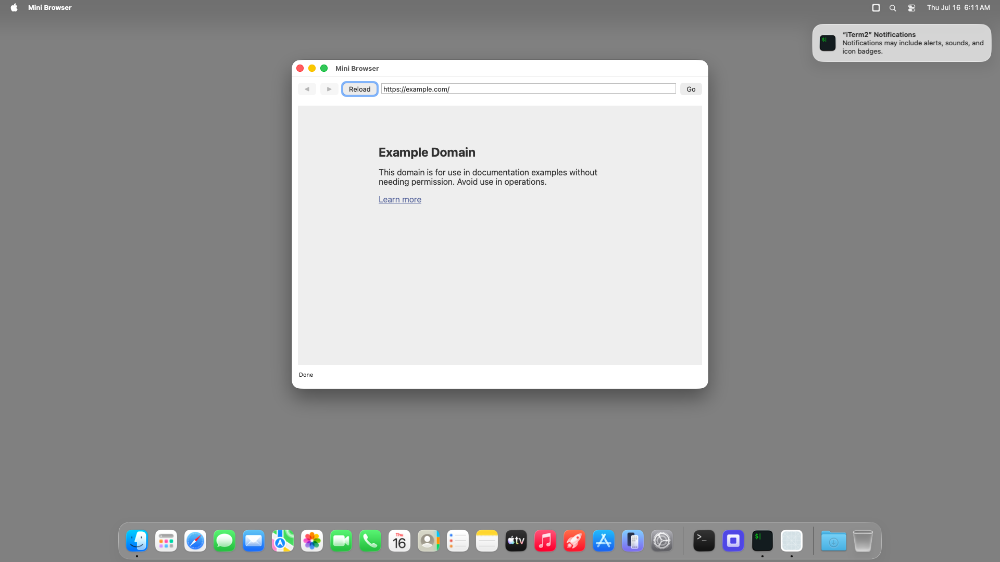

# mini-browser (Node TypeScript) — bundled `.app` TestAnyware VM verification report

**App:** `targets/typescript/app-implementations/macos/mini-browser/build/Mini Browser.app`
**Date:** 2026-07-16
**Result:** ✅ PASS — the shipped bundle launches, its `WKWebView` renders real live content
(navigated to `https://example.com/` and the page rendered), and it quits cleanly on Cmd-Q.
**Artifact:** the `bundle-typescript` Step-8 output, same shape as `hello-window`'s own bundle.

## Environment

Same shared VM session as `ui-controls-gallery`'s own report.

## What was verified

- `agent windows` shows the real window, title "Mini Browser", focused.
- The screenshot shows the toolbar (◀/▶/Reload/URL field/Go) and the actual rendered
  `https://example.com/` page content inside the `WKWebView` — confirms WebKit resolves and
  renders without an explicit `-framework WebKit` link in the bundled launcher (same "resolves
  fine without an explicit link" class as SceneKit — see `pdfkit-viewer`'s own report for the one
  framework, PDFKit, that does need one).
- `otool -L` shows only `@executable_path/../Frameworks/{libnode,libuv}.*.dylib` — no Homebrew
  absolute paths.
- Cmd-Q (window explicitly focused first) terminated the process cleanly — the confirming `pgrep`
  found no match afterward (the exec call itself hit the same benign 30s channel-timeout quirk
  `scenekit-viewer`'s report documents — the underlying command still completed and reported the
  correct result once its output was read).

## Not covered by this session

Full navigation/error-handling interaction (back/forward, invalid URL, failure alert) was already
verified against the dev launcher in Step 7 (`report.md`); this session verifies bundling
mechanics only.
