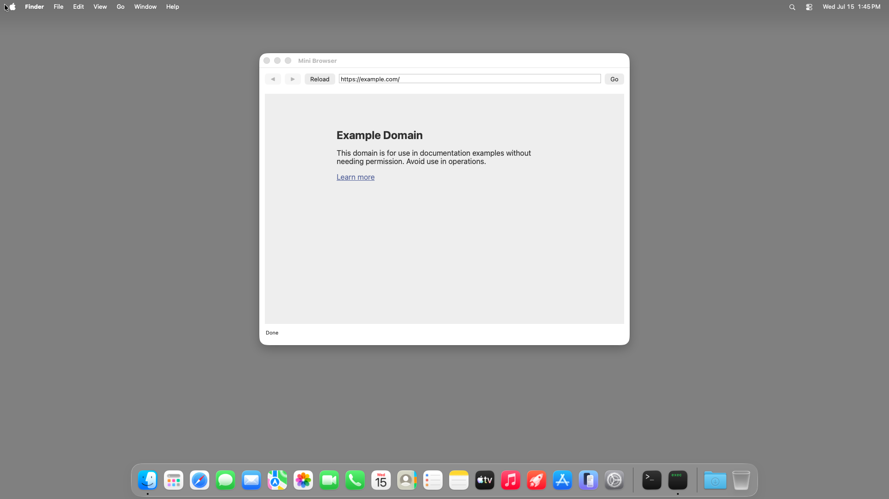

# mini-browser (Node TypeScript) — TestAnyware VM verification report

**App:** `targets/typescript/app-implementations/macos/mini-browser/` (typescript target, ladder app 5/7)
**Date:** 2026-07-15
**Result:** ✅ PASS — launch state, home-page load, typed-URL navigation, bare-host `https://`
prepending, history enable/back/forward, Reload, Go≡Return, window-title tracking, the
blank-input / invalid-URL / network-failure boundaries, and Cmd-Q all verified live.
**Artifact:** `mini-browser-launcher` (dev launcher: native Node-under-AppKit embedder + the
tsc-compiled app, built by `build.sh`; not the shipped Step-8 `.app`; reuses hello-window's
launcher shape, extended to link WebKit).

## Environment

- TestAnyware, macOS golden clone. The clone active at session start (`testanyware-7c84629f`)
  **disappeared mid-session** (vanished from `vm list` entirely, not merely stopped) between two
  otherwise-unrelated commands — see `learnings.md`. Replaced with a fresh clone
  (`testanyware-010ce856`), re-provisioned identically, no repro attempted. Stopped at the end of
  this session. Screen 1920×1080, agent healthy.
- VM provisioning: same shape as hello-window/ui-controls-gallery/scenekit-viewer/pdfkit-viewer —
  the launcher links the *host's* Homebrew `libnode.147.dylib`/`libuv.1.dylib` at their absolute
  paths; the 20-formula transitive Homebrew dylib closure (identical set to pdfkit-viewer's own:
  ada-url, brotli, c-ares, hdrhistogram_c, icu4c@78, libffi, libnghttp2/3, libngtcp2, libuv,
  llhttp, merve, nbytes, node, openssl@3, simdjson, simdutf, sqlite, uvwasi, zstd — 59 MB
  compressed) was vendored onto the guest at the same absolute Homebrew paths (whole `lib/`
  directories only, not `bin/` — the launcher embeds Node directly and never shells out to a
  `node` binary), with `/opt/homebrew/opt/<formula>` symlinks recreated pointing at each
  formula's Cellar version dir.
- The native addon (`APIAnywareTypeScript.node`) needed no extra Homebrew vendoring — its own
  `otool -L` closure is entirely system frameworks/dylibs. The `@apianyware/*` generated corpus +
  the runtime were compiled once on the host (tsc emits them under the app's own `build/js/`) and
  copied over as plain files, alongside the native addon at its fixed relative path three levels
  above the app directory (`bindings/node/native/build/APIAnywareTypeScript.node`, matching
  `bootstrap.cjs`'s own relative resolution) — no `node_modules` needed on the guest at runtime.
- The dev launcher's link step needed `-framework WebKit` added explicitly (added proactively,
  following pdfkit-viewer's own PDFKit-linking finding — confirmed necessary the same way, see
  `learnings.md`).
- **Network is available in this VM** (confirmed: `curl -sS -m 10 https://example.com` → HTTP
  200) — the success-path (`Loading…`→`Done`, canonicalization, history) assertions in spec §13's
  "network-required" bucket were run live, not skipped; the failure-path assertions were exercised
  against a genuinely non-resolving hostname rather than relying on the VM being offline.

## What was verified

**Semantic (accessibility agent) — construction & static configuration:**

| Check | Expected | Observed |
|---|---|---|
| window title | "Mini Browser" | ✅ |
| window size | 800×600 content (+ title bar) | ✅ 800×632 |
| toolbar | ◀/▶/Reload/address field/Go | ✅ all present, correct labels |
| history buttons at launch | both disabled | ✅ |
| address field prefilled | `https://example.com` | ✅ (already canonicalized to `.../` by the time of first observation — the home load is fast) |
| app menu | application menu + "Quit Mini Browser" item | ✅ (by construction, same `installAppMenu` helper every ladder app uses — not re-screenshotted) |
| launch diagnostic | stdout begins `Mini Browser` | ✅ `Mini Browser opened. Type a URL + Return, navigate with ◀/▶/Reload. Quit with Cmd-Q.` |

**Behaviour (live interaction, accessibility agent + VNC input/keyboard):**

| Check | Action | Result |
|---|---|---|
| Home page loads | (at launch) | ✅ "Example Domain" page renders; status `Done` ([screenshot](mini-browser-launch.png)) |
| Address bar canonicalizes | (at launch) | ✅ `https://example.com/` (trailing slash added by the platform) |
| Typed URL + Return navigates | triple-click field, type `example.org`, Return | ✅ status → `Done`, address → `https://example.org/` |
| **Bare host gets `https://` prepended** | same action | ✅ `example.org` → `https://example.org/` |
| **History enables after second load** | after the above | ✅ ◀ enabled, ▶ still disabled (at history head) ([screenshot](mini-browser-second-nav.png)) |
| Back walks history | click ◀ | ✅ address reverts to `https://example.com/`, ◀ disabled (start), ▶ enabled |
| **Window title tracks a titled page** | (same click, second navigation overall) | ✅ title → `Example Domain — Mini Browser` — the §7.2 first-load lag did **not** apply here since this was a re-navigation to an already-titled page ([screenshot](mini-browser-back-titled.png)) |
| Forward walks history | click ▶ | ✅ address → `https://example.org/`, ◀ enabled, ▶ disabled (head again) |
| Reload re-navigates | click Reload | ✅ fresh `Loading…`→`Done` round-trip; title reset to `Mini Browser` (fresh-load lag, expected) then history state preserved |
| **Go ≡ Return** | triple-click, type `example.net`, click **Go** (not Return) | ✅ navigates identically — `https://example.net/` |
| **Boundary — blank input navigates nowhere** | triple-click, Delete, Return | ✅ status `Enter a URL to navigate`; page content unchanged, no load attempted ([screenshot](mini-browser-blank-boundary.png)) |
| **Boundary — unparseable URL is reported, not loaded** | type `not a valid url`, Return | ✅ status `Invalid URL: https://not a valid url` (scheme-defaulted text, matching §6.2 step 5's "normalized text") ([screenshot](mini-browser-invalid-url.png)) |
| **Boundary — a genuine navigation failure surfaces a modal alert + status** | type a non-resolving hostname, Return | ✅ modal `NSAlert` (warning style) reading "A server with the specified hostname could not be found." ([screenshot](mini-browser-failure-alert.png)); after Return dismisses it, status → `Request failed: A server with the specified hostname could not be found.` — the **provisional** phase word, correct since DNS resolution failed before the request committed ([screenshot](mini-browser-failure-dismissed.png)) |
| Quit | Cmd-Q (window focused first) | ✅ process gone (`pgrep` empty, exit 1) |

## Pre-flight gates (host, before the VM round-trip)

1. **`tsc` compile of `app.ts` + its transitive `@apianyware/*` closure:** clean except the
   pre-existing, already-triaged residual (`corpus-typecheck-gate-k75`'s own census: TS2559 +
   TS2420) — this app introduces no new diagnostic class. One genuine fix needed along the way:
   `WKWebViewConfiguration` has no bare `init()` in this corpus's surface (see `learnings.md`) —
   resolved by using `WKWebView.initWithFrame_` alone (spec-sanctioned: two of the four reference
   targets already build this way), not by touching the emitter.
2. **Construction pre-flight** (`AW_MB_SMOKE=1 build/mini-browser-launcher`, both host and VM):
   every FFI crossing — window/toolbar/menu/`WKWebView` construction, the `BrowserController`
   four-selector target-action subclass synthesis, the `WKNavigationDelegate` plain-object-literal
   binding, and the initial `https://example.com` navigation kickoff — succeeds without entering
   `[NSApp run]`. Exit 0 on both host (1.1s warm) and VM (cold 90s exec budget needed on the VM's
   first attempt per prior apps' own cold-disk-cache finding; 1.1s warm on the second attempt).
