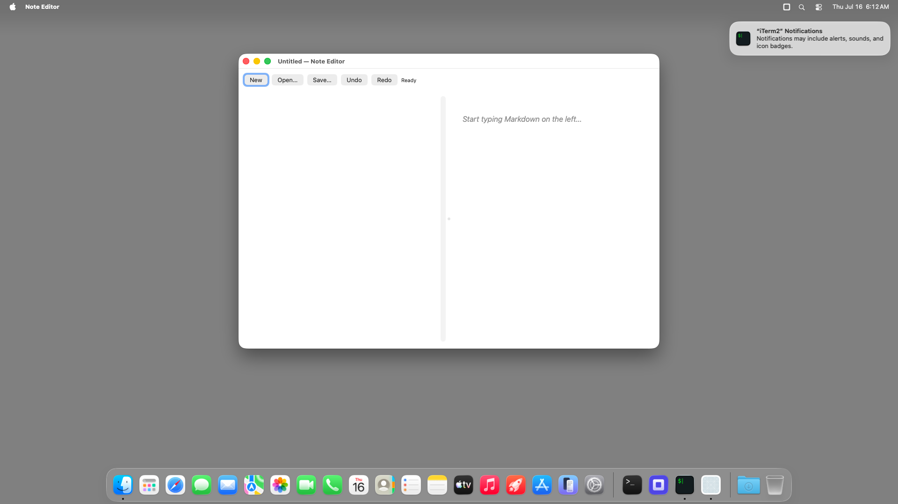

# note-editor (Node TypeScript) — bundled `.app` TestAnyware VM verification report

**App:** `targets/typescript/app-implementations/macos/note-editor/build/Note Editor.app`
**Date:** 2026-07-16
**Result:** ✅ PASS — the shipped bundle launches, shows its split Markdown-editor/preview UI with
the toolbar (New/Open…/Save…/Undo/Redo/status), and quits cleanly on Cmd-Q.
**Artifact:** the `bundle-typescript` Step-8 output, same shape as `hello-window`'s own bundle.

## Environment

Same shared VM session as `ui-controls-gallery`'s own report.

## What was verified

- `agent windows` shows the real window, title "Untitled — Note Editor", focused.
- The screenshot confirms the toolbar (New/Open…/Save…/Undo/Redo/"Ready" status) and the split
  editor/preview pane, with the preview's placeholder text ("Start typing Markdown on the left…")
  rendering via the same WebKit preview surface `mini-browser` already confirmed resolves without
  an explicit framework link.
- `otool -L` shows only `@executable_path/../Frameworks/{libnode,libuv}.*.dylib` — no Homebrew
  absolute paths.
- Cmd-Q terminated the process cleanly with no unsaved-changes prompt (an untouched "Untitled"
  document has nothing to discard) — `pgrep` found no match afterward.

## Not covered by this session

Full editing/save/discard-alert interaction was already verified against the dev launcher in
Step 7 (`report.md`); this session verifies bundling mechanics only.
