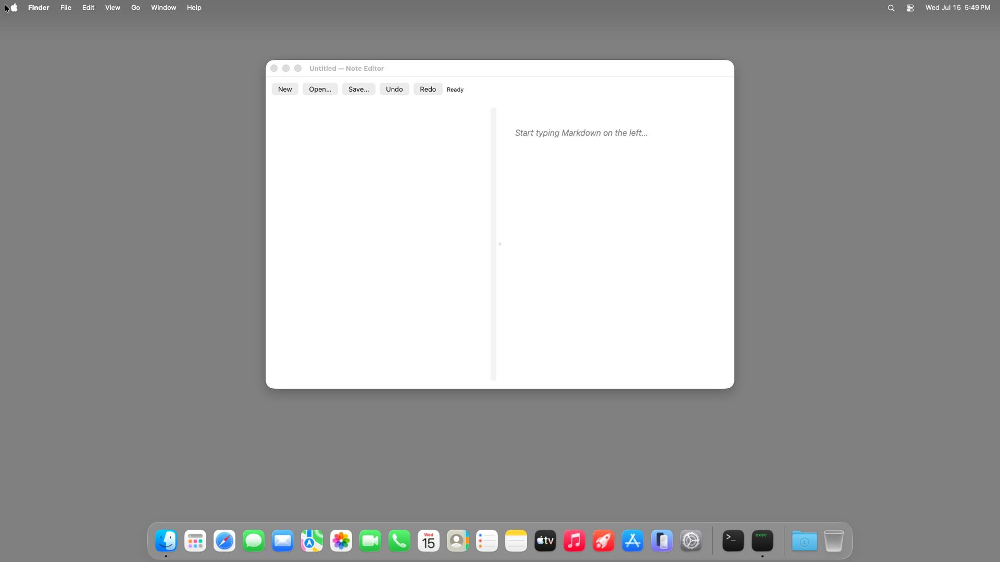

# note-editor (Node TypeScript) — TestAnyware VM verification report

**App:** `targets/typescript/app-implementations/macos/note-editor/` (typescript target, ladder app 6/7)
**Date:** 2026-07-16
**Result:** ✅ PASS — launch, live editing/preview (heading, bold/italic/code, list, fenced block),
first-save-opens-sheet + byte-exact write + subsequent direct-overwrite, Open (fixture load +
round-trip), the New/Open discard-confirmation alerts (distinct wording, Cancel-preserves,
clean-New-skips-alert), Undo/Redo (including the fresh-document no-op boundary), and Cmd-Q
termination all verified live. One in-VM-only finding (undo history persists across
New/Open — see `learnings.md`) and one spec "(unknown — to confirm in-VM)" item resolved
(close-button hides the window; the process keeps running) — neither is an app bug.
**Artifact:** `note-editor-launcher` (dev launcher: native Node-under-AppKit embedder + the
tsc-compiled app, built by `build.sh`; not the shipped Step-8 `.app`; reuses hello-window's/
mini-browser's launcher shape, extended to link WebKit — see `learnings.md`).

## Environment

- TestAnyware, macOS golden clone (`testanyware vm start --platform macos`, fresh clone this
  session — stopped at the end), screen 1920×1080, agent healthy.
- VM provisioning: same shape as pdfkit-viewer/mini-browser — the 20-formula transitive Homebrew
  dylib closure of `libnode`/`libuv` (ada-url, brotli, c-ares, hdrhistogram_c, icu4c@78, libffi,
  libnghttp2/3, libngtcp2, libuv, llhttp, merve, nbytes, node, openssl@3, simdjson, simdutf,
  sqlite, uvwasi, zstd — 59 MB compressed `lib/` dirs only) was vendored onto the guest at the same
  absolute `/opt/homebrew/Cellar/<formula>/<version>/lib` paths, with `/opt/homebrew/opt/<formula>`
  symlinks recreated pointing at each version dir. This VM's golden image again ships a
  pre-provisioned but package-empty `/opt/homebrew` prefix.
- The native addon (`APIAnywareTypeScript.node`) needed no extra Homebrew vendoring — its `otool -L`
  closure is entirely system frameworks/dylibs (confirmed by inspection before deploying).
- The app + native addon were deployed preserving the same relative directory layout as the host,
  under `/Users/admin/apianyware-deploy/targets/typescript/...` — `bootstrap.cjs` resolves the
  addon via `../../../bindings/node/native/build/APIAnywareTypeScript.node`, and the deploy tarball
  placed `app-implementations/macos/note-editor/` and `bindings/node/native/build/` at that same
  relative offset. No absolute-path rewriting was needed.
- The fixture (`apps/macos/note-editor/fixtures/fixture-note.md`) was uploaded directly to
  `/Users/admin/fixture-note.md` and selected through the open panel via Cmd-Shift-G + full path +
  Return ×2, per spec §13/§15's fixture and driver guidance.
- No new `-framework` link was needed beyond what `build.sh` already specifies (`AppKit`,
  `Foundation`, `CoreFoundation`, `WebKit` — WebKit was already added for mini-browser and carries
  over unchanged; `NSTextView`/`NSSplitView`/`NSScrollView`/`NSUndoManager`/`NSSavePanel` are all
  plain AppKit, already linked).

## What was verified

**Semantic (accessibility agent) — construction & static configuration:**

| Check | Expected | Observed |
|---|---|---|
| window title at launch | `Untitled — Note Editor` | ✅ |
| toolbar buttons | `New`, `Open…`, `Save…`, `Undo`, `Redo` | ✅ all present, all enabled |
| status label at launch | `Ready` | ✅ |
| preview placeholder | `Start typing Markdown on the left…` | ✅ |
| launch diagnostic | stdout line begins `Note Editor` | ✅ `Note Editor opened. Type Markdown on the left; preview renders on the right. Quit with Cmd-Q.` |
| construction pre-flight (`AW_NE_SMOKE=1`) | exit 0, no crash | ✅ host and VM |

**Visual (screenshots):** empty/placeholder state
([note-editor-empty.png](note-editor-empty.png)); live rendering of a heading, bold/italic/code
spans, a two-item bulleted list, and a fenced code block, all in one preview pane
([note-editor-markdown-render.png](note-editor-markdown-render.png)); the save sheet prefilled
`untitled` (extension hidden per macOS convention — the underlying value is `untitled.md`)
([note-editor-save-sheet-prefilled.png](note-editor-save-sheet-prefilled.png)); the New
confirmation alert, `Discard unsaved changes and start a new note?` with `Discard`/`Cancel`
([note-editor-discard-alert.png](note-editor-discard-alert.png)); the Open confirmation alert's
distinct wording, `Discard unsaved changes?`
([note-editor-open-discard-alert.png](note-editor-open-discard-alert.png)); a successful Open of
the fixture with status `Opened /Users/admin/fixture-note.md`
([note-editor-opened-fixture.png](note-editor-opened-fixture.png)); a clean save with status
`Saved /Users/admin/Documents/ts-note-verify.md` and a clean title
([note-editor-saved-status.png](note-editor-saved-status.png)); a clean New (`New document`,
placeholder preview, no alert) ([note-editor-new-document.png](note-editor-new-document.png)); and
Redo restoring the heading after a full Undo-to-placeholder round trip
([note-editor-redo-restored.png](note-editor-redo-restored.png)).

**Behaviour (live interaction, accessibility agent + VNC input/keyboard):**

| Check | Action | Result |
|---|---|---|
| Typing marks dirty | click editor, `type "# Hello"` | ✅ title → `Untitled — edited — Note Editor` |
| Preview renders the heading | after typing | ✅ large `Hello` heading in the right pane |
| Preview tracks continued typing | append paragraph, list, fence | ✅ bold/italic/code spans, `<ul><li>` bullets, and a gray fenced code block all render live, no extra action ([screenshot](note-editor-markdown-render.png)) |
| First save opens a sheet, default name | click `Save…` on dirty Untitled doc | ✅ sheet appears, name field prefilled `untitled` (`.md` hidden) |
| Completing the save writes the file | Cmd-Shift-G → `/Users/admin/Documents/ts-note-verify.md` → Return | ✅ file exists, content **byte-identical** (135 bytes, `diff` confirmed) to what was typed, status `Saved …`, title clean |
| Subsequent saves are direct | edit again (title `edited`), click `Save…` | ✅ no sheet (confirmed via `agent snapshot` — no sheet element), file updates directly, title cleans, content re-verified byte-identical after the second write |
| **Boundary — clean New shows no alert** | click `New` on a clean doc | ✅ proceeds directly: status `New document`, placeholder preview, no alert |
| **Boundary — dirty Open asks first, distinct wording** | dirty doc, click `Open…` | ✅ alert `Discard unsaved changes?` (not New's wording) |
| Open loads the fixture | Discard → Cmd-Shift-G → fixture path → Return ×2 | ✅ editor shows fixture text, preview re-renders it, status `Opened /Users/admin/fixture-note.md`, title `fixture-note.md — Note Editor` |
| **Boundary — dirty New asks first** | dirty doc, click `New` | ✅ alert `Discard unsaved changes and start a new note?` with `Discard`/`Cancel` |
| **Boundary — Cancel keeps everything** | press `Cancel` (mouse click) | ✅ text (`# Hello`) and dirty title (`— edited —`) both unchanged |
| **Boundary — cancelling the save sheet changes nothing** | dirty Untitled doc, `Save…`, then Escape | ✅ title still `— edited —`, no file written |
| Undo reverts typing, repeatedly, to the placeholder | fresh doc, type `# Hello`, click `Undo` ×6 | ✅ editor empties, preview returns to placeholder |
| Redo restores | click `Redo` | ✅ `# Hello` and the rendered heading both come back ([screenshot](note-editor-redo-restored.png)) |
| **Boundary — Undo on a fresh document is a no-op** | relaunch, immediately click `Undo` | ✅ title unchanged (`Untitled — Note Editor`), process still running |
| Quit | Cmd-Q (dirty doc) | ✅ process gone (`pgrep` empty), no alert intervened, edits never touched disk |
| **(Spec "unknown — to confirm in-VM") Close-button behaviour** | click the window's close control | ✅ **resolved live**: the window disappears from `agent windows`, the process (`pgrep`) keeps running — closing does **not** quit, matching §3.10's prediction |
| **No state across launches** | kill, relaunch | ✅ fresh launch starts at `Untitled — Note Editor`, empty editor, placeholder preview |

## Pre-flight gates (host, before the VM round-trip)

1. **`tsc` compile of `app.ts` + its transitive `@apianyware/*` closure:** clean except the
   pre-existing, already-triaged residual (`corpus-typecheck-gate-k75`'s own census: TS2559,
   36 occurrences, all in the generated `@apianyware/*` corpus, none in `app.ts` itself) — this app
   introduces no new diagnostic class (no TS2420 this run, unlike pdfkit-viewer's own count — the
   residual composition is per-corpus-surface-touched, not fixed).
2. **Construction pre-flight** (`AW_NE_SMOKE=1 build/note-editor-launcher`, both host and VM): every
   FFI crossing — window/toolbar/split-view/text-view/web-view construction, the six-selector
   `NoteController` subclass synthesis (five target-actions + the notification callback),
   `NSNotificationCenter` observer registration — succeeds without entering `[NSApp run]`. Exit 0
   on both host and VM.
