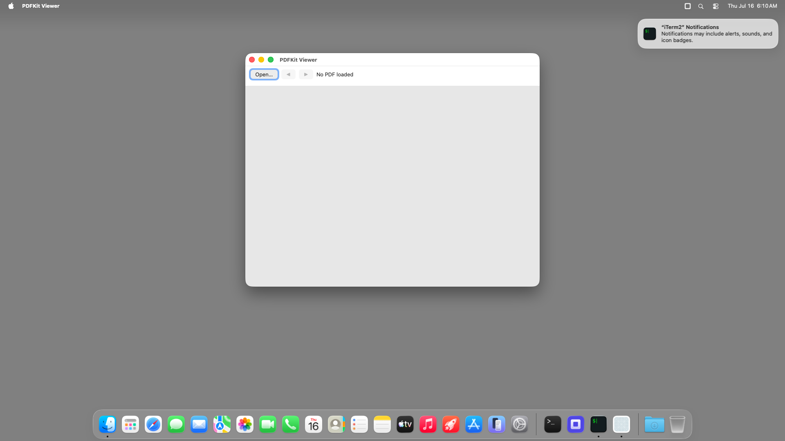

# pdfkit-viewer (Node TypeScript) — bundled `.app` TestAnyware VM verification report

**App:** `targets/typescript/app-implementations/macos/pdfkit-viewer/build/PDFKit Viewer.app`
**Date:** 2026-07-16
**Result:** ✅ PASS (after one real `bundle-typescript` fix) — the shipped bundle launches, shows
its toolbar (Open…/◀/▶/"No PDF loaded") over an empty `PDFView`, and quits cleanly on Cmd-Q.
**Artifact:** the `bundle-typescript` Step-8 output, same shape as `hello-window`'s own bundle.

## A real, pre-existing `bundle-typescript` defect this session found and fixed

The first bundle build crashed at construction: `AW_APP_SMOKE=1` on both host and guest threw
`TypeError: Cannot read properties of null (reading 'init')` at `__alloc(PDFView).init()` — the
exact defect `pdfkit-viewer/learnings.md` already documented and fixed for the **dev** launcher
(`build.sh`'s `-framework PDFKit` link), but `bundle-typescript`'s own launcher compile step
(`launcher.rs::compile_launcher`) never picked it up: it hardcoded only
`-framework AppKit -framework Foundation -framework CoreFoundation`, the baseline every app gets,
with no way for an app to ask for more. Unlike AppKit/Foundation/SceneKit/WebKit (whose ObjC classes
resolve via a bare `objc_getClass` without an explicit launcher link in this environment — confirmed
empirically, not assumed), PDFKit specifically needs to be a load command of the launcher itself.

**Fix**: added `AppSpec::extra_frameworks: Vec<String>` (`bundle.rs`), threaded through
`compile_launcher`'s `swiftc` invocation as additional `-framework <name>` args (`launcher.rs`), and
set it to `["PDFKit"]` for `pdfkit-viewer` specifically in the `bundle_app` example — mirroring the
same per-app `-framework` list each sample app's own dev `build.sh` already states, not a new
concept. Confirmed via `otool -L` that the rebuilt launcher now carries
`/System/Library/Frameworks/PDFKit.framework/Versions/A/PDFKit` as a load command, and the
`AW_APP_SMOKE=1` pre-flight passes cleanly on both host and guest after the fix. All 24 existing
`apianyware-bundle-typescript` unit/integration tests still pass unchanged (the new field defaults
to empty via `AppSpec::from_script_name`, so every other app's bundle is unaffected).

## Environment

Same shared VM session as `ui-controls-gallery`'s own report. The fixed bundle was re-zipped,
re-uploaded, and re-verified (`codesign --verify --deep --strict` + `AW_APP_SMOKE=1` both passed)
before the real GUI launch below.

## What was verified

- `agent windows` shows the real window, title "PDFKit Viewer", focused.
- The screenshot confirms the toolbar (Open…/◀/▶/"No PDF loaded" label) and the `PDFView` surface
  render (a blank page area — correct for no PDF loaded yet).
- `otool -L` on the launcher (guest copy, post-transfer) shows the vendored
  `@executable_path/../Frameworks/{libnode,libuv}.*.dylib` load commands (system-framework lines,
  including PDFKit, are filtered from this grep by design — `/System/...` paths need no vendoring).
- Cmd-Q (window explicitly focused first) terminated the process cleanly — `pgrep` found no match
  afterward.

## Not covered by this session

Full PDF-loading interaction (Open panel, page navigation, notification-driven label sync) was
already verified against the dev launcher in Step 7 (`report.md`); this session verifies bundling
mechanics (plus the one framework-link fix it surfaced) only.
