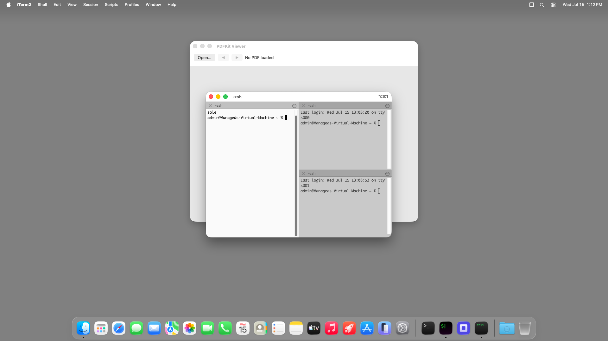

# pdfkit-viewer (Node TypeScript) — TestAnyware VM verification report

**App:** `targets/typescript/app-implementations/macos/pdfkit-viewer/` (typescript target, ladder app 4/7)
**Date:** 2026-07-15
**Result:** ✅ PASS — empty state, the modal open flow, page-1 load, boundary button states at
first/interior/last page, no wrap-around, notification-driven label sync (button **and**
non-button navigation), the cancel-is-a-no-op boundary, and Cmd-Q all verified live.
**Artifact:** `pdfkit-viewer-launcher` (dev launcher: native Node-under-AppKit embedder + the
tsc-compiled app, built by `build.sh`; not the shipped Step-8 `.app`; reuses hello-window's
launcher shape, extended to link PDFKit — see `learnings.md`).

## Environment

- TestAnyware, macOS golden clone (already running at session start — reused rather than
  cloning fresh; stopped at the end of this session), screen 1920×1080, agent healthy.
- VM provisioning: same shape as hello-window/ui-controls-gallery/scenekit-viewer — the launcher
  links the *host's* Homebrew `libnode.147.dylib`/`libuv.1.dylib` at their absolute paths; the
  20-formula transitive Homebrew dylib closure (ada-url, brotli, c-ares, hdrhistogram_c,
  icu4c@78, libffi, libnghttp2/3, libngtcp2, libuv, llhttp, merve, nbytes, node, openssl@3,
  simdjson, simdutf, sqlite, uvwasi, zstd — 59 MB compressed) was vendored onto the guest at the
  same absolute Homebrew paths (whole `lib/` directories), with `/opt/homebrew/opt/<formula>`
  symlinks recreated pointing at each formula's Cellar version dir. This VM's golden image ships
  a pre-provisioned but package-empty `/opt/homebrew` prefix, matching prior apps' own finding.
- The native addon (`APIAnywareTypeScript.node`) needed no extra Homebrew vendoring — its own
  `otool -L` closure is entirely system frameworks/dylibs. The `@apianyware/*` generated corpus +
  the runtime were compiled once on the host and copied over as plain files.
- **New this app: the dev launcher's link step needed `-framework PDFKit` added explicitly** —
  see `learnings.md` for why (PDFKit does not resolve via `objc_getClass` unless actually
  linked/loaded, unlike AppKit/Foundation/SceneKit in this environment).
- The 3-page fixture PDF (`apps/macos/pdfkit-viewer/fixtures/fixture.pdf`) was uploaded directly
  to `/Users/admin/fixture.pdf` and selected through the open panel via keyboard
  (Cmd-Shift-G → type path → Return × 2), per spec §13's fixture rule and driver guidance.

## What was verified

**Semantic (accessibility agent) — construction & static configuration:**

| Check | Expected | Observed |
|---|---|---|
| window title | "PDFKit Viewer" | ✅ |
| window size | 720×540 content (+ title bar) | ✅ 720×572 |
| toolbar | Open…/◀/▶ + page label | ✅ all present, correct labels |
| empty-state label | "No PDF loaded" | ✅ |
| empty-state nav buttons | both disabled | ✅ |
| app menu | application menu + "Quit PDFKit Viewer" item, `terminate:` action | ✅ |

**Visual (screenshots):** empty state, page 1/3 (pale red, "PAGE 1"), page 3/3 (pale blue,
"PAGE 3") all render exactly per the fixture, matching spec §11.

**Behaviour (live interaction, accessibility agent + VNC input/keyboard):**

| Check | Action | Result |
|---|---|---|
| Open flow reaches the panel | click "Open…" | ✅ modal `NSOpenPanel` (880×448) opens |
| Open loads page 1 | Cmd-Shift-G → type fixture path → Return×2 | ✅ "Page 1 of 3", pale-red "PAGE 1" renders ([screenshot](pdfkit-viewer-page1.png)) |
| **Boundary — first page** | after open | ✅ ◀ disabled, ▶ enabled |
| Advance (button) | click ▶ | ✅ "Page 2 of 3", pale-green "PAGE 2", both ◀/▶ enabled (interior) |
| Advance again (button) | click ▶ | ✅ "Page 3 of 3", pale-blue "PAGE 3" ([screenshot](pdfkit-viewer-page3-last.png)) |
| **Boundary — last page** | at page 3 | ✅ ▶ disabled, ◀ enabled |
| **Boundary — no wrap-around** | click ▶ again while disabled | ✅ still "Page 3 of 3", ▶ still disabled |
| Back (button) | click ◀ | ✅ "Page 2 of 3", both buttons re-enabled — confirms the single observer handles both directions |
| **Label tracks non-button navigation (key behaviour, spec §7.1/§7.3)** | two-finger scroll over the document area (no button click) | ✅ scrolled all the way to "Page 3 of 3", ▶ correctly disabled — the `pageChanged:` notification observer, not a button handler, drove the refresh ([screenshot](pdfkit-viewer-scroll-nav.png)) |
| **Boundary — cancel is a no-op** | click "Open…", press Escape | ✅ state unchanged ("Page 3 of 3", ◀/▶ unchanged) — dismissing the panel without confirming changed nothing |
| Quit | Cmd-Q (window focused first) | ✅ process gone (`pgrep` empty) |

## Pre-flight gates (host, before the VM round-trip)

1. **`tsc` compile of `app.ts` + its transitive `@apianyware/*` closure:** clean except the
   pre-existing, already-triaged residual (`corpus-typecheck-gate-k75`'s own census: TS2559 +
   TS2420) — this app introduces no new diagnostic class.
2. **Construction pre-flight** (`AW_PKV_SMOKE=1 build/pdfkit-viewer-launcher`, both host and VM):
   every FFI crossing — window/toolbar/menu/`PDFView` construction, the `PdfController`
   four-selector subclass synthesis (three target-actions + the notification callback),
   `NSNotificationCenter` observer registration — succeeds without entering `[NSApp run]`. Exit 0
   on both host and VM (VM run needed a 90s exec budget on the first cold attempt — see
   `learnings.md`, consistent with prior apps' own cold-disk-cache finding).
