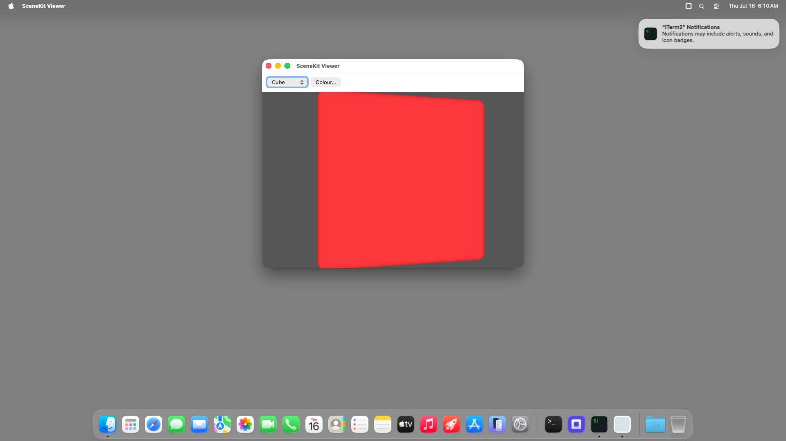

# scenekit-viewer (Node TypeScript) — bundled `.app` TestAnyware VM verification report

**App:** `targets/typescript/app-implementations/macos/scenekit-viewer/build/SceneKit Viewer.app`
**Date:** 2026-07-16
**Result:** ✅ PASS — the shipped bundle launches, renders the real SceneKit 3D scene (a red cube),
shows the geometry picker + colour button, and quits cleanly on Cmd-Q.
**Artifact:** the `bundle-typescript` Step-8 output, same shape as `hello-window`'s own bundle.

## Environment

Same shared VM session as `ui-controls-gallery`'s own report (see there for the transfer/signing
mechanics, identical for every app this session).

## What was verified

- `agent windows` shows the real window, title "SceneKit Viewer", focused.
- The screenshot confirms the SceneKit render surface actually draws (a red cube, not a blank/grey
  `SCNView`) and the toolbar (geometry pop-up "Cube", "Colour…" button) is present.
- `agent snapshot` confirms the pop-up button and colour button are both enabled accessibility
  elements, not decorative.
- `otool -L` shows only `@executable_path/../Frameworks/{libnode,libuv}.*.dylib` — no Homebrew
  absolute paths, no explicit SceneKit link needed (confirmed pre-existing in
  `pdfkit-viewer/learnings.md`: SceneKit's classes resolve via `objc_getClass` without an explicit
  launcher link in this environment, unlike PDFKit — see that app's own report for the one
  framework that does need it).
- Cmd-Q (window explicitly focused first) terminated the process cleanly — `pgrep` found no match
  afterward.

## A benign VM-exec-channel quirk (not a bundle-typescript or app defect)

The `AW_APP_SMOKE=1` construction pre-flight (`file exec`) reported `"timed_out": true` after 30s
in the guest, even though its own `stdout` captured the app's normal
`"SceneKit Viewer opened. Quit with Cmd-Q.\nEXIT:0"` output — i.e. the process itself completed
and printed its own exit code within the window, but the exec channel's own completion signal
arrived late. Reproduced the same smoke pre-flight directly on the host (`timeout 20 …`): it
completes in well under 20s with a clean exit. Root cause not pursued further — most likely a
GPU-adjacent helper process SceneKit's renderer spawns in the guest inheriting the exec channel's
pipe past the parent shell's own exit, a guest-environment artifact of the exec transport, not of
the launcher or the app. The **real** run (this report's own subject) launched, rendered, and quit
cleanly, so this does not block the leaf's "Done when".

## Not covered by this session

Full per-control interaction (geometry swap, colour persistence) was already verified against the
dev launcher in Step 7 (`report.md`); this session verifies bundling mechanics only.
