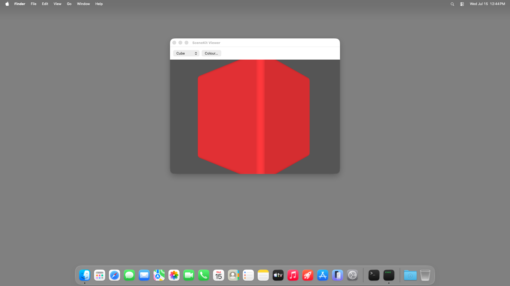

# scenekit-viewer (Node TypeScript) — TestAnyware VM verification report

**App:** `targets/typescript/app-implementations/macos/scenekit-viewer/` (typescript target, ladder app 3/7)
**Date:** 2026-07-15
**Result:** ✅ PASS — window + toolbar render correctly; geometry swap, colour panel, and the
load-bearing colour-persists-across-swap behaviour all verified live; spin animation confirmed
live; Cmd-Q terminates cleanly.
**Artifact:** `scenekit-viewer-launcher` (dev launcher: native Node-under-AppKit embedder + the
tsc-compiled app, built by `build.sh`; not the shipped Step-8 `.app`; reuses hello-window's
launcher shape unchanged).

## Environment

- TestAnyware, fresh golden `macos` clone, screen 1920×1080, agent healthy.
- VM provisioning: same shape as hello-window/ui-controls-gallery — the launcher links the
  *host's* Homebrew `libnode.147.dylib`/`libuv.1.dylib` at their absolute paths; the full 25-file
  transitive Homebrew dylib closure (ICU incl. `libicudata` via `@loader_path`, brotli incl.
  `libbrotlicommon` via `@rpath`, c-ares, hdr-histogram, llhttp, ada-url, simdjson, simdutf,
  nghttp2/nghttp3/ngtcp2, openssl, sqlite, libffi, uvwasi, zstd, merve/nbytes) was vendored onto
  the guest at the same absolute Homebrew paths (whole `lib/` directories, `cp -P`, symlinks
  preserved), with `/opt/homebrew/opt/<formula>` symlinks recreated pointing at each formula's
  Cellar version dir. The native addon (`APIAnywareTypeScript.node`) needed **no** extra
  vendoring — its own `otool -L` closure is entirely system frameworks/dylibs (no Homebrew
  dependency; SceneKit itself is never linked directly, matching trampoline elision — the addon
  reaches it via `objc_msgSend`). The `@apianyware/*` generated corpus + the runtime were
  compiled once on the host and copied over as plain files, matching prior apps.
- This VM's golden image ships a pre-provisioned but package-empty `/opt/homebrew` prefix
  (its own `bin`/`lib`/`Cellar`/`opt` dirs already exist, owned by the `admin` user) — vendoring
  extracted straight into it with no `sudo` needed, no golden-image rebuild.

## What was verified

**Semantic (accessibility agent) — construction & static configuration:**

| Check | Expected | Observed |
|---|---|---|
| window title | "SceneKit Viewer" | ✅ |
| window size | 640×480 content (+ title bar) | ✅ 640×512 |
| toolbar | picker + colour button | ✅ pop-up value "Cube", button label "Colour…" |
| title bar buttons | close/miniaturise/**zoom all enabled** (resizable, unlike hello-window) | ✅ |
| picker menu contents | Cube, Sphere, Torus, Cylinder, in order | ✅ (read from the open menu's AX snapshot, per spec §13 driver guidance) |
| app menu | application menu + Quit item | ✅ |

**Visual (screenshots):** a lit red cube on a dark-grey backdrop at launch, matching spec §11.

**Behaviour (live interaction, accessibility agent + VNC input):**

| Check | Action | Result |
|---|---|---|
| Geometry swap | pick "Sphere" from the picker | ✅ picker value → "Sphere", viewport renders a sphere ([screenshot](scenekit-viewer-geometry-swap.png)) |
| Colour panel opens | click "Colour…" | ✅ system "Colors" panel opens |
| Live recolour | click a blue/violet region of the colour wheel | ✅ sphere recolours to blue/violet immediately ([screenshot](scenekit-viewer-colour-panel.png)) |
| **Colour persists across a swap (key behaviour, spec §7)** | pick "Torus" after recolouring | ✅ torus renders in the **same blue/violet**, not reset to white ([screenshot](scenekit-viewer-colour-persists.png)) |
| Colour persists across a second swap | pick "Cube" | ✅ cube also renders in the same blue/violet |
| Spin animation is live | two screenshots ~3s apart, Cube selected | ✅ visibly different rotation angle between frames (the Torus case at the same interval showed no visible change — geometrically expected: SceneKit's default torus lies with its hole on the Y axis, the exact axis this app spins around, so a Y-rotation is invisible on that one shape; not a bug) |
| Quit | Cmd-Q (window explicitly focused first) | ✅ process gone (`pgrep` empty) |

## Pre-flight gates (host, before the VM round-trip)

1. **`npm test` (runtime package):** 118/118 passing (unchanged by this leaf — no runtime changes
   were needed).
2. **`npm run typecheck` (runtime package):** clean.
3. **`tsc` compile of `app.ts` + its transitive `@apianyware/*` closure:** clean except the
   pre-existing, already-triaged residual (`corpus-typecheck-gate-k75`'s own census: TS2559 +
   TS2420). This app is the **first** to import `@apianyware/scenekit`, which reaches TS2420 on
   `SCNLayer` (conforms both `CALayerDelegate` and `SCNSceneRenderer`, whose `setDelegate:`
   signatures collide) for the first time — a pre-existing generated-corpus residual, not
   introduced by this app; see `learnings.md`.
4. **Construction pre-flight** (`AW_SKV_SMOKE=1 build/scenekit-viewer-launcher`, both host and
   VM): every FFI crossing — window/toolbar/menu construction, the full SceneKit surface (scene,
   node, four geometry factories, material/property chain, action), the `SceneController`
   subclass synthesis + three-selector `setTarget_`/`setAction_` wiring — succeeds without
   entering `[NSApp run]`. Exit 0 on both host and VM (VM run was slower — cold disk I/O for the
   dylib closure, not a defect; see `learnings.md`).
