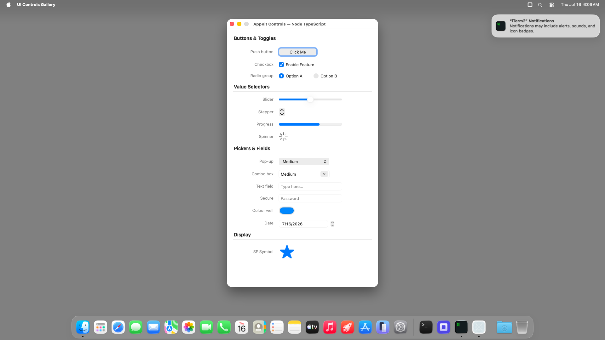

# ui-controls-gallery (Node TypeScript) — bundled `.app` TestAnyware VM verification report

**App:** `targets/typescript/app-implementations/macos/ui-controls-gallery/build/UI Controls Gallery.app`
**Date:** 2026-07-16
**Result:** ✅ PASS — the shipped bundle launches, shows its real UI (button, checkbox, two
radio buttons, stepper, and more), and quits cleanly on Cmd-Q.
**Artifact:** the `bundle-typescript` Step-8 output, same shape as `hello-window`'s own bundle
(see that app's `bundle-report.md` for the full pipeline description; not re-derived per app).

## Environment

Reused the same running TestAnyware macOS VM `bundle-typescript-k126` left provisioned (no fresh
golden clone needed). Transfer: `ditto -c -k --sequesterRsrc --keepParent` on the host, `file
upload` the zip, `unzip` in the guest — no manual dylib provisioning. `codesign --verify --deep
--strict` passed both on the host and on the unzipped guest copy.

## What was verified

- `agent windows` shows the real window, title "AppKit Controls — Node TypeScript", focused.
- `agent snapshot --mode interact` lists the real accessibility tree: a "Click Me" button, an
  "Enable Feature" checkbox (checked), an "Option A"/"Option B" radio pair, and a stepper — no
  placeholder or crash surface.
- `otool -L` on the launcher (guest copy, post-transfer) shows only
  `@executable_path/../Frameworks/{libnode,libuv}.*.dylib` — zero Homebrew absolute paths.
- Cmd-Q (window explicitly focused first) terminated the process cleanly — `pgrep` found no match
  afterward.

## Not covered by this session

Full per-control interaction (radio exclusion, stepper increment, etc.) was already verified
against the dev launcher in Step 7 (`report.md`); this session's own "Done when" bar is bundling
mechanics, not re-verifying app behaviour, per `bundle-remaining-apps-k127`'s own scope note.
