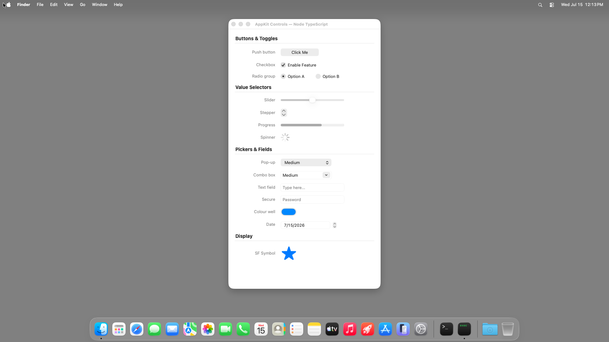
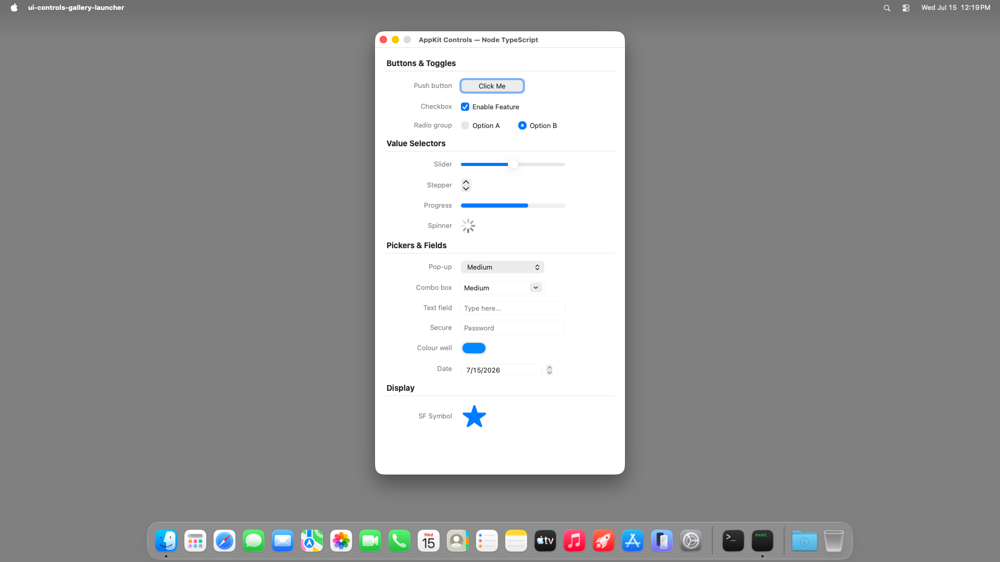
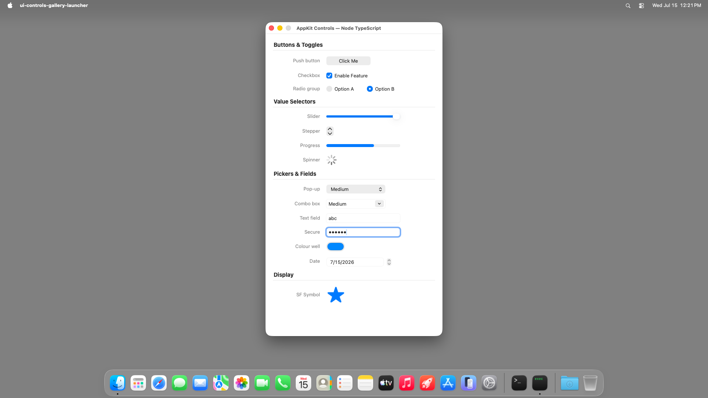

# ui-controls-gallery (Node TypeScript) — TestAnyware VM verification report

**App:** `targets/typescript/app-implementations/macos/ui-controls-gallery/` (typescript target, ladder app 2/7)
**Date:** 2026-07-15
**Result:** ✅ PASS — all 14 spec-mandated controls present and configured; sectioned layout renders
correctly; radio exclusivity, checkbox toggle, slider/stepper interaction, text entry, and secure-field
masking all verified live; Cmd-Q terminates cleanly.
**Artifact:** `ui-controls-gallery-launcher` (dev launcher: native Node-under-AppKit embedder + the
tsc-compiled app, built by `build.sh`; not the shipped Step-8 `.app`; reuses hello-window's launcher
shape unchanged).

## Environment

- TestAnyware, fresh golden `macos` clone, screen 1920×1080, agent healthy.
- VM provisioning: same shape as hello-window — the launcher links the *host's* Homebrew
  `libnode.147.dylib`/`libuv.1.dylib` at their absolute paths; the full 25-file transitive Homebrew
  dylib closure (recomputed from scratch for this app: ICU ×3 incl. `libicudata` reached only via
  `@rpath`, brotli ×3 incl. `libbrotlicommon` likewise, c-ares, hdr-histogram, llhttp, ada-url,
  simdjson, simdutf, nghttp2/nghttp3/ngtcp2, openssl ×2, sqlite, libffi, uvwasi, zstd, merve/nbytes)
  was vendored onto the guest at the same absolute Homebrew paths, with `/opt/homebrew/opt/*`
  symlinks recreated pointing at each formula's Cellar version dir — see `learnings.md` for why a
  naive "copy the one resolved dylib per formula" first attempt undercounted this (missed the
  `libFoo.N.dylib` symlink alias each load command actually references, not the real
  `libFoo.N.N.N.dylib` file). The `@apianyware/*` generated corpus + the runtime were compiled once
  on the host and copied over as plain files, matching hello-window.
- A pre-existing running VM discovered via `vm list` (left over from an earlier session) had a
  broken exec channel (every `file exec` call 500'd, while the accessibility/VNC channel stayed
  healthy) — abandoned in place per the "never stop a VM you didn't start this session" policy;
  verification ran entirely on a fresh clone this session started and stopped itself.

## What was verified

**Semantic (accessibility agent) — construction & static configuration:**

| Check | Expected | Observed |
|---|---|---|
| window title | contains "Controls" | ✅ "AppKit Controls — Node TypeScript" |
| roster completeness | all 14 spec §6 control kinds present | ✅ button, checkbox, 2 radios, slider, stepper, progress bar, spinner, popup, combo, text field, secure field, color well, date picker, image view |
| section headers | bold, grouped | ✅ "Buttons & Toggles", "Value Selectors", "Pickers & Fields", "Display" |
| push button title | "Click Me" | ✅ |
| checkbox title + initial state | "Enable Feature", checked | ✅ value=1 |
| radio titles + initial selection | "Option A"/"Option B", A selected | ✅ A value=1, B value=0 |
| slider range/initial value | 0–100, mid-range | ✅ value=50 |
| stepper range/initial value | 0–10, small value | ✅ value=5 |
| progress bar | determinate, ~two-thirds | ✅ visually ~65% filled |
| spinner | indeterminate, animating | ✅ visually spinning in both screenshots |
| popup / combo item count | exactly 3 items each | ✅ "Medium" selected in both |
| text field placeholder | "Type here..." | ✅ |
| secure field placeholder | "Password" | ✅ |
| color well | system blue | ✅ `value="System systemBlueColor"` |
| date picker | text-field-and-stepper style, today's date | ✅ "7/15/2026" (matches VM system date) |
| image view | system image, no bundled asset | ✅ blue-tinted star (SF Symbol `star.fill`) |
| app menu | application menu + Quit item | ✅ "Quit UI Controls Gallery" |
| title bar buttons | close/miniaturise enabled, zoom disabled (not resizable) | ✅ |

**Behaviour (live interaction, accessibility agent + VNC input):**

| Check | Action | Result |
|---|---|---|
| Radio mutual exclusion | click "Option B" | ✅ B → selected (1), A → deselected (0) — see `learnings.md`: this needed an explicit target-action callback, contrary to this app's own first assumption |
| Checkbox toggle | click "Enable Feature" | ✅ 1 → 0 (native NSButton behaviour, no app wiring needed) |
| Slider interaction | click near track end | ✅ value → 100, stayed within [0, 100] |
| Stepper interaction | ~40 clicks across the up/down arrows | ✅ value observed at 5, 2, 6, 4 across the sequence — always within [0, 10], never out of range (exact click-to-arrow targeting was imprecise at this VNC's scale — see `learnings.md` — so this is not a precise boundary-clamp proof, but does confirm live interaction + in-range behaviour) |
| Text field input | click + type "abc" | ✅ `value="abc"`, visible in the screenshot |
| Secure field masking | click + type "secret" | ✅ AX value is 6 masked bullet glyphs (`` ×6), never the cleartext; screenshot shows dots |
| Quit | Cmd-Q (window explicitly focused first) | ✅ process gone (`pgrep` empty) — the "Quit UI Controls Gallery" menu item's target-action reaches `-[NSApplication terminate:]` |

## Pre-flight gates (host, before the VM round-trip)

1. **`npm test` (runtime package):** 118/118 passing (unchanged by this leaf — no runtime changes
   were needed).
2. **`npm run typecheck` (runtime package):** clean.
3. **`tsc` compile of `app.ts` + its transitive `@apianyware/*` closure:** clean except the
   pre-existing, already-triaged TS2559 residual (`corpus-typecheck-gate-k75`'s own posture).
4. **Construction pre-flight** (`AW_UCG_SMOKE=1 build/ui-controls-gallery-launcher`, both host and
   VM): every FFI crossing — all 14 control constructors + setters, the menu/window inits, the
   `GalleryController` subclass synthesis + `setTarget_`/`setAction_` wiring — succeeds without
   entering `[NSApp run]`. Exit 0 on both host and VM, matching.
